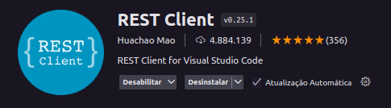
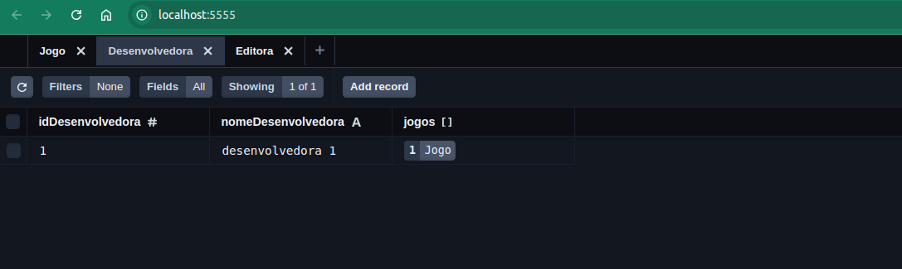

# Backend

## Como rodar?

1. Rode o projeto pelo terminal

```sh
   cd app/backend
   npm run dev
   ```

2. Instale a extensão REST Client
   

3. Abra um novo terminal para acessar o arquivo `jogo.http`

```sh
   cd api-test
   code jogo.http # code abre no vscode
   ```

4. Clique em Send Request
    - Será listado os jogos cadastrados

## Como usar o prisma?

- Salvar alterações no banco

    ```sh
   npx prisma db push
   ```

- Abrir o prisma studio

     ```sh
   npx prisma studio
   ```


