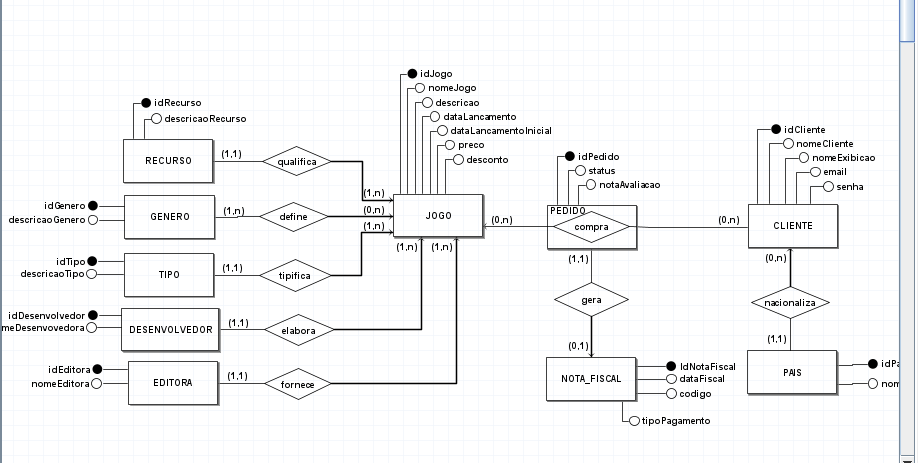

# 4.1. Módulo Estilos e Padrões Arquiteturais

# Introdução

Arquitetura de software consiste na representação da estrutura de um sistema, que engloba seus componentes, relações entre eles e com o ambiente, e os princípios que guiam o seu design e evolução. O Documento de Arquitetura de Software (DAS) é um artefato que descreve essa arquitetura, apresentando as principais decisões de projeto e justificativas, além de fornecer uma visão geral do sistema.

Para esse projeto foram selecionadas 3 visões do DAS: **Lógica, Implementação e Dados**. A visão lógica descreve a organização do sistema em termos de componentes e suas interações, a visão de implementação detalha como a arquitetura é concretizada em termos de código, e a visão de dados apresenta a estrutura de armazenamento de dados do sistema.

# Visão Lógica

A visão lógica em arquitetura de software é uma representação abstrata de como o sistema é organizado em termos de suas principais estruturas e componentes de software. Essa visão foca em como os diferentes componentes, módulos ou subsistemas interagem entre si para cumprir os requisitos funcionais do sistema. Ela tem como principais propósitos ajudar os desenvolvedores e possíveis stakeholders no entendimento do sistema, fornecer uma linguagem comum para fortalecer as discussões do design do sistema e ajudar nas identificações de possíveis falhas ou pontos de preocupações do projeto.

<!-- - Apresentar diagrama de pacotes ou até de classes -->

<!-- - FORNECER LINKS COM ARTEFATOS PRODUZIDOS ANTERIORMENTE -->
## Estilo Arquitetural

<!-- 2. **Repositório** - Utilizado para garantir a persistência dos dados
1. **Orientado a eventos**:
    - (extra)
    - Opção 1: Mostrando o observer criado na entrega de padrões de projeto -> porém pode ser custoso implementar (pode ser citado, não entrando no escopo do mvp)
    - Opção 2: Criar os diagramas para uso do estilo no front
2. **Orientado a serviços**:
    - (extra)
    - empacotamento web service -> protocolo de comunicação e interface
    - Precisa definir uma camada para a comunição com demais
    - OPÇÃO 1: Composite criado para métodos de pagamento pode ser adaptado ao estilo, se escolhermos puxar um serviço de terceiros
    - OPÇÃO 2: Criar os diagramas de composite para login, puxando api de validação de cpf (mais simples)
3. **PIPES AND FILTERS**
    - (extra do extra)
    - pode ser aplicado como filtro de pesquisa de jogo -> exige criar diagrama
    - lida com threads -> $$$
    - alto custo
 -->

### N-Camadas

Como o projeto se trata de uma aplicação web, o estilo arquitetural, o estilo arquitetural escolhido para a visão lógica do sistema foi o **N-Camadas**. Esse estilo é amplamente utilizado nesses sistemas, pois permite a separação clara das responsabilidades entre as diferentes camadas do sistema, facilitando a manutenção e evolução, escalabilidade do código, reutilização de código e testes. O estilo N-Camadas divide a aplicação em camadas lógicas, onde cada camada possui um conjunto específico de responsabilidades e interage com as camadas adjacentes de forma bem definida. Os padrão escolhido para representar o N-Camadas foi o **MVC**.

### MVC

O padrão MVC (Model-View-Controller) é um padrão de arquitetura de software que divide a aplicação em três componentes principais: o Modelo, a Visão e o Controlador. O Modelo é responsável pela lógica de negócio e manipulação dos dados, a Visão é responsável pela interface do usuário e a apresentação dos dados, e o Controlador é responsável por intermediar a comunicação entre o Modelo e a Visão, respondendo às ações do usuário e atualizando o Modelo e a Visão conforme necessário.
Esse padrão foi selecionado por se tratar de uma aplicação web em que tem várias formas de interagir e visualizar com os dados do sistema.

### Cliente-Servidor

O estilo arquitetural Cliente-Servidor também será utilizado no projeto, nas interações entre o banco de dados e a aplicação. Neste estilo as funções de um sistema são divididas entre dois componentes: o cliente, que faz as solicitações, e o servidor, que processa essas solicitações e fornece os recursos ou serviços necessários. Para o projeto, o servidor será responsável por gerenciar as requisições de dados do banco de dados e fornecer as informações necessárias para a aplicação (cliente).

## Diagrama de Pacotes

Um diagrama de pacotes é uma ferramenta essencial para organizar e visualizar a estrutura de alto nível de um sistema de software, mostrando como os diferentes módulos ou componentes estão agrupados e como interagem. Ele ajuda a gerenciar a complexidade do sistema, facilita a comunicação entre partes interessadas, identifica dependências entre componentes e apoia o planejamento e a evolução do software, permitindo uma estrutura modular e eficiente.

    -Colocar a imagem da versão final

# Visão de Implementação

A visão de implementação em arquitetura de software complementa a visão arquitetônica geral, detalhando como os componentes do sistema serão organizados e integrados para formar um produto funcional. Ela abrange a definição dos principais componentes, a estrutura de pastas e arquivos, as interfaces e APIs, as tecnologias utilizadas, e os padrões de codificação que devem ser seguidos. Além disso, inclui detalhes sobre os ambientes de desenvolvimento e configuração do software. Essa visão é fundamental para garantir que a arquitetura do sistema seja traduzida corretamente em código e que todos os desenvolvedores tenham um entendimento claro de como implementar e integrar os diferentes componentes, assegurando a consistência e a qualidade do produto final.

- FORNECER LINKS COM ARTEFATOS PRODUZIDOS ANTERIORMENTE
- Código

# Visão de Dados

<!-- - Explicar o que é a visão de dados === OK
- Explicar a escolha: persistência dos dados === +-OK
- Estilo repositório + cliente-servidor === ?
- Atualizar MER, DER, DLD === ?
- FORNECER LINKS COM ARTEFATOS PRODUZIDOS ANTERIORMENTE === ? -->

A visão de dados refere-se a uma representação do modelo de dados, visualizada através de diagramas de classe, que são usados para descrever especificamente esse modelo.

No contexto de um e-commerce, o tráfego de informações é extremamente importante. Persistir os dados é essencial devido ao valor que essas informações podem ter. Portanto, essa visão torna-se crucial, e o estilo repositório e a arquitetura cliente-servidor para conectar com o banco de dados tornam-se necessários. Nesse contexto, foram elaborados os seguintes modelos:

- **Modelo de Entidade e Relacionamento (MER)**: Este modelo é utilizado para descrever a estrutura lógica do banco de dados, mostrando as entidades e os relacionamentos entre elas.
- **Diagrama Entidade-Relacionamento (DER)**: Um diagrama que ilustra graficamente as entidades, atributos e os relacionamentos entre eles, facilitando a compreensão do modelo de dados.
- **Diagrama Lógico de Dados (DLD)**: Representa a estrutura lógica do banco de dados, detalhando tabelas, colunas e as relações entre elas, sem se preocupar com a implementação física.

Para isso, a **arquitetura cliente-servidor** e o **estilo arquitetural repositório** são importantes estratégias a serem aplicadas. O estilo repositório permite a centralização e o gerenciamento eficaz das informações, enquanto a arquitetura cliente-servidor facilita a comunicação entre o cliente (usuário) e o servidor (banco de dados).

### Modelo Entidade Relacionamento (MER)

**Entidades**

- JOGO
- USUARIO
- ADMIN
- CLIENTE
- BIBLIOTECA
- PEDIDO
- AVALIACAOJOGO
- RECURSOS
- TIPO
- GENERO
- DESENVOLVEDOR
- EDITORA

**Atributos**

- JOGO (idJogo, nome, {avaliacoes}, descricao, dataLancamento, dataLancamentoInicial, preco, desconto, plataforma)
- USUARIO (idUsuario, nome, email, senha)
- ADMIN (cpf, telefone(ddd, numeroTelefone))
- CLIENTE (idCliente, nomeExibicao, pais, {idJogo})
- BIBLIOTECA (idBiblioteca, idJogo, idUsuario, favorito)
- PEDIDO (numPedido, {idJogo}, idUsuario, status, descontoTotal, precoTotal, formaPagamento)
- AVALIACAOJOGO (idAvaliacao, idJogo, idUsuario, horasJogadas, nota, comentario, numCurtidas)
- RECURSO (idRecurso, descricao)
- TIPO (idTipo, descricao)
- GENERO (idGenero, descricao)
- DESENVOLVEDOR (idDesenvolvedor, nome)
- EDITORA (idEditora, nome)

**Relacionamentos**

- CLIENTE - tem - JOGO
  - n:m
  - Um CLIENTE tem zero ou mais JOGOs e um JOGO é tido por um ou mais CLIENTEs
- JOGO - apresenta - TIPO
  - 1:n
  - Um JOGO apresenta um TIPO e um TIPO é apresentado por um ou n JOGOs

- JOGO - possui - AVALIACAOJOGO
  - n:1
  - Um JOGO possui zero ou mais AVALIACAOJOGO e uma AVALIACAOJOGO é possuida por apenas um JOGO

- DESENVOLVEDOR - elabora - JOGO
  - n:1
  - Um DESENVOLVEDOR elabora um ou mais JOGOs e um JOGO é elaborado por um DESENVOLVEDOR

- JOGO - classificado - RECURSO
  - n:1
  - Um JOGO é exigido por um ou mais RECURSOS e um RECURSO é exigido por um ou mais JOGOs
- JOGO - fornecido - EDITORA
  - n:1
  - Um JOGO é fornecido por apenas uma EDITORA e uma EDITORA fornece um ou mais JOGOs

- JOGO - pertence - GENERO
  - n:m
  - Um JOGO pertence a um ou mais GENEROs e um GENERO é possuido por um ou mais JOGOs

- JOGO - compoe - BIBLIOTECA
  - 1:n
  - Um JOGO compoe uma BIBLIOTECA e uma BIBLIOTECA é composta por zero ou mais JOGOs

- CLIENTE - adiciona - AVALIACAOJOGO
  - 1:1
  - Um CLIENTE adiciona uma AVALIACAOJOGO e uma AVALIACAOJOGO é adicionada apenas por um CLIENTE

- CLIENTE - tem - BIBLIOTECA
  - 1:1
  - Um CLIENTE tem apenas uma BIBLIOTECA e uma BIBLIOTECA tem apenas um CLIENTE

### Diagrama Entidade-Relacionamento (DER)

Inicialmente foi elaborado com [brModelo](http://www.sis4.com/brModelo/) durante a implementação foram realizadas algumas adaptações e apartir das models do projeto foi elaborado o der com o [prisma-erd-generator](https://prisma-erd.simonknott.de/).

<<<<<<<<<<<<>>>>>> atualizar der brMOdelo

### Diagrama Lógico de Dados (DLD)

<<<<<<<<<<<<< atualizar dld ou retirar

<!-- ### Dicionário de Dados
opcional
-->

# Referências

[1] Arquitetura e Desenho de Software - Vídeo Aulas (Tópico 3 - Arquitetura de Software & Reutilização de Software). SERRANO, Milene.

[2] Arquitetura e Desenho de Software - Material em slide (Tópico 3 - Arquitetura de Software & Reutilização de Software). SERRANO, Milene.

[3] CIN-UFPE. RUP - Documento de Arquitetura de Software. Centro de Informática da UFPE. Disponível em: <https://www.cin.ufpe.br/~gta/rup-vc/core.base_rup/workproducts/rup_software_architecture_document_C367485C.html?nodeId=8d5440e6>.

[4] UNIVERSIDADE DE BRASÍLIA. Sistema de Administração Escolar. Disciplinas: Sistemas de Banco de Dados.

# Histórico de Versão

| Data       | Versão | Atividade             | Responsável                                                                                                                                 |
| ---------- | ------ | ----------------------------------------------- | ------------------------------------------------------------------|
| 07/08/2024 | 1.0    | Criação inicial com sugestões/instruções do DAS | [Raquel Eucaria](https://github.com/raqueleucaria)|
| 08/08/2024 | 1.1    | Criação inicial Visão de Dados | [Alexia Naara](https://github.com/alexianaa), [Luan Mateus](https://github.com/luanduartee), [Pedro Barbosa](https://github.com/pedrobarbosaocb), [Raquel Eucaria](https://github.com/raqueleucaria) e [Sabrina B.](https://github.com/sabrinaberno) |
| 13/08/2024 | 1.2    | Coloca textos da visão lógica | [Pedro Cabeceira](https://github.com/pkbceira03) e [Luciano Freitas](https://github.com/luciano-freitas-melo)|
| 15/08/2024 | 1.3    | Coloca textos da visão de implementação| [Pedro Cabeceira](https://github.com/pkbceira03)|
| 16/08/2024 | 1.4    | Atualiza a visão de dados| [Raquel Eucaria](https://github.com/raqueleucaria)|
