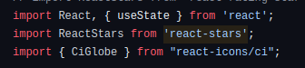
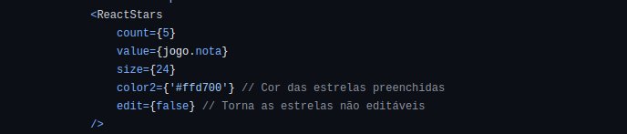
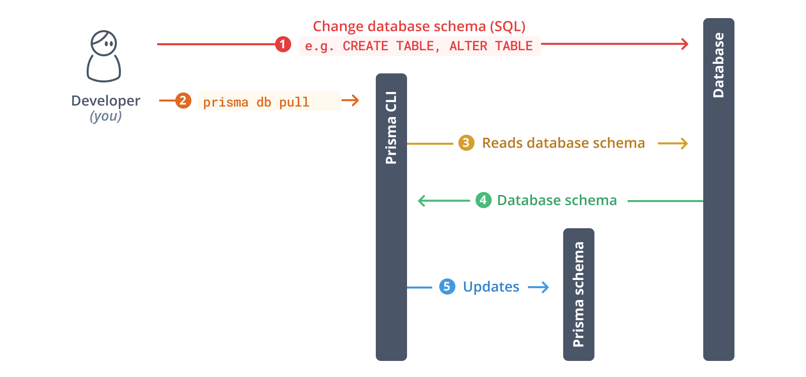
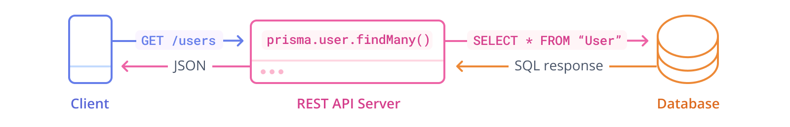
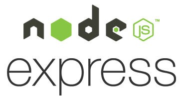
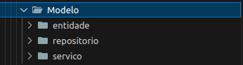

# 4.2. Módulo Reutilização de Software

## Introdução

A reutilização de software é um conceito amplamente utilizado que pode ser definido de várias maneiras. Em geral, refere-se ao aproveitamento de informações, componentes de software ou sistemas já existentes por um desenvolvedor na criação de novos sistemas. Este documento visa destacar exemplos e práticas onde essa abordagem foi aplicada efetivamente.

## Pacote de Avaliação por Estrelas do React

Em muitas aplicações da atualidade é necessario permitir aos usuários fornecer feedback através de uma interface de avaliação por estrelas e também exibir essa informação ao usuario. Para isso o pacote **React Stars** oferece um componente de avaliação por estrelas fácil de integrar e personalizar.

### Aplicações no projeto

Na nossa aplicação um dos locais onde o **React Stars** pode ser utilizado foi para exibir a avaliação que um jogo possui. Abaixo estão os trechos de código e interface pertinentes:

    
Implementação em código - React Stars

O codigo em questão pode ser encontrado na integra em [/app/myecommerce/src/app/jogos/[id]/page.tsx](https://github.com/UnBArqDsw2024-1/2024.1_G1_My_Ecommerce/blob/main/app/myecommerce/src/app/jogos/%5Bid%5D/page.tsx)

    
Visualização na interface - React Stars

## Tailwind

Tailwind CSS é um framework de CSS utilitário que permite aplicar estilos diretamente no HTML usando classes pré-definidas, o que torna o desenvolvimento mais rápido e eficiente.  Ele foi escolhido devido a sua reutilização de código, promovendo consistência ao usar as mesmas classes em diferentes partes do projeto, simplificando a manutenção ao evitar a criação de novas regras CSS, e reduzindo o código duplicado, resultando em um código mais limpo e reutilizável.

## Prisma

### Conceito

O Prisma é um framework ORM para NodeJS que, além de mapear as entidades de um banco de dados, auxilia, facilita e oferece mais segurança no desenvolvimento. Foram utilizados os construtores de consulta por meio do Prisma Client, os quais permitem a modificação das models no schema de forma mais flexível. Também foram feitas, de forma mais rígida, as declarações de modelagem e migração de dados para SQLite, com o uso do Prisma Migrate, além da visualização rápida e edição do banco por meio do Prisma Studio. No contexto de REST APIs, também foram geradas consultas ao banco na controladora de rotas, associada a outro framework, o Express. Assim, foi permitida a reutilização de software de forma mais ágil.

### Características

- **Reutilizável**: Bem documentado e compreensível;
- **Extensível**: Capaz de ser especializado para diferentes aplicações, NodeJs e Typescript principalmente;
- **Seguro**: Com princípios como encapsulamento bem implementados;
- **Tipo**: Considerado caixa cinza por ser híbrido, oferecendo ferramentas mais flexíveis (caixa branca) e mais rígidas (caixa preta);
- **Empacotamento**: Pacote NPM (Node Package Manager), que pode ser facilmente adicionado a qualquer projeto Node.js.

### Código

    
Definição das models

`app/backend/prisma/schema.prisma`

    generator client {
    provider = "prisma-client-js"
    }

    datasource db {
    provider = "sqlite"
    url      = env("DATABASE_URL")
    }

    model Genero {
    @@map("generos")
    idGenero Int @id @default(autoincrement())
    nomeGenero String @unique
    GeneroJogo GeneroJogo[]
    }

    model Editora {
    @@map("editoras")
    idEditora Int @id @default(autoincrement())
    nomeEditora String @unique
    Jogo Jogo[]
    }

    model Desenvolvedora {
    @@map("desenvolvedoras")
    idDesenvolvedora Int @id @default(autoincrement())
    nomeDesenvolvedora String @unique
    Jogo Jogo[]
    }

    model Recurso {
    @@map("recursos")
    idRecurso Int @id @default(autoincrement())
    nomeRecurso String @unique
    RecursoJogo RecursoJogo[]
    }

    model Tipo {
    @@map("tipo")
    idTipo Int @id @default(autoincrement())
    nomeTipo String @unique
    TipoJogo TipoJogo[]
    }

    model Jogo {
    @@map("jogos")
    idJogo String @id @default(uuid())
    nomeJogo String 
    precoJogo Float
    descricao String
    dataLancamento DateTime
    dataLancamentoInicial DateTime
    desconto Float
    quantidadeVendido Int
    editora Editora?  @relation(fields: [editoraId], references: [idEditora])
    editoraId Int?
    desenvolvedora Desenvolvedora? @relation(fields: [desenvolvedoraId], references: [idDesenvolvedora])
    desenvolvedoraId Int?
    plataforma String
    imagemCaminho String 
    Pedidos Pedido[]
    RecursoJogo RecursoJogo[]
    GeneroJogo GeneroJogo[]
    TipoJogo TipoJogo[]
    }

    model TipoJogo {
    idJogo    String
    idTipo Int
    jogo      Jogo    @relation(fields: [idJogo], references: [idJogo])
    tipo   Tipo @relation(fields: [idTipo], references: [idTipo])

    @@id([idJogo, idTipo])
    }

    model RecursoJogo {
    idJogo    String
    idRecurso Int
    jogo      Jogo    @relation(fields: [idJogo], references: [idJogo])
    recurso   Recurso @relation(fields: [idRecurso], references: [idRecurso])

    @@id([idJogo, idRecurso])
    }

    model GeneroJogo {
    idJogo    String
    idGenero Int
    jogo      Jogo    @relation(fields: [idJogo], references: [idJogo])
    genero   Genero @relation(fields: [idGenero], references: [idGenero])

    @@id([idJogo, idGenero])
    }

    model Pais {
    idPais Int @id @default(autoincrement())
    nomePais String @unique
    Cliente Cliente[]
    }

    model Cliente {
    @@map("clientes")
    idCliente String @id @default(uuid())
    nomeExibicao String @unique
    dataNascimento DateTime
    nome String
    email String @unique
    senha String
    pais Pais? @relation(fields: [paisId], references: [idPais])
    paisId Int?
    Pedidos Pedido[]
    }

    model Pedido {
    idPedido Int @id @default(autoincrement())
    status String
    dataPedido DateTime
    notaFiscal     String?
    Cliente Cliente @relation(fields: [clienteId], references: [idCliente])
    clienteId String
    Jogo Jogo @relation(fields: [jogoId], references: [idJogo])
    jogoId String 
    FormaPagamento FormaPagamento? @relation(fields: [formaPagamentoId], references: [idFormaPagamento])
    formaPagamentoId String? // Adiciona o campo de chave estrangeira
    }

    model FormaPagamento {
        idFormaPagamento  String   @id @default(uuid())
        dataVencimento DateTime
        pagamentoConfirmado Boolean
        tipo           String?
        numeroCartao   String?  
        titular        String?  
        cvc            String?  
        validade       String?  
        codigoBoleto   String?  
        chavePix       String? 
        Pedido         Pedido[] 
    }

    
Consultas

`app/backend/src/Modelo/repositorio/jogo.repositorio.ts`

    ...

    public async pesquisarPorNome(nomeJogo: string): Promise<Jogo[]> {
            // Buscar todos os jogos que correspondem ao nome fornecido, insensível a maiúsculas e minúsculas
            const aJogos = await this.prisma.jogo.findMany({
                where: { nomeJogo: { contains: nomeJogo }},
                include: {
                    editora: { select: { nomeEditora: true } },
                    desenvolvedora: { select: { nomeDesenvolvedora: true } },
                    RecursoJogo: {
                        include: {
                            recurso: { select: { nomeRecurso: true } }
                        }
                    },
                    GeneroJogo: {
                        include: {
                            genero: { select: { nomeGenero: true } }
                        }
                    },
                    TipoJogo: {
                        include: {
                            tipo: { select: { nomeTipo: true } }
                        }
                    }
                }
            });

    ...

`app/backend/src/api/express/controladora/jogo.controladora.ts`

    ...

    public async lista(request: Request, response: Response) {
        try {
            const jogoRepositorio = JogoRepositorioPrisma.build(prisma);
            const jogoServico = JogoServicoImplementacao.build(jogoRepositorio);

            const saida = await jogoServico.lista();

            const data = {
                jogos: saida.jogos,
            };

            response.status(200).json(data);
        } catch (error) {
            console.error("Erro ao listar jogos:", error);
            response.status(500).json({ error: 'Erro ao listar jogos' });
        }
    }

    ...

## Express

### Conceito

O Express é um framework web flexível e minimalista para Node.js, que apresenta um conjunto robusto de recursos para a construção de aplicações web e APIs. Ele é uma das ferramentas mais populares no ecossistema Node.js, amplamente utilizado para criar servidores web que podem processar requisições HTTP, como GET, POST, PUT e DELETE. Sua simplicidade, combinada com a flexibilidade, permite que os desenvolvedores construam rapidamente aplicações web de alta performance e escaláveis.

### Características 

- **Minimalista**: Não impõe muitas restrições ou convenções ao desenvolvedor, permitindo maior liberdade na estruturação e implementação do projeto;
- **Middleware**: Busca manipular requisições HTTP. Os middlewares são funções que têm acesso ao objeto de requisição (req), resposta (res) e ao próximo middleware na cadeia. Permitem, por exemplo, adicionar autenticação, manipular dados, ou fazer log de requisições;
- **Roteamento**: Facilitação na definição de rotas, sendo possível mapear URLs para funções específicas que tratam essas requisições, o que é essencial para a criação de APIs RESTful;
- **Fácil Integração**: Se integra facilmente com outros módulos do Node.js e várias bibliotecas de terceiros, o que permite a adição de funcionalidades como templates, bancos de dados, autenticação e muito mais com facilidade.

### Aplicações no projeto

No contexto do nosso projeto, o Express desempenha um papel fundamental na reutilização de software, especialmente no backend, onde precisamos garantir que a lógica do servidor seja modular, reutilizável e eficiente.

Aplicamos o Express no uso da criação das controladoras e rotas de nossa aplicação, veja a seguir como o framework foi aplicado na definição das rotas e uso das controladoras.

    
Arquivo de inicialização/principal do servidor

`app/backend/src/main.ts`

    import { ApiExpress } from "./api/express/api.express";
    import { ClienteControladora } from "./api/express/controladora/cliente.controladora";
    import { JogoControladora } from "./api/express/controladora/jogo.controladora";
    import { PedidoControladora } from "./api/express/controladora/pedido.controladora";

    function main() {
        const api = ApiExpress.build();

        const controllerJogo = JogoControladora.build();
        const controllerCliente = ClienteControladora.build();
        const controllerPedido = PedidoControladora.build();

        api.addGetRoute("/", controllerJogo.lista);
        api.addPostRoute("/jogos/pesquisa", controllerJogo.pesquisarPorNome);
        api.addPostRoute("/jogos/buscarPorId", controllerJogo.buscarPorId);
        api.addGetRoute("/clientes", controllerCliente.listar);
        api.addPostRoute("/clientes/logar", controllerCliente.logar);
        // api.addPostRoute("/pedido/carrinho", controllerPedido.confirmarPedido);
        // api.addPostRoute("/pedido/comprar", controllerPedido.confirmarPedido);
        // api.addPostRoute("/pedido/biblioteca", controllerPedido.confirmarPagamento);
        api.addPostRoute("/pedido/status", controllerPedido.alterarStatusPedido);
        api.addPostRoute("/pedido/carrinho", controllerPedido.addCarrinho);

        api.start(8000);
    }

    main();

    
API Express

`app/backend/src/api/express/api.express.ts`

    import cors from 'cors';
    import express, { Express, Request, Response } from "express";
    import { Api } from "../api";

    export class ApiExpress implements Api {
        private constructor(readonly app: Express) { }

        public static build() {
            const app = express();

            // Habilita CORS para todas as rotas
            app.use(cors({
                origin: 'http://localhost:3000', // Permite o acesso do frontend
                methods: ['GET', 'POST'], // Métodos permitidos
                allowedHeaders: ['Content-Type'], // Headers permitidos
            }));

            app.use(express.json());
            return new ApiExpress(app);
        }

        public addGetRoute(
            path: string,
            handler: (req: Request, res: Response) => void
        ): void {
            this.app.get(path, handler);
        }

        public addPostRoute(
            path: string,
            handler: (req: Request, res: Response) => void
        ): void {
            this.app.post(path, handler);
        }

        public start(port: number) {
            this.app.listen(port, () => {
                console.log("Server running on port " + port);
                this.printRoutes();
            });
        }

        private printRoutes() {
            const routes = this.app._router.stack
                .filter((route: any) => route.route)
                .map((route: any) => {
                    return {
                        path: route.route.path,
                        method: route.route.stack[0].method,
                    };
                });

            console.log(routes);
        }
    }

## GOF Facade

### Conceito
O Facade é um padrão de projeto estrutural, o qual já foi mencionado anteriormente [nessa seção](PadroesDeProjeto/3.2.GoFsEstrutural?id=facade). 

### Aplicações no projeto

Foi realizada uma alteração na aplicação do Facade do projeto, ao invés de ser aplicado na loja, será aplicado em 3 partes da camada modelo, sendo elas: **Serviço**, **Entidade** e **Repositório**.

A imagem abaixo mostra a estrutura de pastas que explicita a aplicação dos Facades na camada modelo:

Estes componenentes da camada modelo estão detalhados abaixo:

#### Entidade

Representação de um conjunto de dados que serão manipulados pelo sistema. Entidades são definidas como um conceito que apresenta informações relacionadas a ele, as quais desejamos guardar em uma camada de persistência. A estas informações que armazenamos, damos o nome de **ATRIBUTO**.

Na pasta `app/backend/src/Modelo/entidade` foram criadas 6 entidades, elas são:
- Cliente;
- Editora;
- Forma Pagamento;
- Jogo;
- Nota Fiscal;
- Pedido;

Para exemplificar como foi feito, segue aqui o código da entidade Jogo:

    
Entidade Jogo

`app/backend/src/Modelo/entidade/jogo.ts`

    export type JogoProps = {
        idJogo: string,
        nomeJogo: string,
        precoJogo: number,
        descricao: string,
        dataLancamento: Date,
        dataLancamentoInicial: Date,
        desconto: number,
        quantidadeVendido: number,
        editora?: string,
        desenvolvedora?: string,
        plataforma: string,
        imagemCaminho: string,
        nota?: number | number,
        generos?: string[],
        recursos?: string[],
        tipos?: string[]
    }

    export class Jogo {
        private constructor(private readonly props: JogoProps) { }

        public static criar(
            idJogo: string,
            nomeJogo: string,
            precoJogo: number,
            descricao: string,
            dataLancamento: Date,
            dataLancamentoInicial: Date,
            desconto: number,
            quantidadeVendido: number,
            plataforma: string,
            imagemCaminho: string,
            nota?: number,
            editora?: string,
            desenvolvedora?: string,
            generos?: string[],
            recursos?: string[],
            tipos?: string[]
        ) {
            return new Jogo({
                idJogo,
                nomeJogo,
                precoJogo,
                descricao,
                dataLancamento,
                dataLancamentoInicial,
                desconto,
                quantidadeVendido,
                editora,
                desenvolvedora,
                plataforma,
                imagemCaminho,
                nota,
                generos,
                recursos,
                tipos
            });
        };

        public static with(
            idJogo: string,
            nomeJogo: string,
            precoJogo: number,
            descricao: string,
            dataLancamento: Date,
            dataLancamentoInicial: Date,
            desconto: number,
            quantidadeVendido: number,
            plataforma: string,
            imagemCaminho: string,
            nota?: number,
            editora?: string,
            desenvolvedora?: string,
            generos?: string[],
            recursos?: string[],
            tipos?: string[]
        ) {
            return new Jogo({
                idJogo,
                nomeJogo,
                precoJogo,
                descricao,
                dataLancamento,
                dataLancamentoInicial,
                desconto,
                quantidadeVendido,
                plataforma,
                imagemCaminho,
                nota,
                editora,
                desenvolvedora,
                generos,
                recursos,
                tipos
            });
        }

        public get idJogo() {
            return this.props.idJogo;
        }

        public get nomeJogo() {
            return this.props.nomeJogo;
        }

        public get precoJogo() {
            return this.props.precoJogo;
        }

        public get descricao() {
            return this.props.descricao;
        }

        public get dataLancamento() {
            return this.props.dataLancamento;
        }

        public get dataLancamentoInicial() {
            return this.props.dataLancamentoInicial;
        }

        public get desconto() {
            return this.props.desconto;
        }

        public get quantidadeVendido() {
            return this.props.quantidadeVendido;
        }

        public get plataforma() {
            return this.props.plataforma;
        }

        public get imagemCaminho() {
            return this.props.imagemCaminho;
        }

        public get nota() {
            return this.props.nota;
        }

        public get editora() {
            return this.props.editora;
        }

        public get desenvolvedora() {
            return this.props.desenvolvedora;
        }

        public get generos() {
            return this.props.generos ?? [];
        }

        public get recursos() {
            return this.props.recursos ?? [];
        }

        public get tipos() {
            return this.props.tipos ?? [];
        }

        public calcularValor() {
            return this.precoJogo - this.desconto;
        }
    }

#### Serviço

A camada de serviço visa encapsular diversas funcionalidades que podem ser reutilizadas em diferentes partes do sistema. Ao invés de utilizar um subsistema complexo com diversas instâncias, o sistema passa a utilizar a classe fachada que é responsável em fornecer acesso à funcionalidades específicas do subsistema, o que auxilia no desenvolvimento de novas funcionalidades, atualizações do framework ou substituiução de framework.

Na pasta `app/backend/src/Modelo/servico` foram criadas 4 entidades para atuarem na camada de serviço, elas são:
- Cliente
- Forma De Pagamento
- Jogo
- Pedido

Para exemplificar a camada de serviço do GOF, segue o código desenvolvido para a classe de Jogo:

    
Serviço Jogo

`app/backend/src/Modelo/servico/jogo.service.implementacao.ts`

    import { JogoRepositorio } from "../repositorio/jogo.repositorio";

    // metodos para a aplicacao
    export type ListaJogoDto = {
        jogos: {
            idJogo: string;
            nomeJogo: string;
            precoJogo: number;
            descricao: string;
            dataLancamento: Date;
            dataLancamentoInicial: Date;
            desconto: number;
            quantidadeVendido: number;
            nota?: number,
            editora?: string;
            desenvolvedora?: string;
            GeneroJogo?: string[];
            RecursoJogo?: string[];
            TipoJogo?: string[];
        }[];
    };

    export type JogoDto = {
        idJogo: string;
        nomeJogo: string;
        precoJogo: number;
        descricao: string;
        dataLancamento: Date;
        dataLancamentoInicial: Date;
        desconto: number;
        quantidadeVendido: number;
        nota?: number,
        editora?: string;
        desenvolvedora?: string;
        GeneroJogo?: string[];
        RecursoJogo?: string[];
        TipoJogo?: string[];
    };

    export interface JogoServico {
        lista(): Promise<ListaJogoDto>;
        pesquisarPorNome(nomeJogo: string): Promise<ListaJogoDto>;
        buscarPorId(idJogo: string): Promise<JogoDto>;
        // pesquisa(nomeJogo: string): Promise<PesquisaSaidaDto>;
    };

    export class JogoServicoImplementacao implements JogoServico {

        private constructor(readonly repositorio: JogoRepositorio) { }

        public static build(repositorio: JogoRepositorio) {
            return new JogoServicoImplementacao(repositorio);
        }

        public async lista(): Promise<ListaJogoDto> {
            const aJogos = await this.repositorio.lista();
            // lista de produtos
            const jogos = aJogos.map((j) => {
                return {
                    idJogo: j.idJogo,
                    nomeJogo: j.nomeJogo,
                    precoJogo: j.precoJogo,
                    descricao: j.descricao,
                    dataLancamento: j.dataLancamento,
                    imagemCaminho: j.imagemCaminho,
                    dataLancamentoInicial: j.dataLancamentoInicial,
                    desconto: j.desconto,
                    quantidadeVendido: j.quantidadeVendido,
                    nota: j.nota,
                    editora: j.editora ?? '',
                    desenvolvedora: j.desenvolvedora ?? '',
                    generos: j.generos,
                    recursos: j.recursos,
                    tipos: j.tipos
                };
            });

            const saida: ListaJogoDto = {
                jogos,
            };

            return saida;
        }

        public async pesquisarPorNome(nomeJogo: string): Promise<ListaJogoDto> {
            const aJogos = await this.repositorio.pesquisarPorNome(nomeJogo);
            // Lista de produtos
            const jogos = aJogos.map((j) => {
                return {
                    idJogo: j.idJogo,
                    nomeJogo: j.nomeJogo,
                    precoJogo: j.precoJogo,
                    descricao: j.descricao,
                    dataLancamento: j.dataLancamento,
                    dataLancamentoInicial: j.dataLancamentoInicial,
                    desconto: j.desconto,
                    quantidadeVendido: j.quantidadeVendido,
                    nota: j.nota,
                    editora: j.editora ?? '',
                    desenvolvedora: j.desenvolvedora ?? '',
                    generos: j.generos,
                    recursos: j.recursos,
                    tipos: j.tipos
                };
            });

            const saida: ListaJogoDto = {
                jogos,
            };

            return saida;
        }

        public async buscarPorId(idJogo: string): Promise<JogoDto> {
            const jogo = await this.repositorio.buscarPorId(idJogo);

            return jogo;
        }
    }

#### Repositório

Repositório é responsável por encapsular a lógica de acesso ao banco de dados. Esse padrão permite que a lógica de persistência seja isolada, facilitando a substituição ou modificação da camada de acesso ao banco de dados sem impactar o restante do sistema.

Na pasta `app/backend/src/Modelo/repositorio` foram criadas 4 entidades para atuarem como repositórios e, assim como a camada de serviço, elas são:
- Cliente
- Forma De Pagamento
- Jogo
- Pedido

Observe abaixo um exemplo de repositorio implementado no nosso projeto:

    
Repositorio Jogo

`app/backend/src/Modelo/repositorio/jogo.repositorio.ts`

    import { PrismaClient } from "@prisma/client";
    import { Jogo } from "../entidade/jogo";
    import { Pedido } from "../entidade/pedido";

    // interface
    export interface JogoRepositorio {
        lista(): Promise<Jogo[]>;
        pesquisarPorNome(nomeJogo: string): Promise<Jogo[]>;
        buscarPorId(idJogo: string): Promise<Jogo>;
        // comprarJogo(idJogo:string, idCLiente:string): Promise<Pedido>;
        // filtrar(genero: string,recurso:string, tipo:string, plataforma:string): Promise<Jogo[]>
    }

    export class JogoRepositorioPrisma implements JogoRepositorio {
        private constructor(readonly prisma: PrismaClient) { }
        comprarJogo(idJogo: string, idCLiente: string): Promise<Pedido> {
            throw new Error("Method not implemented.");
        }

        public static build(prisma: PrismaClient) {
            return new JogoRepositorioPrisma(prisma);
        }

        public async lista(): Promise<Jogo[]> {
            // Buscar todos os jogos com suas relações
            const aJogos = await this.prisma.jogo.findMany({
                include: {
                    editora: { select: { nomeEditora: true } },
                    desenvolvedora: { select: { nomeDesenvolvedora: true } },
                    RecursoJogo: {
                        include: {
                            recurso: { select: { nomeRecurso: true } }
                        }
                    },
                    GeneroJogo: {
                        include: {
                            genero: { select: { nomeGenero: true } }
                        }
                    },
                    TipoJogo: {
                        include: {
                            tipo: { select: { nomeTipo: true } }
                        }
                    }
                }
            });

            // Mapear os jogos para a estrutura esperada na classe Jogo
            const jogos: Jogo[] = aJogos.map((j) => {
                const {
                    idJogo,
                    nomeJogo,
                    precoJogo,
                    descricao,
                    dataLancamento,
                    dataLancamentoInicial,
                    desconto,
                    quantidadeVendido,
                    plataforma,
                    imagemCaminho,
                    editora,
                    desenvolvedora,
                    RecursoJogo,
                    GeneroJogo,
                    TipoJogo
                } = j;

                return Jogo.with(
                    idJogo,
                    nomeJogo,
                    precoJogo,
                    descricao,
                    dataLancamento,
                    dataLancamentoInicial,
                    desconto,
                    quantidadeVendido,
                    plataforma,
                    imagemCaminho,
                    editora?.nomeEditora,
                    desenvolvedora?.nomeDesenvolvedora,
                    GeneroJogo.map(gj => gj.genero.nomeGenero),
                    RecursoJogo.map(rj => rj.recurso.nomeRecurso),
                    TipoJogo.map(tj => tj.tipo.nomeTipo)
                );
            });

            return jogos;
        }

        public async pesquisarPorNome(nomeJogo: string): Promise<Jogo[]> {
            // Buscar todos os jogos que correspondem ao nome fornecido, insensível a maiúsculas e minúsculas
            const aJogos = await this.prisma.jogo.findMany({
                where: { nomeJogo: { contains: nomeJogo } },
                include: {
                    editora: { select: { nomeEditora: true } },
                    desenvolvedora: { select: { nomeDesenvolvedora: true } },
                    RecursoJogo: {
                        include: {
                            recurso: { select: { nomeRecurso: true } }
                        }
                    },
                    GeneroJogo: {
                        include: {
                            genero: { select: { nomeGenero: true } }
                        }
                    },
                    TipoJogo: {
                        include: {
                            tipo: { select: { nomeTipo: true } }
                        }
                    }
                }
            });

            // Se não encontrar nenhum jogo, retorna uma lista vazia
            if (aJogos.length === 0) return [];

            // Mapeia os resultados para o formato de Jogo
            const jogos = aJogos.map((j) => {
                const {
                    idJogo,
                    nomeJogo,
                    precoJogo,
                    descricao,
                    dataLancamento,
                    dataLancamentoInicial,
                    desconto,
                    quantidadeVendido,
                    plataforma,
                    imagemCaminho,
                    editora,
                    desenvolvedora,
                    RecursoJogo,
                    GeneroJogo,
                    TipoJogo
                } = j;

                return Jogo.with(
                    idJogo,
                    nomeJogo,
                    precoJogo,
                    descricao,
                    dataLancamento,
                    dataLancamentoInicial,
                    desconto,
                    quantidadeVendido,
                    plataforma,
                    imagemCaminho,
                    editora?.nomeEditora ?? "",
                    desenvolvedora?.nomeDesenvolvedora ?? "",
                    GeneroJogo.map(gj => gj.genero.nomeGenero),
                    RecursoJogo.map(rj => rj.recurso.nomeRecurso),
                    TipoJogo.map(tj => tj.tipo.nomeTipo)
                );
            });

            return jogos;
        }

        public async buscarPorId(idJogo: string): Promise<Jogo> {
            const aJogo = await this.prisma.jogo.findUnique({
                where: { idJogo },
                include: {
                    editora: { select: { nomeEditora: true } },
                    desenvolvedora: { select: { nomeDesenvolvedora: true } },
                    RecursoJogo: {
                        include: {
                            recurso: { select: { nomeRecurso: true } }
                        }
                    },
                    GeneroJogo: {
                        include: {
                            genero: { select: { nomeGenero: true } }
                        }
                    },
                    TipoJogo: {
                        include: {
                            tipo: { select: { nomeTipo: true } }
                        }
                    }
                }
            });

            if (!aJogo) {
                throw new Error("Não existe");
            }

            const {
                nomeJogo,
                precoJogo,
                descricao,
                dataLancamento,
                dataLancamentoInicial,
                desconto,
                quantidadeVendido,
                plataforma,
                imagemCaminho,
                editora,
                desenvolvedora,
                RecursoJogo,
                GeneroJogo,
                TipoJogo
            } = aJogo;

            const jogo = Jogo.with(
                idJogo,
                nomeJogo,
                precoJogo,
                descricao,
                dataLancamento,
                dataLancamentoInicial,
                desconto,
                quantidadeVendido,
                plataforma,
                imagemCaminho,
                editora?.nomeEditora ?? "",
                desenvolvedora?.nomeDesenvolvedora ?? "",
                GeneroJogo.map(gj => gj.genero.nomeGenero),
                RecursoJogo.map(rj => rj.recurso.nomeRecurso),
                TipoJogo.map(tj => tj.tipo.nomeTipo)
            );

            return jogo;
        }

    }

<!-- TODO quem escrever primeiro -->
## Referências

[1] Arquitetura e Desenho de Software - Vídeo Aulas (Tópico 3 - Arquitetura de Software & Reutilização de Software). SERRANO, Milene.

[2] Arquitetura e Desenho de Software - Material em slide (Tópico 3 - Arquitetura de Software & Reutilização de Software). SERRANO, Milene.

[3] PRISMA. Prisma - Documentação. Disponível em: <https://www.prisma.io/>. Acesso em: 16 ago. 2024.

[4] UNIVERSIDADE FEDERAL DE SANTA MARIA. ORM - Object-Relational Mapping. Disponível em: <https://www.ufsm.br/pet/sistemas-de-informacao/2022/05/23/orm>. Acesso em: 16 ago. 2024.

[6] SOLID + MVC: Projeto completo com NodeJS, Typescript, Express e Prisma. Disponível em: <https://www.youtube.com/watch?v=RY0BQV803UU&t=647s>. Acesso em: 16 ago. 2024. 

[7] Server-side website programming: Express Web Framework (Node.js/JavaScript). Disponível em: <https://developer.mozilla.org/en-US/docs/Learn/Server-side/Express_Nodejs/Introduction>. Acesso em: 16 ago. 2024.

[8] Modelagem de Dados 1: Entidades. Disponível em: <https://www.devmedia.com.br/modelagem-de-dados-1-entidades/4140>. Acesso em 16 ago. 2024.

## Histórico de versão

| Data       | Versão | Atividade                                                | Responsável                                        |
| ---------- | ------ | -------------------------------------------------------- | -------------------------------------------------- |
| 15/08/2024 | 1.0    | Criação do documento e adição de exemplo de reutilização | [Luciano Ricardo](https://github.com/l-ricardo)    |
| 15/08/2024 | 1.1    | Adição do texto inicial do Tailwind                      | [Pedro Cabeceira](https://github.com/pkbceira03)   |
| 16/08/2024 | 1.2    | Adição do Prisma                                         | [Raquel Eucaria](https://github.com/raqueleucaria) |
| 16/08/2024 | 1.3    | Adição do Express                                        | [Pedro Henrique](https://github.com/phmelosilva)   |
| 16/08/2024 | 1.4    | Adição do GoF Facade                                     | [Luciano Freitas](https://github.com/luciano-freitas-melo), [Pedro Barbosa](https://github.com/pedrobarbosaocb), [João Schmitz](https://github.com/JoaoSchmitz), [Luciano Ricardo](https://github.com/l-ricardo) e [João Morbeck](https://github.com/uMorbeck)    |
