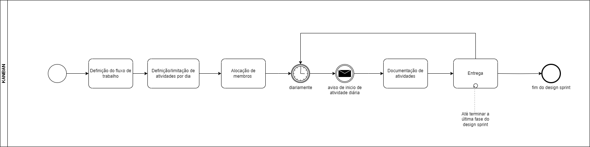
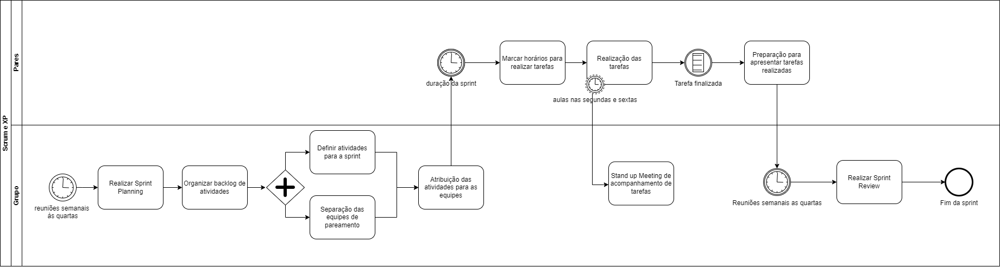
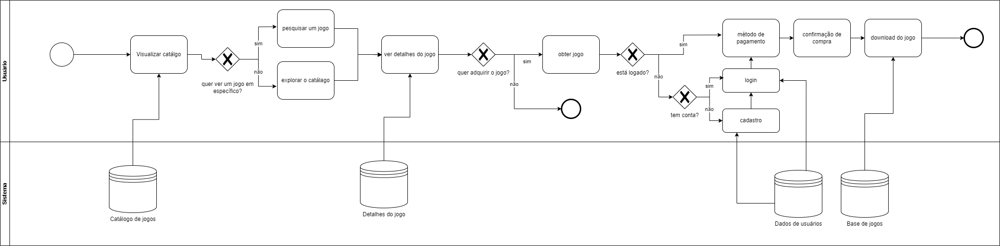
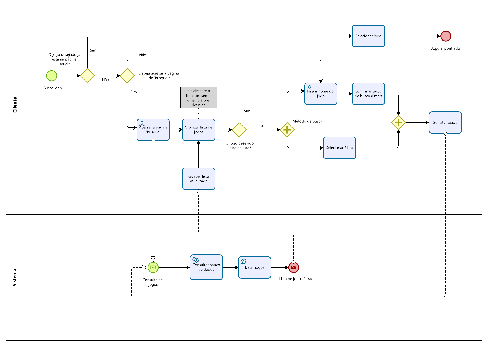

# 1.2. Módulo Processos/Metodologias/Abordagens

## Escolha de metodologias

As metodologias utilizadas foram decididas intuitivamente pela proximidade do grupo com técnicas, abordagens e metodologias já experenciadas. Gerando uma metodologia híbrida das seguintes metodologias:

- SCRUM

  - Sprint planning
  - Review

- KANBAN

  - Quadro de visibilidade, principalmente para o design sprint

- XP

  - Pareamento de membros para realizar atividades
  - Stand Up Meeting ao final de cada aula

- OPENUP
  - Glossário

_As técnicas utilizadas foram revisadas no dia 05/04/2023 com ajuda de todo grupo em sala de aula_

## BPNM das metodologias

_Business Process Model and Notation_ ou BPMN é uma especificação que oferece uma notação gráfica para especificar processos de negócios em um diagrama. Seu objetivo é dar suporte à modelagem de processos de negócios provendo um padrão de notação que pode abordar tanto processos mais simples para stakeholders gerais quanto esquemas complexos e sistemáticos para usuários mais técnicos.

O grupo explorou formas diferentes abordagens ao produzir o BPMN, apesar da matéria solicitar a notação das metodologias utilizadas exploramos também realizar notações caminhando pelos processos do site modelo.

### BPMN KANBAN

Figura 01 - BPMN do kanban

Fonte: Alexia e Luciano Melo

Como o Kanban foi utilizado para acompanhar a semana de design sprint seguimos um modelo um pouco diferente do usual adaptando às necessidades do grupo, mas seguindo os princípios do sistema kanban com a utilização do site Trello: com cartões, colunas e quadros seguindo o carater de limitar a linha produtiva de acordo com a capacidade da equipe e de ter uma representação mais visual do processo.

### BPMN SCRUM

Figura 02 - BPMN do Scrum

Fonte: Alexia e Luciano Melo

### BPMN do fluxo de compra

Figura 03 - BPMN do fluxo de compras

Fonte: Alexia, Luciano Melo, Pedro Henrique, Sabrina e Luciano Ricardo

### BPMN da busca de jogos

Figura 04 - BPMN da busca de jogos

Fonte: Luan Mateus, Luan Melo, Raquel Eucaria e Pedro Barbosa

## Referências

[1] Object Management Group. Graphical Notations For Business Processes. Disponível em: https://www.omg.org/bpmn/. Acesso em: 07/04/2024.

[2] ESPINHA, Roberto Gil. Easily Kanban – Guia completo para gerenciar fluxos de trabalho. Artia, 21 de Dezembro de 2023. Disponível em: https://artia.com/blog/kanban/. Acesso em: 07/04/2024.

## Histórico de versão

| Data       | Versão | Atividade                                        | Responsável      |
| ---------- | ------ | ------------------------------------------------ | ---------------- |
| 05/04/2024 | 1.0    | Modifica template para necessidades do grupo     | Alexia           |
| 05/04/2024 | 1.1    | Adiciona bpmn de fluxo de compra, scrum e kanbam | Alexia e Luciano |
| 07/04/2024 | 1.2    | Adiciona bpmn de busca de jogos                  | Luan Melo        |
| 08/04/2024 | 1.3    | Mudança no padrão das referências                | Marcus Martins   |
