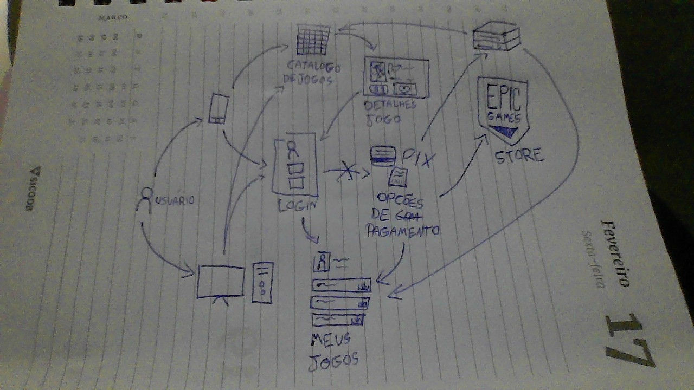
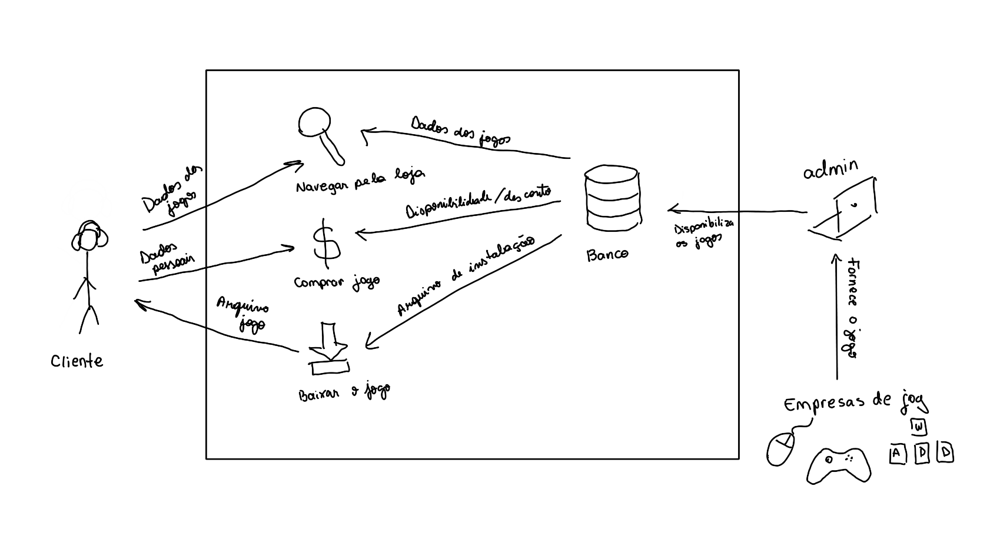

# Etapa Idealizar

## Introdução

### Time de desenvolvimento

- Luan Mateus
- Luciano Ricardo
- Pedro Barbosa
- Raquel Eucaria
- Sabrina Berno

### Qual o principal problema a ser resolvido?

- Jogadores e entusiastas de videogame possuem dificuldade de obter e comprar jogos eletrônicos de forma acessível, rápida e confiável.

## Execução

### 5W2H

A ferramenta 5W2H é um conjunto de questões utilizado para compor planos de ação de maneira rápida e eficiente.

Para responder essas questões o time de desenvolvimento se reuniu para montar a tabela abaixo.

| O quê?                                                 | Como?                                                                                                                                                                                                                      | Onde?                                                   | Quando?                                           | Por que?                                                                                                                           | Quem?                                                         | Quanto Custa?                                          |
| ------------------------------------------------------ | -------------------------------------------------------------------------------------------------------------------------------------------------------------------------------------------------------------------------- | ------------------------------------------------------- | ------------------------------------------------- | ---------------------------------------------------------------------------------------------------------------------------------- | ------------------------------------------------------------- | ------------------------------------------------------ |
| Um site E-commerce para a venda de jogos de videogame. | Por meio de uma interface explicativa, interativa e acessível                                                                                                                                                              | Em um sistema web                                       | A solução se desenvolverá no 1° semestre de 2024. | Facilitar o acesso na compra de jogo digitais de forma satisfatória.                                                               | Alunos da disciplina de Arquitetura e Desenho de Computadores | Horas de desenvolvimento por parte dos desenvolvedores |
| Um site E-commerce para a venda de jogos de videogame. | Por meio de uma interface que garanta visibilidade do status do sistema, correspondência entre o mundo real e o sistema, consistência e padrões, reconhecimento ao invés de memorização, flexibilidade e eficiência de uso | Em um sistema web responsiva em diferentes dispositivos | A solução se desenvolverá no 1° semestre de 2024. | Tornar a compra de jogos digitais menos desgastante, mais acessível e simplificada, assim garantindo uma experiência satisfatória. | Alunos da disciplina de Arquitetura e Desenho de Computadores | Horas de desenvolvimento por parte dos desenvolvedores |

### Rich Pictures

O Rich Picture é uma ferramenta visual utilizada para análise de problemas e apresentação de ideias de situações complexas. Essa técnica permite capturar a complexidade de sistemas, processos e problemas por meio de uma representação visual que inclui elementos gráficos, símbolos, texto e ilustrações. 

Assim foi desenvolvido por cada integrante um Rich Picture com a sua perspectiva de como resolver a problematica em foco. Esses Rich Picture são exibidos a seguir:

Autor: Luan Mateus

Autor: Luciano Ricardo

Autor: Pedro Barbosa

Autor: Raquel Eucaria

Autor: Sabrina Berno

## Histórico de versão

| Data       | Versão | Atividade                        | Responsável     |
| ---------- | ------ | -------------------------------- | --------------- |
| 05/04/2024 | 1.0    | Criando artefato                 | Luan Duarte     |
| 07/04/2024 | 1.1    | Adicionando historico de versões | Luciano Ricardo |
| 07/04/2024 | 1.2    | Complementando seção de execução | Luciano Ricardo |