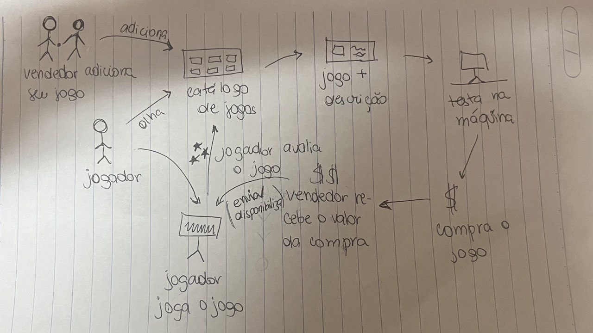

# Etapa Decidir

## Introdução

### Time de desenvolvimento

- Pedro Henrique - Documentador e criador dos Storyboards
- João Morbeck - Documentador e criador das cenas dos Storyboards
- João Schmitz - Criador das cenas dos Storyboards

### Qual o principal problema a ser resolvido?

- Jogadores e entusiastas de videogame possuem dificuldade de obter e comprar jogos eletrônicos de forma acessível, rápida e confiável.

## Metodologia

### Storyboard

Storyboard é uma técnica de planejamento comumente usada em design de interfaces de usuário e desenvolvimento de software para representar visualmente o fluxo de interação do usuário com o sistema. Um storyboard geralmente consiste em uma série de quadros ou wireframes que mostram cada tela ou interface do usuário, juntamente com as ações do usuário e as transições entre essas telas. Esses quadros podem ser desenhados à mão, feitos digitalmente ou criados usando ferramentas específicas de design de software.

Com a escolha dos Rich Pictures que abordem as principais features do projeto, o grupo decidiu desenvolver um storyboard com o objetivo de desenvolver protótipos de baixa fidelidade. O objetivo disso é demonstrar o usuário conflitando com o problema e conseguindo solucioná-lo com o uso do produto de software.

## Execução

Utilizando os Rich Pictures feitos pela Sabrina e pelo Luciano Ricardo, decidimos realizar uma mescla destes dois que possuem detalhes que seriam interessantes de se ter na aplicação, e seriam um diferencial de mercado, .

Figura 01 - Rich Picture feito pela Sabrina.

Figura 02 - Rich Picture feito pelo Luciano Ricardo.

O storyboard produzido possui as principais features apresentadas em ambos os rich pictures e busca trazer os elementos fundamentais de ambos artefatos para apresentar o problema que o usuário deve enfrentar e como a solução proposta pode resolver tais questões.

Figura 03 - Storyboard produzido

As principais features identificadas através do Storyboard são:

- Conta de usuário
- Disponibilização de jogos
- Busca de jogos
- Descrição dos jogos
- Compra de jogos
- Biblioteca de jogos
- Avaliações de jogos
- Quais amigos jogam o jogo
- Testagem de requisitos da máquina (identificar se o computador do cliente executa o jogo)
- Descontos e promoções
- Múltiplas formas de pagamento
