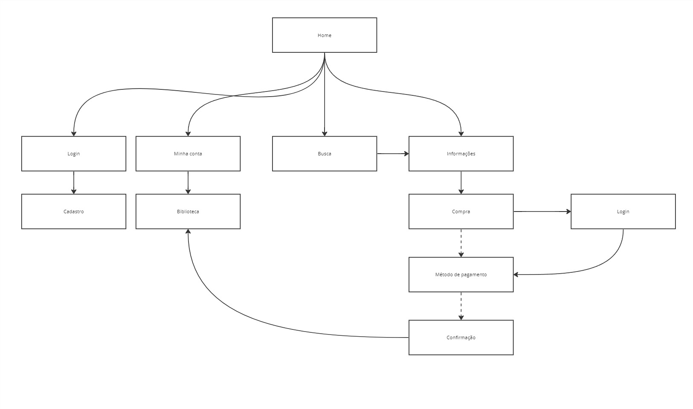
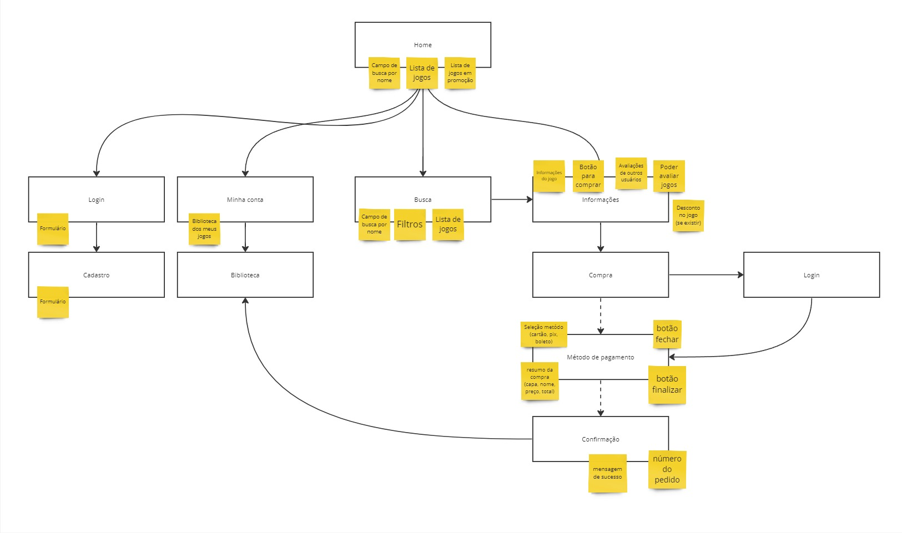

# Etapa Prototipar

## INTRODUÇÃO

### Time de desenvolvimento

- Alexia Naara - Realização do diagrama e Design das interfaces
- Luan Melo - Realização do diagrama, Design das interfaces e Revisão das interfaces
- Raquel Eucaria - Realização do diagrama e Design das interfaces

### Qual o principal problema a ser resolvido?

- Jogadores e entusiastas de videogame possuem dificuldade de obter e comprar jogos eletrônicos de forma acessível, rápida e confiável.

## Arquitetura da Informação

O diagrama de Arquitetura da Informação é uma técnica que visa representar a distribuição das telas no sistema para auxiliar na conexão entre elas e na realização dos principais fluxos da plataforma. Foi produzido o diagrama com base nos BPMN gerados e nas atividades definidas na etapa Decidir.

Depois do definição das telas e das relações entre elas a equipe realizou um brainstorming inicial para entender os elementos que haveriam em cada uma delas. Cada post-it representa uma funcionalidade que deveria existir em sua respectiva tela.

## Prototipação

Na parte da prototipação, foram divididas as telas entre os membros da equipe e utilizada a ferramenta Figma para o trabalho colaborativo. Todas as telas definidas no diagrama foram realizadas e prototipadas, permitindo a interação e navegação entre as interfaces, um fator essencial para a realização dos testes de usabilidade das telas. Segue abaixo a visualização do arquivo final e o protótipo funcional permitindo a interação e navegação.

### Arquivo

<iframe style="border: 1px solid rgba(0, 0, 0, 0.1);" width="800" height="450" src="https://www.figma.com/embed?embed_host=share&url=https%3A%2F%2Fwww.figma.com%2Ffile%2FXRWCtRTQaOmXHwxmyy962F%2FArq%2526Des-Software%3Ftype%3Ddesign%26node-id%3D0%253A1%26mode%3Ddesign%26t%3DLcQWIquYM1bvfMWb-1" allowfullscreen></iframe>

### Protótipo

<iframe style="border: 1px solid rgba(0, 0, 0, 0.1);" width="800" height="600" src="https://www.figma.com/embed?embed_host=share&url=https%3A%2F%2Fwww.figma.com%2Fproto%2FXRWCtRTQaOmXHwxmyy962F%2FArq%2526Des-Software%3Fpage-id%3D0%253A1%26type%3Ddesign%26node-id%3D61-1003%26viewport%3D506%252C217%252C0.1%26t%3DZkgv7WPuVaNFDeMp-1%26scaling%3Dscale-down-width%26starting-point-node-id%3D61%253A1003%26mode%3Ddesign" allowfullscreen></iframe>
