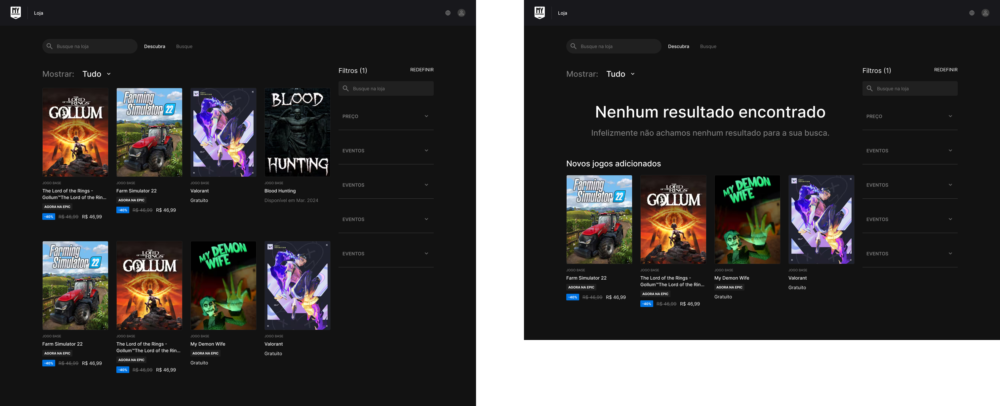

# 1.1.1.4. Etapa Prototipar

## Introdução

### Time de desenvolvimento

- Alexia Naara - Realização do diagrama e Design das interfaces
- Luan Melo - Realização do diagrama, Design das interfaces e Revisão das interfaces
- Raquel Eucaria - Realização do diagrama e Design das interfaces

### Sobre

O protótipo de alta fidelidade é crucial no desenvolvimento de um projeto, proporcionando uma análise avançada das alterações antes da conclusão efetiva. Essa ferramenta possibilita uma avaliação precisa das mudanças em relação às expectativas iniciais, contribuindo para um processo de desenvolvimento mais objetivo e esclarecedor. Dessa forma, foi desenvolvido o protótipo do **My_Ecommerce** com o auxílio da ferramenta Miro e Figma, atendendo as principais tarefas definidas nas etapas anteriores do **design sprint**.

### Qual o principal problema a ser resolvido?

Jogadores e entusiastas de videogame possuem dificuldade de obter e comprar jogos eletrônicos de forma acessível, rápida e confiável.

## Arquitetura da Informação

O diagrama de Arquitetura da Informação é uma técnica que visa representar a distribuição das telas no sistema para auxiliar na conexão entre elas e na realização dos principais fluxos da plataforma. Foi produzido o diagrama (Figura 01) com base nos **BPMN** gerados e nas atividades definidas na **Etapa Decidir**.

Figura 01 - Diagrama 1

Depois do definição das telas e das relações entre elas a equipe realizou um brainstorming inicial para entender os elementos que haveriam em cada uma delas, conforme a Figura 02. Cada post-it representa uma funcionalidade que deveria existir em sua respectiva tela.

<!--  -->

 

<!-- Figura 02 - Diagrama 2 -->

## Telas

Na parte da prototipação, foram divididas as telas entre os membros da equipe e utilizada a ferramenta Figma para o trabalho colaborativo. Todas as telas definidas no diagrama foram realizadas e prototipadas, permitindo a interação e navegação entre as interfaces, um fator essencial para a realização dos testes de usabilidade das telas. Segue abaixo as principais telas desenvolvidas.

### 1. **Telas de Login**

<!--  -->

 
Figura 03 - Telas de Login

### 2. **Telas de Busca**

<!--  -->

 

Figura 04 - Telas de Busca

### 3. **Tela de informação**

<!--  -->

 

Figura 05 - Tela de Informação

### 4. **Telas de Compra**

<!--  -->

Figura 06 - Telas de Compra

### 5. **Todas as telas**

Todas as telas podem ser visualizadas no Iframe 01.

<iframe style="border: 1px solid rgba(0, 0, 0, 0.1);" width="800" height="450" src="https://www.figma.com/embed?embed_host=share&url=https%3A%2F%2Fwww.figma.com%2Ffile%2FXRWCtRTQaOmXHwxmyy962F%2FArq%2526Des-Software%3Ftype%3Ddesign%26node-id%3D0%253A1%26mode%3Ddesign%26t%3Dx1BvEapFNLKeZGlb-1" allowfullscreen></iframe>
 
Iframe 01 - Telas do Protótipo

## Protótipo de Alta Fidelidade

O modelo interativo do protótipo de alta fidelidade pode ser acessado abaixo no Iframe 02.

<iframe style="border: 1px solid rgba(0, 0, 0, 0.1);" width="100%" height="850" src="https://www.figma.com/embed?embed_host=share&url=https%3A%2F%2Fwww.figma.com%2Fproto%2FXRWCtRTQaOmXHwxmyy962F%2FArq%2526Des-Software%3Fpage-id%3D0%253A1%26type%3Ddesign%26node-id%3D61-1003%26viewport%3D506%252C217%252C0.1%26t%3DZkgv7WPuVaNFDeMp-1%26scaling%3Dscale-down-width%26starting-point-node-id%3D61%253A1003%26mode%3Ddesign" allowfullscreen></iframe>
 
Iframe 02 - Protótipo de Alta Fidelidade

## Referências

[1] BARBOSA, Simone; DINIZ, Bruno. Interação Humano-Computador, Editora Elsevier, Rio de Janeiro, 2010. Acesso em: 06/04/2024.

[2] GUIMARAES, Felipe; AELA, Equipe. Arquitetura da Informação: Planejando o Conteúdo da sua Interface. AEA Digital School, 2022. Disponível em: [https://aelaschool.com](<https://aelaschool.com/pt/experienciadousuario/arquitetura-da-informacao-planejando-o-conteudo-da-sua-interface/#:~:text=A%20Arquitetura%20da%20Informa%C3%A7%C3%A3o%20(AI,como%20um%20produto%20deve%20funcionar)>). Acesso em: 06/04/2024.

## Histórico de versão

| Data       | Versão | Atividade                   | Responsáveis                                                                                |
| ---------- | ------ | --------------------------- | ------------------------------------------------------------------------------------------- |
| 06/04/2024 | 1.0    | Criação da documentação     | [Luan Melo](https://github.com/Luanmq) e [Raquel Eucaria](https://github.com/raqueleucaria) |
| 08/04/2024 | 1.1    | Consertando links quebrados | [Luciano Ricardo](https://github.com/l-ricardo) e Marcus Martins                            |
