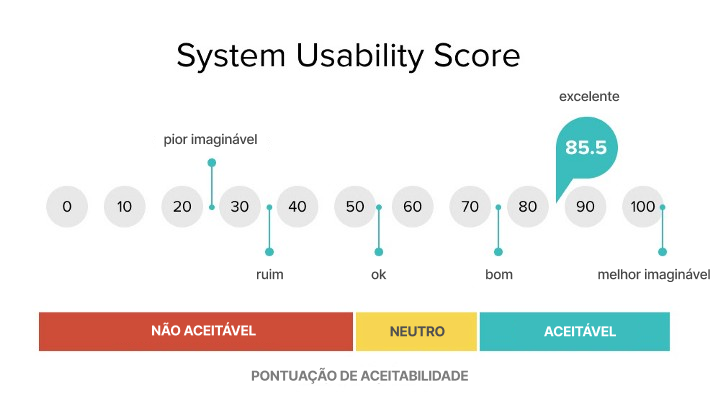
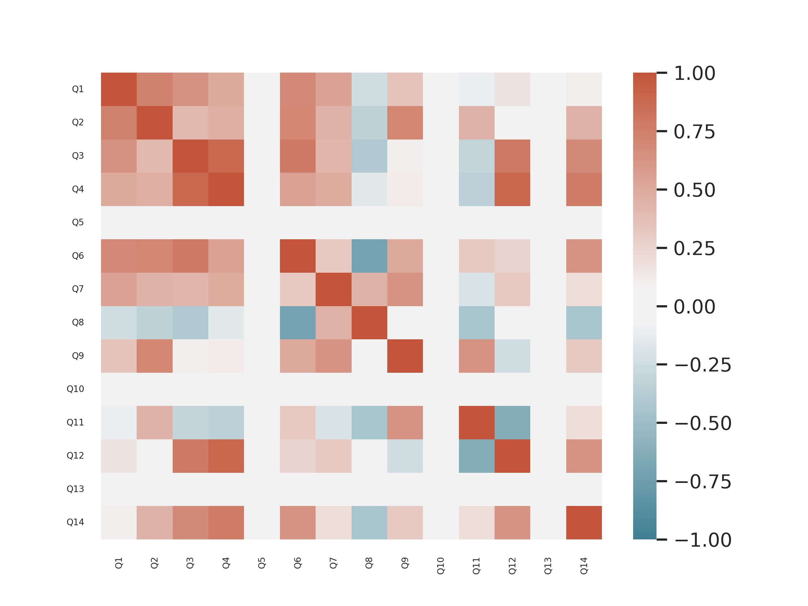

# Etapa Testar

## Introdução

### Time de desenvolvimento

- Luciano de Freitas Melo - Documentador
- Marcus Vinícius - Documentador e realizar entrevistas
- Raquel Eucaria - Documentadora

### Como será feita essa etapa?

Nesta etapa, será conduzida uma validação dos protótipos por meio de entrevistas com os usuários. Após as entrevistas, os participantes serão convidados a preencher um questionário, além de serem observados durante a interação com o protótipo.

Para garantir uma avaliação abrangente, serão utilizadas métricas específicas de usabilidade e experiência do usuário (UX), de forma que o protótipo atenda às necessidades e expectativas dos usuários de forma intuitiva e eficiente.

## Entrevistas

Foram feitas 6 entrevistas com estudantes entre 20 e 22 anos. O propósito das entrevistas era testar a usabilidade do protótipo com base na sequência de tarefas.

As entrevistas foram gravadas de forma consentida apenas para garantir mais precisão na obtenção das métricas, as informações pessoais foram ocultadas preservando suas imagens. Dessa forma, os entrevistados foram nomeados como "Usuário 1" até "Usuário 6".

### Sequência de tarefas

**1. Cadastro na plataforma** - O procedimento de cadastro, login e sair da conta deveria ser completo.

**2. Pesquisa de jogo pela barra de pesquisa** - Usando a barra de pesquisa, o jogador deveria conseguir fazer uma busca, limpar a barra de busca e encontrar o jogo desejado.

**3. Pesquisa de jogo usando filtros** - Para concluir essa tarefa era preciso utilizar os filtros da plataforma durante a pesquisa para encontrar o jogo na página "Busque".

**4. Compra de jogo** - O usuário deveria comprar um jogo e verificar se este estava em sua biblioteca.

**5. Busca de informações sobre jogo** - O objetivo final era saber se o usuário conseguiria encontrar o jogo em sua biblioteca e, ao encontrá-lo, achar a área com suas políticas de privacidade.

## Formulário

Após a realização da entrevista foi passado um formulário, por meio da plataforma Google Form, para cada entrevistado.

### Perguntas

As perguntas estabelecidas para o formulário estão apresentadas na Tabela 01. As perguntas foram feitas de forma quantitativa e, as perguntas do Sistema de Escala de Usabilidade (SUS) estão entre Q4 e Q13.

| ID  | Descrição da Pergunta                                                                                    |
| --- | -------------------------------------------------------------------------------------------------------- |
| Q1  | Qual sua idade?                                                                                          |
| Q2  | Qual seu grau atual de escolaridade? (Fundamental, Médio, Superior, Pós-Graduação, Doutorado )           |
| Q3  | Quão familiar você está com plataformas de e-commerce de jogos? (De 1 a 4)                               |
| Q4  | Eu acho que gostaria de usar esse sistema com frequência. (De 1 a 5)                                     |
| Q5  | Eu acho o sistema desnecessariamente complexo. (De 1 a 5)                                                |
| Q6  | Eu achei o sistema fácil de usar. (De 1 a 5)                                                             |
| Q7  | Eu acho que precisaria de ajuda de uma pessoa com conhecimentos técnicos para usar o sistema. (De 1 a 5) |
| Q8  | Eu acho que as várias funções do sistema estão muito bem integradas. (De 1 a 5)                          |
| Q9  | Eu acho que o sistema apresenta muita inconsistência. (De 1 a 5)                                         |
| Q10 | Eu imagino que as pessoas aprenderão como usar esse sistema rapidamente. (De 1 a 5)                      |
| Q11 | Eu achei o sistema atrapalhado de usar. (De 1 a 5)                                                       |
| Q12 | Eu me senti confiante ao usar o sistema. (De 1 a 5)                                                      |
| Q13 | Eu precisei aprender várias coisas novas antes de conseguir usar o sistema. (De 1 a 5)                   |
| Q14 | Você não concluiu alguma das atividades propostas? (De 1 a 5)                                            |

Tabela 01 - Perguntas quantitativas

Além disso, foram realizadas perguntas qualitativas de melhoras do protótipo, como:

| ID  | Descrição da Pergunta                                                                           |
| --- | ----------------------------------------------------------------------------------------------- |
| QL1 | Se não foi possível concluir uma tarefa, qual foi?                                              |
| QL2 | Para encontrar o jogo você preferiu usar a barra de pesquisa ou a navegação com uso de filtros? |
| QL3 | Alguma expectativa não foi atendida?                                                            |
| QL4 | Gostaria de sugerir alguma alteração no protótipo?                                              |

Tabela 02 - Perguntas qualitativas 

## Respostas

As respostas de cada entrevistados pode ser acompanhada na Tabela 03, abaixo:

| ID Pergunta | Resposta Usuário 1       | Resposta Usuário 2                                                 | Resposta Usuário 3       | Resposta Usuário 4                                                                                                                                                            | Resposta Usuário 5       | Resposta Usuário 6                                                                                                                                                       |
| ----------- | ------------------------ | ------------------------------------------------------------------ | ------------------------ | ----------------------------------------------------------------------------------------------------------------------------------------------------------------------------- | ------------------------ | ------------------------------------------------------------------------------------------------------------------------------------------------------------------------ |
| Q1          | 20                       | 22                                                                 | 21                       | 22                                                                                                                                                                            | 21                       | 21                                                                                                                                                                       |
| Q2          | Médio                    | Superior                                                           | Superior                 | Superior                                                                                                                                                                      | Médio                    | Médio                                                                                                                                                                    |
| Q3          | 2                        | 4                                                                  | 2                        | 4                                                                                                                                                                             | 4                        | 1                                                                                                                                                                        |
| Q4          | 4                        | 5                                                                  | 3                        | 5                                                                                                                                                                             | 4                        | 2                                                                                                                                                                        |
| Q5          | 1                        | 1                                                                  | 1                        | 1                                                                                                                                                                             | 1                        | 1                                                                                                                                                                        |
| Q6          | 4                        | 5                                                                  | 5                        | 5                                                                                                                                                                             | 5                        | 4                                                                                                                                                                        |
| Q7          | 1                        | 1                                                                  | 1                        | 3                                                                                                                                                                             | 1                        | 1                                                                                                                                                                        |
| Q8          | 5                        | 4                                                                  | 4                        | 5                                                                                                                                                                             | 4                        | 5                                                                                                                                                                        |
| Q9          | 1                        | 1                                                                  | 2                        | 2                                                                                                                                                                             | 1                        | 1                                                                                                                                                                        |
| Q10         | 5                        | 5                                                                  | 5                        | 5                                                                                                                                                                             | 5                        | 5                                                                                                                                                                        |
| Q11         | 1                        | 1                                                                  | 2                        | 1                                                                                                                                                                             | 1                        | 1                                                                                                                                                                        |
| Q12         | 5                        | 5                                                                  | 4                        | 5                                                                                                                                                                             | 5                        | 4                                                                                                                                                                        |
| Q13         | 1                        | 1                                                                  | 1                        | 1                                                                                                                                                                             | 1                        | 1                                                                                                                                                                        |
| Q14         | Conclui todas atividades | Conclui todas atividades                                           | Conclui todas atividades | Conclui todas atividades                                                                                                                                                      | Conclui todas atividades | Não conclui todas atividades                                                                                                                                             |
| QL1         | -                        | -                                                                  | -                        | Voltar a página inicial, Utilizar a barra de pesquisa e busca, Usar filtros para pesquisa, Comprar jogos e entrar na minha biblioteca e visualizar a politica de privacidade. | -                        | Não encontrei como adicionar/redefinir filtros de pesquisa.                                                                                                              |
| QL2         | Barra de pesquisa        | Barra de pesquisa                                                  | Barra de pesquisa        | Barra de pesquisa                                                                                                                                                             | Barra de pesquisa        | Barra de pesquisa                                                                                                                                                        |
| QL3         | -                        | -                                                                  | -                        | Foram todas atendidas                                                                                                                                                         | -                        | Para voltar na página principal, eu esperava uma setinha. De início, não raciocinei que podia clicar no botão do canto esquerdo superior. Uma seta seria mais intuitivo. |
| QL4         | -                        | o botão pra minha biblioteca podia ficar do lado do botão "busque" | -                        | Acredito que não                                                                                                                                                              | -                        | Somente a ideia da seta.                                                                                                                                                 |

Tabela 03 - Respostas do Formulário 

## Métricas

As métricas são medidas quantitativas utilizada para avaliar, comparar e acompanhar o desempenho, eficácia, eficiência e qualidade do sistema.

**1. Tempo por tarefa** - Métrica usada para avaliar quanto tempo uma pessoa gasta em uma tarefa específica, sendo medida a partir do momento que é designado a tarefa para o entrevistado até sua conclusão.

**2. Exploração x busca** - Preferência dos usuários ao navegar pela aplicação e encontrar um jogo pela página de navegação ou da barra de pesquisa.

**3. Taxa de erros de usuários** - A taxa de erros diz respeito ao número de cliques que estiveram em discordância com os possíveis caminhos para a conclusão da tarefa.

**4. Taxa de desistência** - A taxa de desistência compreende as tarefas que não conseguiram ser realizadas pelo usuário até que esse desista.

**5. Taxa de conversão** - A Taxa de conversão representa a porcentagem de tarefas realizadas com sucesso.

**6. Escala de usabilidade de sistema (_System Usability Scale_)** - A Escala SUS, ou System Usability Scale, é uma ferramenta utilizada para avaliar a usabilidade do sistema. Ela fornece uma pontuação da usabilidade, de 0 a 100, com base nas perguntas realizadas.

## Resultados

Conforme os registros na tabela 04, podemos identificar o tempo médio para realizar cada tarefa no sistema.

| Usuário              | Tarefa 1 - Cadastro | Tarefa 2 - Busca | Tarefa 3 - Filtro | Tarefa 4 - Compra | Tarefa 5 - Política de privacidade | Média Geral           |
| -------------------- | ------------------- | ---------------- | ----------------- | ----------------- | ---------------------------------- | --------------------- |
| Usuário 1            | 20s                 | 19s              | 33s               | 25s               | 89s                                | **37,2s**             |
| Usuário 2            | 40s                 | 24s              | 27s               | 66s               | 51s                                | **41,6s**             |
| Usuário 3            | 22s                 | 26s              | 38s               | 32s               | 75s                                | **38,6s**             |
| Usuário 4            | 30s                 | 21s              | 64s               | 24s               | 32s                                | **34,2s**             |
| Usuário 5            | 29s                 | 18s              | 37s               | 16ss              | 41s                                | **28,2s**             |
| Usuário 6            | 28s                 | 32s              | 55s               | 28s               | 38s                                | **36,2s**             |
| **Média por tarefa** | **28,16s**          | **23,33s**       | **42,33s**        | **31,83s**        | **54,33s**                         | **36s (média geral)** |

Tabela 04 - Métrica 1 - Tempos das tarefas

### Métrica 1

A média de tempo por tarefa revela que os usuários conseguiram concluir as atividades em um período relativamente curto, com uma média de 36 segundos por tarefa. A agilidade na execução das tarefas pode ser um indicativo positivo da intuitividade e da fluidez do sistema.

### Métrica 2

Os resultados da métrica 2 indicam uma preferência unânime dos usuários pela utilização da barra de pesquisa para encontrar jogos dentro da plataforma, essa escolha destaca a praticidade dessa funcionalidade.

### Métrica 3

Ao todo, foram registrados 14 erros, resultando em uma média de 2,3 erros por usuário. A maioria dos erros ocorreu durante a busca pela informação da política de privacidade, totalizando 9 ocorrências. Além disso, os filtros de pesquisa também geraram dificuldades, registrando 4 erros. Isso sugere uma possibilidade melhoria na acessibilidade ou na visibilidade dessas informações dentro da plataforma.

### Métrica 4

Na métrica de taxa de desistência, observamos que apenas um dos usuários optou por abandonar uma tarefa específica, mais precisamente a relacionada à Área de Busca e Filtragem. Esse índice de desistência representa apenas 3,33% do total de tarefas propostas, indicando uma adesão geral positiva dos usuários em completar as atividades.

### Métrica 5

A métrica 5 revela que a grande maioria das tarefas propostas foi concluída com sucesso pelos usuários, com uma impressionante taxa de conversão de 96,67%. Isso significa que, em quase todas as interações realizadas, os usuários conseguiram completar as tarefas designadas dentro do sistema.

### Métrica 6

Dentro da _Escala SUS_, o protótipo ficou com 92 pontos de média, sendo considerado uma pontuação excelente. Isso sugere que o sistema apresenta uma ótima experiência de usuário, com interfaces intuitivas e funcionalidades bem integradas, como mostra o gráfico da escala na figura abaixo:

Figura 1 - Escala SUS

<!--  -->

Fonte: SUS Acceptability Score. Image credit 10up.com. Traduzido

### Mapa de Calor

Figura 2 - Mapa de calor da correlação de Pearson das questões

<!--  -->

Autor: Marcus Martins

**Correlações observadas:**

- Q3 (Quão familiar você está com plataformas de e-commerce de jogos?) com Q4 (Eu acho que gostaria de usar esse sistema com frequência)

  - Sugere que quanto mais familiarizado o usuário está com plataformas de e-commerce de jogos, maior a probabilidade de ele gostar de usar o sistema com frequência.

- Q4 (Eu acho que gostaria de usar esse sistema com frequência) com Q14 (Você não concluiu alguma das atividades propostas?)

  - Há uma correlação negativa moderada entre essas perguntas. Isso indica que os usuários que expressam mais interesse em usar o sistema com frequência têm menos probabilidade de não concluir as atividades propostas.

- Q6 (Eu achei o sistema fácil de usar) com Q12 (Eu me senti confiante ao usar o sistema)

  - Há uma correlação forte e positiva entre essas duas perguntas. Isso indica que os usuários que acharam o sistema fácil de usar também se sentiram confiantes ao usá-lo.

## Referências

[1] UX Planet. Easily Calculate SUS Score. UX Planet, 26 de Maio de 2020. Disponível em: https://uxplanet.org/easily-calculate-sus-score-a464d753e5aa. Acesso em: 07/04/2024.

[2] UX Collective. O que é o SUS (System Usability Scale) e como usá-lo em seu site. UX Collective, 03 de agosto de 2015. Disponível em: https://brasil.uxdesign.cc/o-que-%C3%A9-o-sus-system-usability-scale-e-como-us%C3%A1-lo-em-seu-site-6d63224481c8. Acesso em: 03/04/2024

## Histórico de versão

| Data       | Versão | Atividade                                                       | Responsável                                      |
| ---------- | ------ | --------------------------------------------------------------- | ------------------------------------------------ |
| 07/04/2024 | 1.0    | Criando artefato                                                | Luciano Freitas                                  |
| 07/04/2024 | 1.1    | Adicionando descrições e mapa de calor                          | Marcus Martins                                   |
| 07/04/2024 | 1.2    | Gráficos e descrições das atividades e métricas das entrevistas | Marcus Martins, Raquel Eucaria e Luciano Freitas |
| 07/04/2024 | 1.3    | Revisão do documento                                            | Luciano Freitas                                  |
