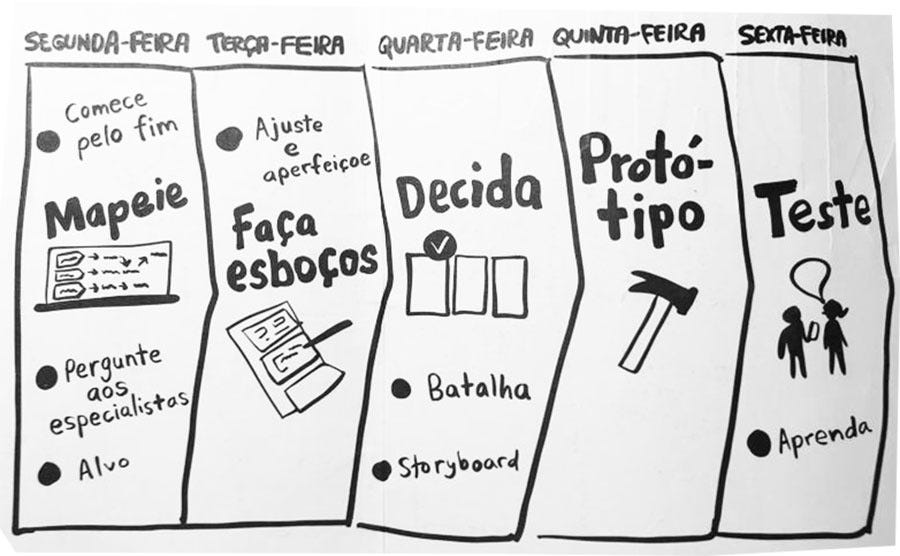

# 1.4. Aplicação do Design Sprint

## Introdução

Nesse primeiro momento foi realizado a elaboração de alguns artefatos com o objetivo de definir a base e o escopo do projeto. Para isso, foi utilizada uma adaptação da design sprint, que será melhor explicada no presente documento.

## Design Sprint

A design sprint é um processo de 5 dias proposto pela Google Venture como uma maneira de responder questões críticas de negócio, isso se dá por meio do desenho, prototipagem e teste de ideias com clientes. Cada um dos dias da semana representa uma etapa desse processo, da seguinte forma:

- Segunda (Mapeie): é feito um panorama geral para a semana, se escolhe um desafio a ser superado a longo-prazo que é mapeado até se encontrar um objetivo que possa ser completado até o fim da semana.
- Terça (Faça esboços): após se entender o problema na segunda, na terça o foco é no desenho de soluções. Os integrantes da equipe colaboram com seu ponto de vista para a criação de esboços da solução.
- Quarta (Decida): aqui é feita a decisão de qual será a solução adotada dentre o catálogo elaborado na terça, logo após é elaborado um storyboard que servirá de passo a passo para o protótipo.
- Quinta (Protótipo): finalmente é feita a elaboração do protótipo que resolva o desafio escolhido no início da semana.
- Sexta (Teste): por último, são feitos testes de usabilidade, por meio de entrevistas, para entender a eficiência do protótipo.

## Metodologia

No contexto do projeto, uma adaptação da design sprint foi utilizada para guiar a construção de alguns artefatos e a subsequente solução de um dado problema. As etapas não seguiram o modelo de dias consecutivos de forma exata, mas sim etapas em que artefatos eram elaborados em conjunto com um determinado objetivo em mente. 

### 1 - Mapeie

[Etapa Mapear](/Base/1.4.1.Mapear.md)

Nessa primeira etapa, foi feita a elaboração de um mapa mental para definição do escopo do projeto e identificação de possíveis obstáculos na utilização do sistema. Aqui foi definido um desafio a ser superado a longo prazo que é a “**dificuldade do usuário encontrar os produtos desejados**“, após isso escolhemos uma pequena parte desse problema para buscar solucionar nesse ciclo da Design Sprint, que é a “**dificuldade de encontrar informações sobre um produto**“. Logo após, foi feita a elaboração de [léxicos](https://unbarqdsw2023-2.github.io/2023.2_G7_ProjetoMagazineLuiza/#/Base/lexicos) para ajudar a entender ainda melhor os conceitos inerentes ao ambiente do sistema e reconhecer os termos peculiares ao seu contexto social.

Posteriormente, foi feita a elaboração de um [5W2H](https://unbarqdsw2023-2.github.io/2023.2_G7_ProjetoMagazineLuiza/#/Base/5W2H) para detalhar melhor o problema da “**dificuldade de encontrar informações sobre um produto**“ e começar a pensar em sua possível solução. Para finalizar essa etapa, foi traçado um [plano de risco e tempo](https://unbarqdsw2023-2.github.io/2023.2_G7_ProjetoMagazineLuiza/#/Base/plano-risco-tempo) para auxiliar a parte de gerenciamento do projeto, de maneira que se possa ter um planejamento maior da execução das etapas posteriores.

### 2 - Faça esboços

[Etapa Idealizar](https://www.notion.so/Etapa-Idealizar-c8f8efcb9d254d67a3e95202f95155fa?pvs=21)

Tomando o partido do brainstorming utilizado na elicitação de possíveis problemas na etapa anterior, na fase Sketch, o time decidiu utilizar o artefato [5W2H](https://www.notion.so/93efe0ced82042c08d0ddfe48d3708c3?pvs=21) para diminuir a abstração do problema e ter um conhecimento melhor a respeito da solução que resolve o impasse. Dessa forma, quatro pessoas se reuniram para construí-lo. Ademais, a equipe decidiu elaborar diferentes [rich pictures](https://www.notion.so/93efe0ced82042c08d0ddfe48d3708c3?pvs=21), com pontos de vista distintos, de modo, que sirvam de insumos para a próxima fase (Decision).

### 3 - Decida

[Etapa Decidir](https://www.notion.so/Etapa-Decidir-2f699cb0521b4b2791601f1b8d5045ba?pvs=21)

A partir dos artefatos produzidos na etapa anterior, foi decidido sobre qual rich picture deveria ser escolhido como base para o storyboard, visto que o storyboard funciona como uma extensão das questões apresentadas no rich picture e também como um protótipo de baixa fidelidade inicial. Todos os artefatos tinham algo à acrescentar ao storyboard e com isso tornou-se difícil a escolha de apenas um para se basear, portanto foi optado por realizar uma mescla de dois rich pictures com mais detalhes e pontos interessantes para o projeto.

### 4 - Protótipo

Nessa etapa, foi feita a elaboração do [protótipo](https://unbarqdsw2023-2.github.io/2023.2_G7_ProjetoMagazineLuiza/#/Base/Prototipos) com base no fluxo do [storyboard](https://unbarqdsw2023-2.github.io/2023.2_G7_ProjetoMagazineLuiza/#/Base/storyboard).

### 5 - Teste

Por fim, o [protótipo](https://unbarqdsw2023-2.github.io/2023.2_G7_ProjetoMagazineLuiza/#/Base/Prototipos) foi válidado com um cliente por meio de um [teste de usabilidade](https://unbarqdsw2023-2.github.io/2023.2_G7_ProjetoMagazineLuiza/#/Base/validacao-prototipo) em forma de entrevista.

## Justificativa da escolha dos artefatos

### 5W2H

O método 5W2H representa uma valiosa ferramenta de gestão de qualidade, que se mostra altamente eficaz na análise e solução de problemas de maneira eficiente. Ele estabelece um estrutura para a coleta de informações relevantes e a construção de um modelo que facilita a clarificação das etapas práticas a serem tomadas, visando garantir uma resolução satisfatória. Esse método se fundamenta em sete perguntas-chave: “o que”, “por quê”, “onde”, “quando”, “quem”, “como” e “quanto”. Ao abordar cada uma destas perguntas, é possível descrever o problema com uma precisão notável, além de identificar as ações necessárias para resolvê-lo. O 5W2H se revela como uma ferramenta de simplicidade e acessibilidade notáveis, aplicável em diversos tipos de projetos. Ele simplifica a gestão, fomenta uma comunicação transparente e, assim, aprimora substancialmente as chances de êxito, uma vez que todos os envolvidos compartilham uma compreensão unificada dos objetivos e do escopo do projeto.

### Mapa Mental

O uso de Mapas Mentais para o nosso projeto é justificado pela sua capacidade de visualizar informações complexas, ideias interconectadas e tarefas relacionadas de forma clara e organizada. Isso promove uma compreensão mais profunda e facilita o planejamento e a comunicação.

### Diagrama Causa-Efeito

O diagrama causa-efeito é uma ferramenta de gestão de qualidade que ajuda a identificar e analisar as causas subjacentes de um problema ou desafio. Ele organiza as informações de forma clara e visual, permitindo que a equipe identifique as principais áreas de impacto e as relações entre as variáveis. Isso é fundamental para a resolução eficaz de problemas e para melhorar processos. O diagrama causa-efeito é valioso para tomada de decisões informadas e implementação de soluções direcionadas, melhorando a eficiência e eficácia do projeto. Ele é uma ferramenta simples e acessível que pode ser usada em diferentes tipos de projetos.

### Rich Picture

O uso de Rich Pictures para o nosso projeto é justificado pela sua capacidade de criar uma representação visual rica e detalhada de um contexto complexo, destacando aspectos relevantes, interações e stakeholders. O Rich Picture permite uma compreensão mais profunda do ambiente em que o projeto está inserido, identificando atores-chave e suas relações. Ele é uma ferramenta simples e acessível que pode ser usada em diferentes tipos de projetos.

### Léxicos

Os artefatos “léxicos” foram escolhidos para o projeto porque são essenciais para a definição precisa e compartilhada da terminologia específica do projeto. Esse objeto evita malentendidos e ambiguidades na comunicação entre membros da equipe, parceiros e interessados. A criação de léxicos também ajuda a tornar a linguagem usada no projeto uniforme, tornando mais fácil para todos os envolvidos entender e usar os termos de maneira consistente. Isso é essencial para o sucesso geral do projeto e para a clareza e eficácia da comunicação.

### Planos de Risco e Tempo

O uso de planos de Risco e Tempo no projeto é justificado pela necessidade de gerenciar de forma eficaz os elementos críticos de qualquer empreendimento. O plano de Risco ajuda a identificar, avaliar e mitigar potenciais problemas que podem afetar o projeto, reduzindo incertezas e impactos negativos. Enquanto isso, o plano de Tempo estabelece um cronograma claro, permitindo uma alocação eficiente de recursos e garantindo que o projeto seja concluído dentro do prazo estipulado. Ambos os planos são essenciais para minimizar contratempos e assegurar o sucesso geral do projeto.

## Conclusão

Ao longo deste trabalho, empregamos metodologias ágeis como SCRUM e XP, juntamente com uma adaptação do design sprint, para abordar e buscar solucionar um desafio específico em nosso projeto: a dificuldade do usuário em encontrar informações sobre um produto. Utilizamos uma variedade de ferramentas e técnicas para entender o problema, gerar soluções potenciais, tomar uma decisão informada sobre a melhor solução e criar um protótipo para testar sua eficácia. Continuaremos a aplicar essas abordagens à medida que avançamos no projeto, sempre com o objetivo de melhorar a experiência do usuário.