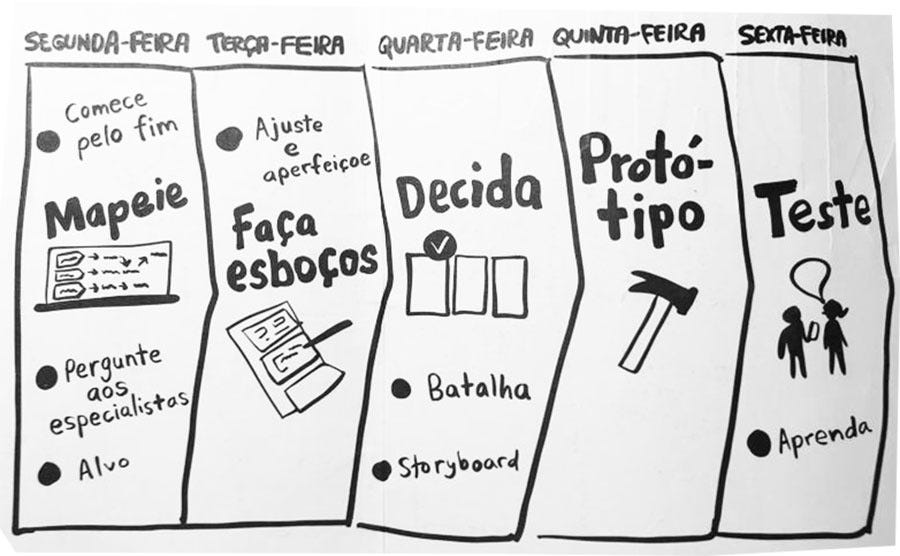

# 1.1.1. Aplicação do Design Sprint

## Introdução

Nesse primeiro momento, foi realizado a elaboração de alguns artefatos com o objetivo de definir a base e o escopo do projeto. Para isso, foi utilizada uma adaptação da design sprint, que será melhor explicada no presente documento.

## Design Sprint

A Design Sprint, concebida pela Google Ventures, é um processo de cinco dias destinado a resolver desafios empresariais essenciais. Esse método inclui a geração de ideias, a criação de protótipos e a validação com os clientes. Cada dia da semana se concentra em uma etapa distinta desse procedimento, possibilitando uma abordagem organizada e eficaz para encontrar soluções.

- Mapear (01/04): é feito um compilado de insights com o auxílio de técnicas de Elicitação (brainstorming, cinco porquês, etc.). A ideia é debater aspectos da solução computacional desejada para levantar o escopo da solução.
- Idealizar (02/04): após levantar as ideias e definir o problema no dia anterior, agora o foco é em desenhar as soluções. Aqui, os membros do grupo devem mostrar seus pontos de vista de solução para o problema através do Rich Picture
- Decidir (03/04): no terceiro dia acontece a decisão da melhor solução com base nos desenhos feitos na Terça-Feira. Após, é feito um storyboard para guiar o desenvolvimento do protótipo que será feito no próximo dia
- Prototipar (04/04): agora o protótipo pode, finalmente, ser feito de forma que resolva o problema levantado no início
- Validar (05/04): com o protótipo pronto, partimos para os testes, com o intuito de saber se a solução atendeu às necessidades dos usuários

## Metodologia

De acordo com a divisão de dias estabelecida na definição de Design Sprint, foram definidos os artefatos a serem entregues durante esse período. A seguir está o detalhamento de cada dia da Design Sprint:

### Mapear

> Segunda-feira, 01/04/2024

Na etapa de Mapear do Design Sprint, a equipe identificou problemas nos E-commerces de jogos digitais, como falta de atualização sobre jogos, deficiências no suporte e dificuldades de compra. Eles também definiram o público-alvo, analisaram concorrentes e utilizaram técnicas como brainstorming e os Cinco Porquês para aprofundar a compreensão dos problemas. Por fim, criaram um caminho crítico que descreve o processo de compra de jogos pelos usuários.

### Idealizar

> Terça-feira, 02/04/2024

Na etapa de Idealizar, a equipe esboçou planos para criar um site de E-commerce para a venda de jogos de videogame, com interfaces explicativas e interativas, responsivas em diferentes dispositivos, utilizando o 5W2H para a especificação da problemática explicitada na etapa anterior. Além disso, cada membro da equipe contribuiu com Rich Pictures, fornecendo perspectivas visuais sobre a solução proposta.

### Decidir

> Quarta-feira, 03/04/2024

Na etapa de Decidir do Design Sprint, a equipe optou por desenvolver um storyboard como parte da metodologia escolhida. Utilizando os Rich Pictures criados, o storyboard resultante incorporou as principais features identificadas, permitindo demonstrar como a solução proposta pode resolver os problemas identificados, auxiliando na tomada de decisão e no desenvolvimento de protótipos.

### Prototipar

> Quinta-feira, 04/04/2024

Na etapa de Prototipar, a equipe montou um protótipo usando a ferramenta do figma para simular o fluxo do usuário analisando as interações consideradas mais relevantes pelo grupo.

### Testar

> Sexta-feira, 05/04/2024

Na etapa de Testar, a equipe fez seis entrevistas de usabilidade com o protótipo criado que, ao fim da execução, os entrevistados foram convidados a responder um formulário sobre a experiência anterior, abordando o Sistema de Escala de Usabilidade (_SUS_) e perguntas qualitativas. Ao fim, os dados obtidos foram devidamente analisados e correlacionados.

## Histórico de Versão

| Data       | Versão | Atividade                        | Responsável           |
| ---------- | ------ | -------------------------------- | --------------------- |
| 03/04/2024 | 1.0    | Cria página                      | Pedro Henrique        |
| 04/04/2024 | 1.1    | Adiciona etapa decidir           | João Morbeck          |
| 04/04/2024 | 1.2    | Adiciona etapa idealizar         | Luan Matheus          |
| 04/04/2024 | 1.3    | Especifica dia da sprint         | Pedro Barbosa         |
| 05/04/2024 | 1.4    | Corrige Imagem                   | Marcus e João Morbeck |
| 07/04/2024 | 1.5    | Adicionando historico de versões | Luciano Ricardo       |
| 07/04/2024 | 1.6    | Modifica histórico de versão     | Alexia                |
| 08/04/2024 | 1.6    | Modifica histórico de versão     | Marcus Martins        |
