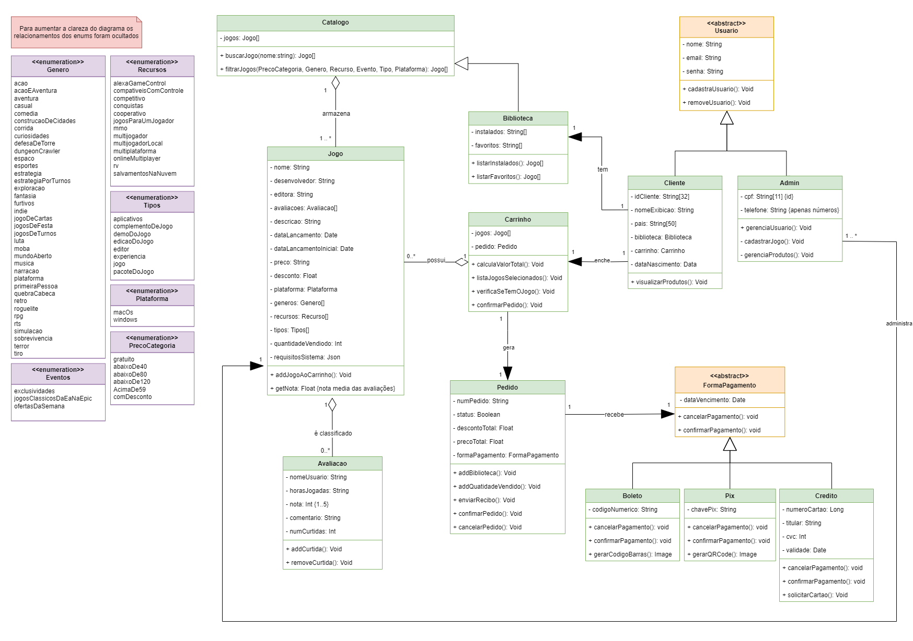
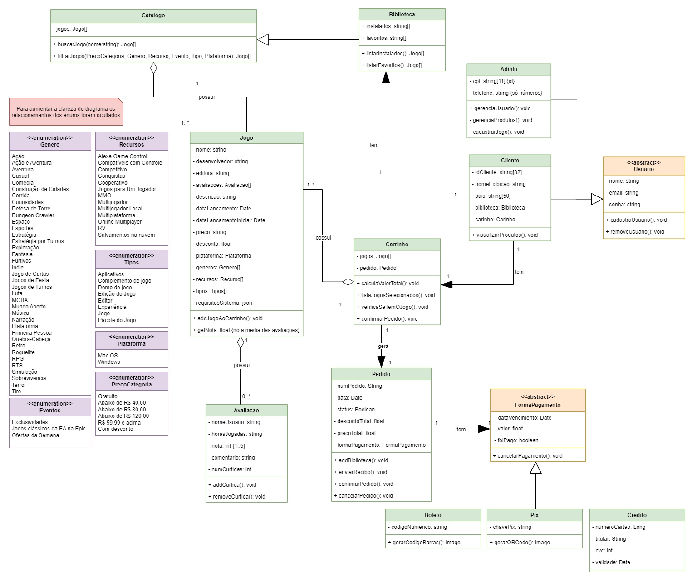

# 2.1.1. Notação UML – Diagramas Estáticos

**Foco_01:** Modelagem UML Estática

Entrega Mínima: 1 Modelo Estático (ESCOPO: Diagrama de Classes; Diagrama de Pacotes; Diagrama de Componentes ou Diagrama de Implantação).

Apresentação (em sala) explicando o modelo estático especificado, com:
(i) rastro claro aos membros participantes (MOSTRAR QUADRO DE PARTICIPAÇÕES);
(ii) justificativas & senso crítico sobre o modelo;
(iii) breve apresentação do modelo estático elaborado;
e (iv) comentários gerais sobre o trabalho em equipe.
Tempo da Apresentação: +/- 10min. Recomendação: Apresentar diretamente via Wiki ou GitPages do Projeto.

A Wiki ou GitPages do Projeto deve conter um tópico dedicado ao Módulo Notação UML – Diagrama Estático, com 1 modelo, histórico de versões, referências, e demais detalhamentos gerados pela equipe nesse escopo.

## Diagrama de Classes

Um diagrama de classes UML é uma ferramenta fundamental para a modelagem de sistemas orientados a objetos e é um dos seis modelos de diagramas estruturais. Dependendo da complexidade do sistema, é possível fazer apenas um diagrama de classes para modelar o sistema inteiro ou vários diagramas para modelar os componentes do sistema. Como será visto mais adiante nesse projeto, utilizamos um único diagrama de classes para representar nosso sistema. O diagrama de classes tem o objetivo de modelar objetos de um sistema ou subsistema, assim exibindo as relações que eles têm e descrevendo o que cada objeto faz e o serviço que eles fornecem. E ao final de sua concepção é apresentado uma estrutura estática de um sistema, visualização as classes, seus atributos, métodos e as relações entre elas.

### Versão 6.0

1. Mudança das cardinalidades e relações.
   - Percebemos que algumas cardinalidades e relações entre classes estavam completamente erradas.
2. Cria relação Admin com o Jogo.
   - Identificamos depois de uma análise da quinta versão que estava faltando a relação entre Admin e Jogo.

<strong>Figura 06 - Diagrama de Classes - V6.0 </strong>

### Versão 5.0

1. Mudança das classes Recurso, Categoria e Genero.
   - Mudamos essas classes para enumeração para ficar com um entendimento melhor das possibilidades de valores para cada classe, assim facilitando na hora da implementação e mudamos o nome da classe Categoria para Tipo.
2. Inclusão das classes CategoriaPreço, Tipo, Plataforma e Eventos.
   - Incluímos essas três classes de enumeração, pois eram atributos que estavam dentro da classe Jogo e precisávamos de um entendimento melhor dos possíveis valores que cada uma delas poderia ter, assim facilitando na hora da implementação.
3. Exclusão da classe Fornecedor.
   - Identificamos que era uma classe que não precisava estar dentro do nosso escopo do projeto, por isso a tiramos, mas como os atributos dela eram importantes, colocamos eles na classe Jogo.
3. Mudança do relacionamento da classe Biblioteca.
   - Percebemos que fazia muito mais sentido a classe Biblioteca ter o relacionamento com o catálogo do que com jogo, pois a biblioteca é a mesma coisa que o catálogo, mas com a mudança de ser apenas com os jogos que o usuário possui.

<strong>Figura 05 - Diagrama de Classes - V5.0 </strong>

### Versão 4.0

1. Inclusão das classes Categoria, Recurso, Fornecedor e Genero.
   - Identificamos que seria melhor para a divisão do nosso diagrama incluir essas três classes ao invés da Descricao e Informacao do jogo.
2. Inclusão das classes Pix, Boleto e Crédito.
   - Com uma análise do diagrama da versão 3 percebemos que tínhamos esquecido de adicionar as formas de pagamento, assim adicionamos essas três classes que herdam os atributos e métodos da classe Pagamento.
3. Alteração do nome da classe ClienteJogo para Biblioteca.

<strong>Figura 04 - Diagrama de Classes - V4.0 </strong>

### Versão 3.0

Após a segunda entrega e com conversas com a professora, percebemos que o nosso diagrama de classes está muito simplificado e com muitos erros. E a partir disso conseguimos ver muitas melhorias e novas classes para o nosso diagrama.

1. Inclusão das classes Cliente e Administrador.
   - Identificamos que no nosso sistema estava faltando o administrador e é uma classe muito importante ao sistema, com isso adicionamos as classes Cliente e Admin, herdando alguns atributos e métodos da nossa classe Usuário.
2. Inclusão da classe ClienteJogo.
   - Identificamos que apenas um atributo dentro de Usuário (que agora é o Cliente) para guardar os jogos do cliente estava muito superficial. Neste contexto, construímos essa nova classe que tem a relação de cliente com jogo, assim ficando mais fácil a compreensão dessa relação e também a busca para saber quais jogos um cliente possui. 
3. Inclusão das classes Descricao do jogo e Informacoes do jogo.
   - Identificamos que ficava melhor separar certos atributos que estavam na classe Jogo. Com isso percebemos que os atributos gênero, descrição e categoria são individuais de cada jogos e colocamos eles na classe Descricao do Jogo, também foi notado que os atributos plataforma, desenvolvedor, editora e dataLacamento podem se repetir quando um jogo são desenvolvidos pela mesma empresa e colocamos eles na classe Informacoes do jogo.
4. Inclusão da classe Avaliacao.
   - Identificamos com a análise dos nossos artefatos da entrega 1 que tínhamos esquecido de adicionar as avaliações do jogo, portanto criamos a classe Avaliacao para suprir essa demanda.
5. Inclusão das classes Pedido e Pagamento.
   - Identificamos que a nossa classe Carrinho estava muito sobrecarregada, com muitas funções que não faziam sentido estar dentro dela. Desta forma, criamos as classes Pagamento e Pedido para deixar melhor dividido os atributos e os métodos.

<strong>Figura 03 - Diagrama de Classes - V3.0 </strong>

### Versão 2.0

**Modificações Realizadas**

Durante a criação do diagrama de sequência, identificamos algumas melhorias que poderiam ser aplicadas ao diagrama de classes para melhor refletir a funcionalidade do sistema. As principais modificações incluem:

1. Inclusão do Atributo jogosPossuidos na Classe Usuário
   - Identificamos que é importante armazenar os jogos que o usuário possui para facilitar o gerenciamento de sua biblioteca de jogos.
2. Carrinho para Um Único Jogo:
   - Decidimos que cada carrinho será específico para um único jogo, simplificando a lógica de compra e garantindo que o carrinho seja criado quando um jogo for comprado.
3. Refatoração dos relacionamentos
   - Catálogo - Jogo: Os catálogos são utilizados para organizar e agrupar jogos de acordo com critérios específicos, como gênero, plataforma, preço, etc.
   - Usuário - Jogo: Os usuários podem possuir jogos que compraram ou adquiriram de outras maneiras. Um jogo pode ser possuído por vários usuários
   - Usuário - Carrinho: Um carrinho é criado por um usuário.
   - Carrinho - Jogo: Um carrinho pode conter um jogo.

<strong>Figura 01 - Diagrama de Classes - V2.0 </strong>

### Versão 1.0

No diagrama de classes original (versão 1.0), foram especificadas as classes principais do sistema, seus atributos e os relacionamentos necessários para a representação estática do projeto. Essa versão serviu como base para as melhorias implementadas na versão 2.0.

<strong>Figura 02 - Diagrama de Classes - V1.0 </strong>

## Histórico de versão

| Data       | Versão | Atividade                                | Responsável                                                                             |
| ---------- | ------ | ---------------------------------------- | --------------------------------------------------------------------------------------- |
| 08/07/2024 | 1.0    | Adiciona descrição e Diagrama de Classes | [Marcus](https://github.com/marcusmartinss) e [João Matheus](https://github.com/JoaoSchmitz) |
| 15/07/2024 | 2.0    | Terceira versão do diagrama de classes | [Luciano Freitas](https://github.com/luciano-freitas-melo), [Pedro Cabeceira](https://github.com/pkbceira03) e [Sabrina](https://github.com/sabrinaberno)  |
| 15/07/2024 | 3.0    | Quarta versão do diagrama de classes | [Pedro Barbosa](https://github.com/pedrobarbosaocb),  [Pedro Cabeceira](https://github.com/pkbceira03) e [Raquel](https://github.com/raqueleucaria)  |
| 16/07/2024 | 4.0    | Quinta versão do diagrama de classes | [Luciano Ricardo](https://github.com/l-ricardo) e [Raquel](https://github.com/raqueleucaria)  |
| 17/07/2024 | 5.0    | Sexta versão do diagrama de classes | [Luciano Ricardo](https://github.com/l-ricardo), [Pedro Henrique](https://github.com/phmelosilva) e [João Pedro](https://github.com/uMorbeck) |
| 17/07/2024 | 5.1    | Revisão em reunião |[João Pedro](https://github.com/uMorbeck),  [Luciano Ricardo](https://github.com/l-ricardo),[Marcus](https://github.com/marcusmartinss), [Pedro Barbosa](https://github.com/pedrobarbosaocb), [Pedro Cabeceira](https://github.com/pkbceira03), [Pedro Henrique](https://github.com/phmelosilva) e [Raquel](https://github.com/raqueleucaria)  |
| 19/07/2024 | 5.2   | Muda texto de introdução | [Pedro Cabeceira](https://github.com/pkbceira03) |

## Referências

[1] Professora Millene Serrano - VideoAula - Diagrama de Classe. Disponível em: <https://unbbr-my.sharepoint.com/personal/mileneserrano_unb_br/_layouts/15/stream.aspx?id=%2Fpersonal%2Fmileneserrano%5Funb%5Fbr%2FDocuments%2FArqDSW%20%2D%20V%C3%ADdeosOriginais%2F05b%20%2D%20VideoAula%20%2D%20DSW%2DModelagem%20%2D%20Diagrama%20de%20Classe%2Emp4&ga=1&referrer=StreamWebApp%2EWeb&referrerScenario=AddressBarCopied%2Eview%2E20a4f50d%2D7c72%2D4249%2Da471%2Dded054aee7a2>. Acesso em: 07 jul. 2024.

[2] IBM - Diagramas de Classes - Rational Software Architect Standard Edition. Disponível em: <https://www.ibm.com/docs/pt-br/rsas/7.5.0?topic=structure-class-diagrams>. Acesso em: 08 jul. 2024.
