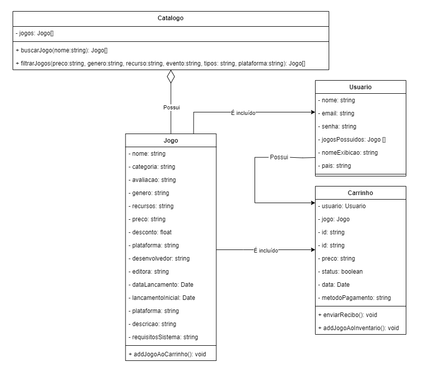
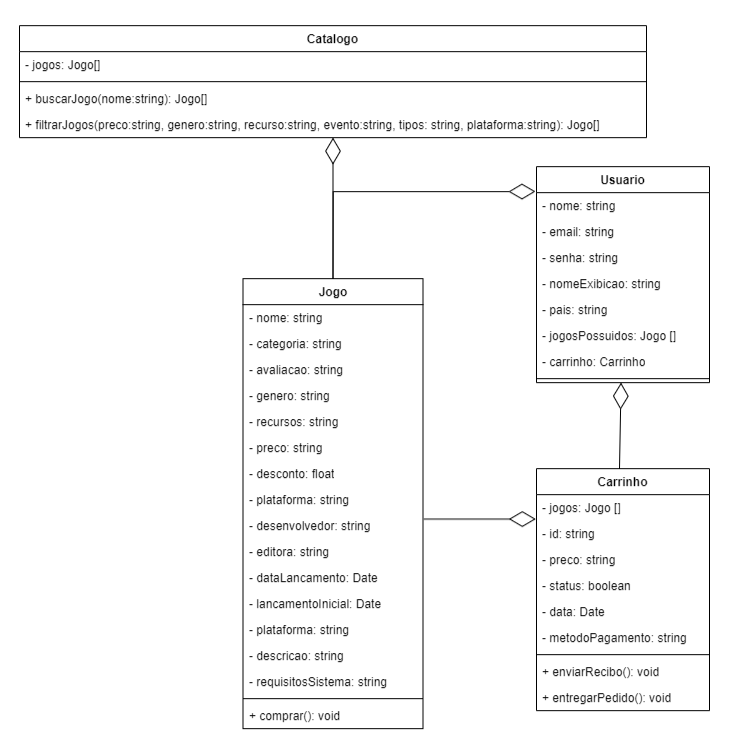

# 2.2.1. Notação UML – Diagramas Estáticos

## Diagrama de Classes

Um diagrama de classes UML é uma ferramenta fundamental para a modelagem de sistemas orientados a objetos. Ele representa a estrutura estática de um sistema, visualizando as classes, seus atributos, métodos e as relações entre elas.

### Versão 2.0

**Modificações Realizadas**

Durante a criação do diagrama de sequência, identificamos algumas melhorias que poderiam ser aplicadas ao diagrama de classes para melhor refletir a funcionalidade do sistema. As principais modificações incluem:

1. Inclusão do Atributo jogosPossuidos na Classe Usuário
   - Identificamos que é importante armazenar os jogos que o usuário possui para facilitar o gerenciamento de sua biblioteca de jogos.
2. Carrinho para Um Único Jogo:
   - Decidimos que cada carrinho será específico para um único jogo, simplificando a lógica de compra e garantindo que o carrinho seja criado quando um jogo for comprado.
3. Refatoração dos relacionamentos
   - Catálogo - Jogo: Os catálogos são utilizados para organizar e agrupar jogos de acordo com critérios específicos, como gênero, plataforma, preço, etc.
   - Usuário - Jogo: Os usuários podem possuir jogos que compraram ou adquiriram de outras maneiras. Um jogo pode ser possuído por vários usuários
   - Usuário - Carrinho: Um carrinho é criado por um usuário.
   - Carrinho - Jogo: Um carrinho pode conter um jogo.

<strong>Figura 01 - Diagrama de Classes - V2.0 </strong>

### Versão 1.0

No diagrama de classes original (versão 1.0), foram especificadas as classes principais do sistema, seus atributos e os relacionamentos necessários para a representação estática do projeto. Essa versão serviu como base para as melhorias implementadas na versão 2.0.

<strong>Figura 02 - Diagrama de Classes - V1.0 </strong>

## Histórico de versão

| Data       | Versão | Atividade                                | Responsável                                                                             |
| ---------- | ------ | ---------------------------------------- | --------------------------------------------------------------------------------------- |
| 08/07/2024 | 1.0    | Adiciona descrição e Diagrama de Classes | [Marcus](https://github.com/marcusmartinss) e [João S.](https://github.com/JoaoSchmitz) |

## Referências

[1] Professora Millene Serrano - VideoAula - Diagrama de Classe. Disponível em: <https://unbbr-my.sharepoint.com/personal/mileneserrano_unb_br/_layouts/15/stream.aspx?id=%2Fpersonal%2Fmileneserrano%5Funb%5Fbr%2FDocuments%2FArqDSW%20%2D%20V%C3%ADdeosOriginais%2F05b%20%2D%20VideoAula%20%2D%20DSW%2DModelagem%20%2D%20Diagrama%20de%20Classe%2Emp4&ga=1&referrer=StreamWebApp%2EWeb&referrerScenario=AddressBarCopied%2Eview%2E20a4f50d%2D7c72%2D4249%2Da471%2Dded054aee7a2>. Acesso em: 07 jul. 2024.

[2] IBM - Diagramas de Classes - Rational Software Architect Standard Edition. Disponível em: <https://www.ibm.com/docs/pt-br/rsas/7.5.0?topic=structure-class-diagrams>. Acesso em: 08 jul. 2024.
