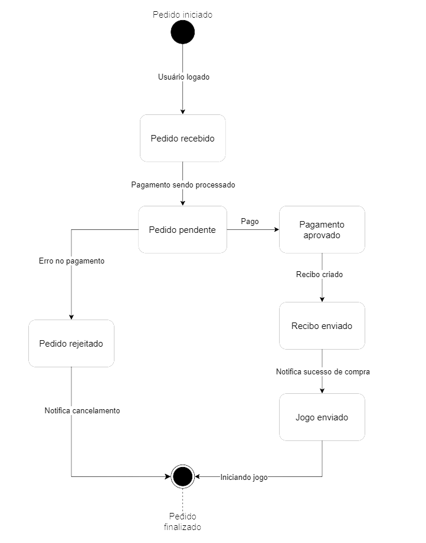

# 2.1.2. Notação UML – Diagramas Dinâmicos

## Introdução

Os diagramas de estado e de atividades são diagramas dinâmicos que representam o comportamento do sistema. Com base neles, o comportamento do [fluxo de compra](../Base/1.2.ProcessosMetodologiasAbordagens?id=bpmn-do-fluxo-de-compra) será representado.

## Metodologia

O diagrama de máquina de estado mostra o comportamento discreto de uma parte do sistema projetado, por meio de transições de estado finitas. Já o diagrama de atividades mostra o fluxo de controle ou fluxo de objetos com ênfase na sequência e condições do fluxo. Assim, os diagramas de atividade foram usados para complementar determinados estados.

## Processo
O grupo decidiu criar em conjunto dois diagramas de classe para o fluxo de compra e para o fluxo de busca. Posteriormente, em reunião (03/03/2024) foi definido o desenvolvimento de mais diagramas dinãmicos para o fluxo de compra. Dessa forma, trabalhamos na melhor representação dos estados que o fluxo de compra do nosso [protótipo do figma](../Base/1.4.4.Prototipar.md).

O Diagrama de estados foi inicialmente desenvolvido em sala de aula no dia 06/06/2024 contando com a presença dos membros: Alexia, Raquel, Luan Melo, Marcus e Luan Mateus como pode ser visto na figura 1.

No dia 07/07/2024, por reunião remota, foi iniciado os diagramas de atividade e a documentação dos diagramas dinâmicos, presente: Alexia e Raquel. Já no dia 08/07/2024, após a aula foi ajustado o diagrama de estado e acrescentado mais diagramas de atividade, presentes: Luan Matheus e Raquel.Remotamente revisado o documento (Responsável: Alexia).

## Diagrama de Estado

Figura 01 - Diagrama de Estados 

 Autor: Alexia, Raquel, Luan Melo, Marcus e Luan Mateus

Para construir o diagrama o grupo debateu quais seriam os estados que o usuário poderia se encontrar e qual é a relação entre eles. Começando pelo pedido iniciado, quando o usuário já sabe qual jogo vai querer comprar, ele precisa estar logado na plataforma para poder seguir, tendo este nível o sistema entra no estado de pedido recebido e o pagamento será processado entrando no estado de Pedido pendente. Existem três opções de pagamento no nosso projeto: pix, boleto flash e cartão de crédito, o grupo discutiu qual seriam os possíveis estados de pagamento baseados nos meios apresentados, neste momento houveram algumas sugestões sobre como seria a melhor representação, levantamos debates quanto a quais opções haveriam de cada meio de pagamento e até onde elas levariam o usuário, por exemplo: o cartão de crédito levaria a um estado diferente por ter um processamento de compra mais longo? O pix poderia levar a outros estados por diferentes motivos de falha? Por fim, ficou decidido que haveriam dois estados resultantes: pedido aprovado, quando por qualquer meio de pagamento ou por qualquer quantidade de tempo que leve o pagamento a ser depositado, e pedido rejeitado, quando por qualquer meio de pagamento ou qualquer quantidade de tempo que leve o pagamento não é efetuado.

Portanto, qualquer erro de pagamento seja qual for o motivo leva a um pedido rejeitado e este pedido gera uma notificação de cancelamento para o usuário levando ao fim do fluxo com o pedido finalizado. Porém ao ter o pagamento aprovado sendo este pago por qualquer modalidade disponível, é criado um recibo que será enviado ao usuário, irá posteriormente gerar uma notificação de sucesso para o usuário entrar no estado em que o jogo será enviado podendo então o usuário inicializar o jogo e finalizar o pedido.

Para demonstrar com mais detalhes algumas possibilidades do fluxo de compra no que se refere ao pagamento recebemos orientação na aula de dúvidas do dia 06/06/2024 criar um diagrama de atividades que poderá representar melhor quais possibilidades existem entre o estado de pedido pendente e seus sucessores.

Figura 02 - Diagrama de Estados 

 Autor: Alexia, Raquel, Luan Melo, Marcus e Luan Mateus

## Diagrama de Atividades

## Referências

[1] MODELAGEM UML DINÂMICA. Disponível em: <https://aprender3.unb.br/pluginfile.php/2790248/mod_label/intro/Arquitetura%20e%20Desenho%20de%20Software%20-%20Aula%20Modelagem%20UML%20Din%C3%A2mica%20-%20Profa.%20Milene.pdf>. Acesso em: 07 jul. 2024.

## Histórico de versão

| Data | Versão | Atividade | Responsável |
| ---- | ------ | --------- | ----------- |
| 07/07/2024 | 1.0 | Adiciona introdução e diagrama de estados | Alexia |