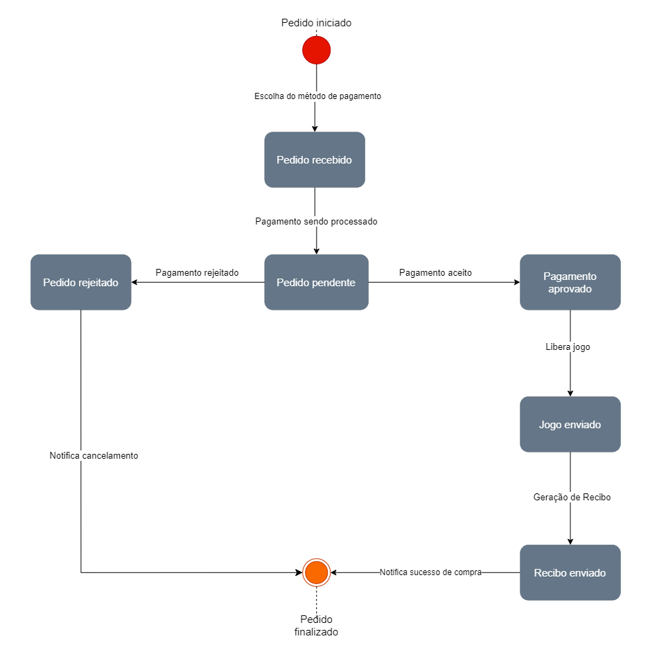
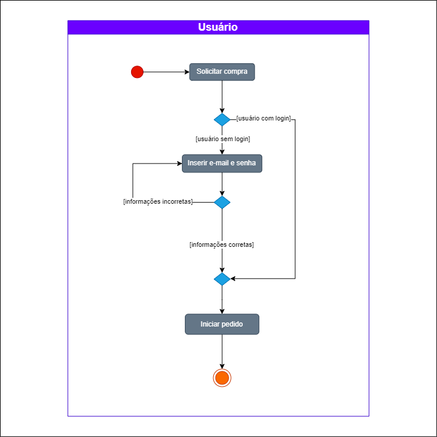

# 2.1.2. Notação UML – Diagramas Dinâmicos

**Foco_02:** Modelagem UML Dinâmica

Entrega Mínima: 1 Modelo Dinâmico (ESCOPO: Diagrama de Sequência; Diagrama de Atividades; Diagrama de Estados ou Diagrama de Comunicação/Colaboração).

Existem alguns diagramas dinâmicos na UML como: 

1. Diagrama de sequência
2. Diagrama de estados
3. Diagrama de atividades
4. Diagrama de colaboração

Na hora de escolher qual era o melhor diagrama para representar o projeto, dividimos em dois fluxos para modelar: o [fluxo de compra](../Base/1.2.ProcessosMetodologiasAbordagens?id=bpmn-do-fluxo-de-compra) e [fluxo de busca](../Base/1.2.ProcessosMetodologiasAbordagens?id=bpmn-da-busca-de-jogos). Após realizar o diagrama estático englobando os dois fluxos, o grupo se dividiu em dois para poder fazer os diagramas dinâmicos, também se dividindo entre os fluxos. Todos os diagramas foram feitos na ferramenta Draw.io.

Para representar o fluxo de compra, o grupo discutiu na reunião semanal do dia 03/07/2024 que poderíamos utilizar o diagrama de estados, o qual poderia demonstrar bem o caminho do usuário ao realizar uma compra, e por utilizar estados que seriam usados para demonstrar visualmente por quais etapas o usuário pode passar. Dessa forma, trabalhamos na melhor representação dos estados do fluxo de compra do nosso [protótipo no Figma](../Base/1.4.4.Prototipar.md)

O Diagrama de estados foi desenvolvido em sala de aula no dia 05/07/2024 contando com a presença dos membros: Alexia, Raquel, Luan Melo, Marcus e Luan Mateus como pode ser visto na figura 1.

 

<strong>Figura 01 - Diagrama de Estados</strong>

  

Autor: Alexia, Raquel, Luan Melo, Marcus e Luan Mateus

Para construir o diagrama, o grupo debateu quais seriam os estados em que o usuário poderia se encontrar e qual seria a relação entre eles. Começando pelo pedido iniciado, quando o usuário já sabe qual jogo vai querer comprar, ele precisa estar logado na plataforma para poder seguir. Neste estágio, o sistema entra no estado de pedido recebido e o pagamento será processado, entrando no estado de pedido pendente. Existem três opções de pagamento no nosso projeto: Pix, boleto flash e cartão de crédito. O grupo discutiu quais seriam os possíveis estados de pagamento baseados nos meios apresentados. Nesse momento, houve algumas sugestões sobre a melhor forma de representação. Levantamos debates sobre quais opções estariam disponíveis para cada meio de pagamento e até onde elas levariam o usuário. Por exemplo: o cartão de crédito levaria a um estado diferente por ter um processamento de compra mais longo? O Pix poderia levar a outros estados por diferentes motivos de falha? Por fim, ficou decidido que haveria dois estados resultantes: pedido aprovado, quando, por qualquer meio de pagamento ou por qualquer quantidade de tempo, o pagamento é depositado; e pedido rejeitado, quando, por qualquer meio de pagamento ou qualquer quantidade de tempo, o pagamento não é efetuado.

Portanto, qualquer erro de pagamento, seja qual for o motivo, leva a um pedido rejeitado, o que gera uma notificação de cancelamento para o usuário, encerrando o fluxo com o pedido finalizado. Por outro lado, ao ter o pagamento aprovado por qualquer modalidade disponível, é criado um recibo que será enviado ao usuário, gerando posteriormente uma notificação de sucesso. O usuário então entra no estado em que o jogo será enviado, podendo inicializar o jogo e finalizar o pedido.

Para demonstrar com mais detalhes algumas possibilidades do fluxo de compra no que se refere ao pagamento, recebemos orientação na aula de dúvidas do dia 05/07/2024 para criar um diagrama de atividades que poderá representar melhor quais possibilidades existem entre o estado de pedido pendente e seus sucessores.

Dessa maneira, desenvolvemos três fluxos de atividades para representar a situação de login do usuário, pedido iniciado e pedido pendente. Concluímos que, ao solicitar uma compra, uma verificação deve ser feita para entender a situação de login do usuário no sistema, na qual a atividade "inserir e-mail e senha" está diretamente ligada ao [fluxo de sequência](../Modelagem/2.1.1.UMLEstaticos.md) em que o usuário precisa realizar o login para fazer um pedido. O diagrama de atividades de usuário logado encontra-se na imagem a seguir.

 

<strong>Figura 02 - Diagrama de Atividades - Usuário Logado </strong>

  

Autor: Raquel e Luan Mateus

Percebe-se que, uma vez que o usuário está logado, o pedido pode ser iniciado. Olhando para o usuário, ele deve escolher o meio de pagamento caso o pedido tenha algum valor que não seja R$ 0,00; caso contrário, o pedido é feito. Focando no sistema, temos um fluxo em que toda a análise do pagamento deve ser feita caso o pedido tenha algum valor, sendo necessário aguardar uma autorização bancária, enviar uma fatura ou gerar um código Pix, dependendo do método de pagamento escolhido pelo usuário. Após isso, começa a validação de pagamento e, finalmente, o pedido é processado. Os fluxos de pedido pendente e pedido iniciado estão representados abaixo.

 

<strong>Figura 03 - Diagrama de Atividades - Pedido Pendente</strong>

  

  Autor: Raquel

 

<strong>Figura 04 - Diagrama de Atividades - Pedido Iniciado</strong>

  

  Autor: Raquel

## Histórico de versão

| Data | Versão | Atividade | Responsável |
| ---- | ------ | --------- | ----------- |
| 07/07/2024 | 1.0 | Adiciona introdução e diagrama de estados | Alexia |
| 08/07/2024 | 2.0 | Adiciona diagrama de atividades e corrige erros | Luan Mateus e Raquel |

## Referências

[1] MODELAGEM UML DINÂMICA. Disponível em: <https://aprender3.unb.br/pluginfile.php/2790248/mod_label/intro/Arquitetura%20e%20Desenho%20de%20Software%20-%20Aula%20Modelagem%20UML%20Din%C3%A2mica%20-%20Profa.%20Milene.pdf>. Acesso em: 07 jul. 2024.

[2] SOUSA, Marcos Morais de. Diagrama de Atividades. Disponível em: https://marcosmoraisdesousa.blogspot.com/2012/03/diagrama-de-atividades_1896.html. Acesso em: 08 jul. 2024.

[3] UML Diagrams. UML Activity Diagrams. Disponível em: https://www.uml-diagrams.org/activity-diagrams.html. Acesso em: 08 jul. 2024.

[4] Millene Serrano, Aprender 3: Desenho de Software (Modelagem): Módulo Projeto Orientado a Abordagens Tradicionais. Disponível em: https://aprender3.unb.br/course/view.php?id=22090&section=3. Acesso em: 08 jul. 2024.
