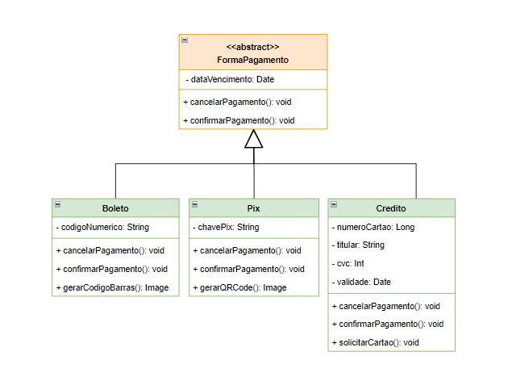

# 3.1. Módulo Padrões de Projeto GRASPs

## Polimorfismo

O GRASP Polimorfismo é um padrão de projeto muito remetente ao conceito de polimorfismo que aprende-se na disciplina de Orientação a Objetos. [1] A sua principal diretriz diz respeito que: A menos que haja um comportamento default na superclasse, declare uma operação polimórfica na superclasse como sendo abstrata. 

Ou seja, utilizamos esse padrão em casos onde há variações de objetos que são semelhantes de alguma forma. Isso implica no uso e criação de classes abstratas ou interfaces, o que já mostra que são os principais tipos de artefatos para serem interpretados como polimorfismo e identificação desse GRASP.

### Aplicação no Projeto

Em nosso projeto de E-Commerce, esse padrão conseguiu ser aplicado na classe responsável por lidar com a forma de pagamento por um jogo que o cliente compra dentro do site. Inicialmente, o nosso [Diagrama de Classes](../Modelagem/2.1.1.UMLEstaticos.md) contou com uma versão onde se encontrava apenas uma classe FormaPagamento, sem que houvesse nenhuma herança ou algo do tipo. 

Com o decorrer do desenvolvimento do diagrama, nossa equipe modificou essa classe para que se tornasse uma classe abstrata a fim de aprimorar o Diagrama de Classes e aplicar as boas práticas do GRASP Polimorfismo em nosso projeto. A partir disso, foi criado uma classe abstrata denominada FormaPagamento na qual as classes Boleto, Pix e Credito herdam dessa como formas especializadas de realizar um tipo de pagamento para a compra de um jogo na plataforma. 

Portanto, pode-se observar a seguir a implementação realizada a nível UML, além de ser possível destacar os principais elementos que tornam a aplicação do GRASP Polimorfismo possível.

<strong>Figura X - GRASP Polimorfismo na Classe Abstrata FormaPagamento</strong>

Autores: Pedro Henrique, Luciano Ricardo, Luan Melo e Sabrina Caldas

## Histórico de versão

| Data       | Versão | Atividade | Responsável | Revisor |
| ---------- | ------ | --------- | ----------- | ------- |
| 18/07/2024 | 1.0    | Adiciona GRASP Polimorfismo | [Pedro H.](https://github.com/phmelosilva)  | [João S.](https://github.com/JoaoSchmitz) |

## Referências

    [1] Professora Millene Serrano - Material Complementar (Parte II) - Módulo Padrões de Projeto GRASP(s). Disponível em: <https://aprender3.unb.br/pluginfile.php/2790263/mod_label/intro/Arquitetura%20e%20Desenho%20de%20Software%20-%20Aula%20GRASP_B%20-%20Profa.%20Milene%20-%20Complementar.pdf>. Acesso em: 18 jul. 2024.