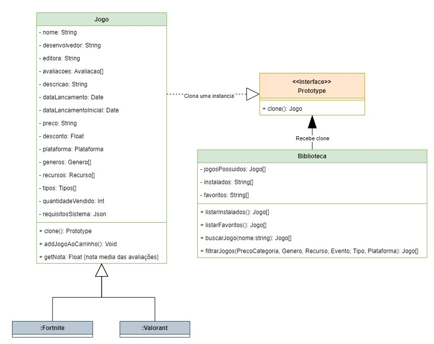
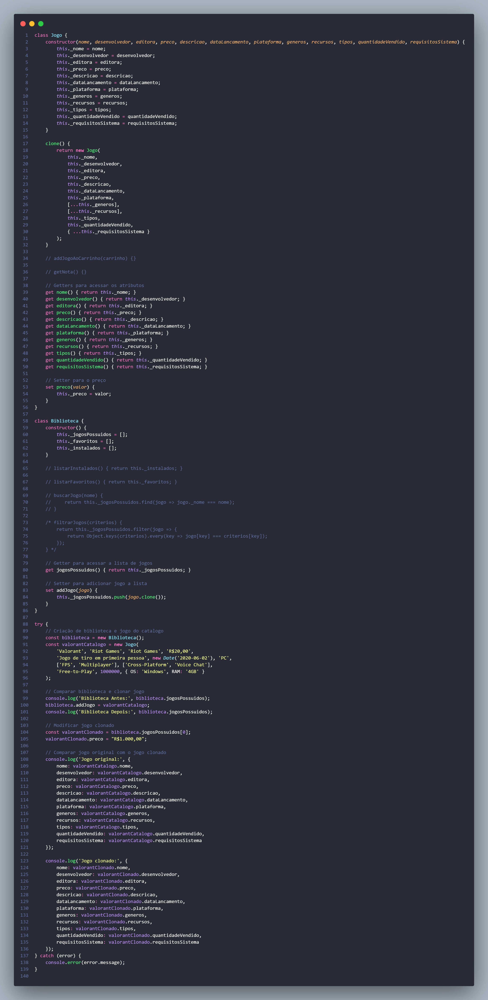
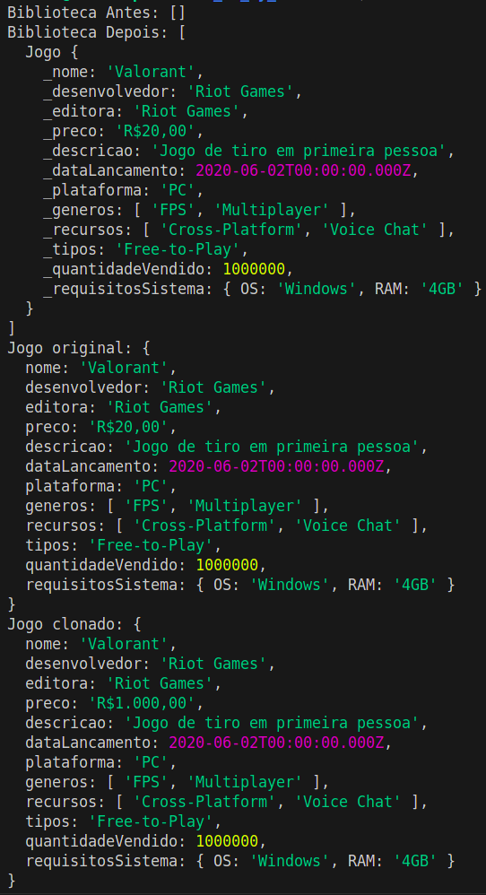
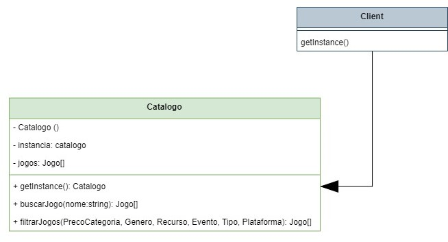
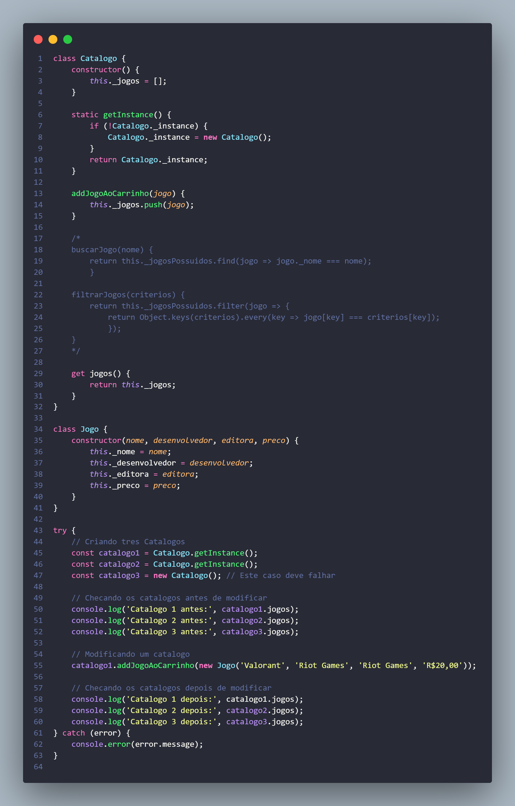
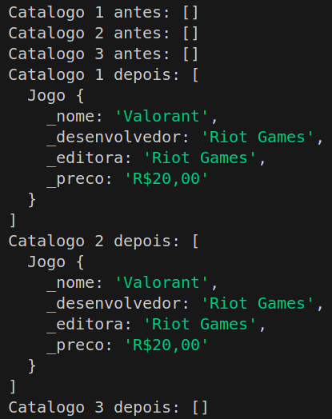

# 3.2. Módulo Padrões de Projeto GoFs Criacionais

## Introdução

Ao criar um diagrama de classes uma questão importante que pode gerar muito gargalo de desempenho é identificar de quem é a responsabilidade de instanciação de uma classe, ou mesmo transferir essa responsabilidade e alguns padrões que podem ajudar nessa questão são os GoFs Criacionais, eles focam em como os objetos são criados auxiliando a criar um sistema mais flexível e reutilizável evitando dependências rígidas. São eles em linhas gerais:

1. **Factory Method**: Delega a instanciação para as subclasses, ajuda uma hierarquia muito acessada que pode sofrer gargalo de desempenho;
2. **Abstract Factory**: Delega a instanciação para as subclasses, ajuda uma família de hierarquias muito acessada que pode sofrer gargalo de desempenho;
3. **Builder**: Separa a construção do objeto da sua representação, ajuda na implementação de objetos compostos que podem ser configurados de várias maneiras diferentes;
4. **Prototype**: Tem como objetivo fazer outros objetos a partir de uma cópia, ajuda no desempenho, comum em jogos. Muito útil quando a criação de um novo objeto é cara ou complexa e pode ser simplificada clonando uma instância existente;
5. **Singleton**: Tem como objetivo fazer a criação de uma instância única a qual todo mundo consegue consumir. É útil quando se precisa de exatamente uma instância de uma classe, como em arquivos ou conexão com o banco de dados;
6. **Multiton**: Permite a criação de instâncias e limita a quantidade delas por objeto. Mesma facilitação do singleton, mas em contextos que terão mais de uma instância necessária porém ainda sim com um limite;
7. **Object Pool**: Auxilia no reaproveitamento de objetos. Já deixa os objetos criados para facilitar quanto os usuários forem acessar, muito usado em jogos.

Sendo assim, esses padrões ajudam a lidar com a complexidade da criação de objetos, facilitando a manutenção e a evolução do software ao longo do tempo.

## Prototype

<strong>Figura 01 - Prototype</strong>

Autor: João Matheus, João Pedro, Luan Melo, Luciano Ricardo, Pedro Cabeceira, Pedro Henrique e Sabrina

    
Implementação em código - Prototype

    
Output do código - Prototype

## Singleton

<strong>Figura 02 - Singleton</strong>

Autor: João Matheus, João Pedro, Luan Melo, Luciano Ricardo, Pedro Cabeceira, Pedro Henrique e Sabrina

    
Implementação em código - Singleton

    
Output do código - Singleton

## Histórico de Versão

| Data       | Versão | Atividade                                                     | Responsável                                                                                                                                                                                                                                                                                                                         |
| ---------- | ------ | ------------------------------------------------------------- | ----------------------------------------------------------------------------------------------------------------------------------------------------------------------------------------------------------------------------------------------------------------------------------------------------------------------------------- |
| 23/07/2023 | 1.0    | Implementação e criação dos GoFs Prototype e Singleton        | [João Matheus](https://github.com/JoaoSchmitz), [João Pedro](https://github.com/uMorbeck), [Luan Melo](https://github.com/luanmq), [Luciano Ricardo](https://github.com/l-ricardo), [Pedro Cabeceira](https://github.com/pkbceira03), [Pedro Henrique](https://github.com/phmelosilva) e [Sabrina](https://github.com/sabrinaberno) |
| 23/07/2023 | 1.1    | Aprimorando encapsulamento e visualização dos dados na código | [Marcus](https://github.com/marcusmartinss)                                                                                                                                                                                                                                                                                         |
| 24/07/2023 | 1.2    | Adicionando codigo e prints dos outputs                       | [Luciano Ricardo](https://github.com/l-ricardo) e [Marcus](https://github.com/marcusmartinss)                                                                                                                                                                                                                                       |
| 24/07/2023 | 1.3    | Adiciona texto introdutório                                   | [Alexia Cardoso](https://github.com/alexianaa)                                                                                                                                                                                                                                                                                      |

## Referências

[1] REFACTORING GURU. Padrões de Projeto. Disponível em: https://refactoring.guru/pt-br/design-patterns. Acesso em: 23 de jul. de 2024.
[2] Richard Carr. blackwasp, 2012. Multiton Design Pattern. Disponível em: https://www.blackwasp.co.uk/multiton.aspx. Acesso em: 24 de jul. de 2024.
[3] Refactoring.guru. Padrões de projeto criacionais. Disponível em: https://refactoring.guru/pt-br/design-patterns/creational-patterns. Acesso em: 24 de jul. de 2024. 
[4] Serrano, Milene. Aprender3. Disponível em: https://aprender3.unb.br/pluginfile.php/2790264/mod_label/intro/Arquitetura%20e%20Desenho%20de%20Software%20-%20Aula%20GoFs%20Criacionais%20-%20Profa.%20Milene.pdf. Acesso em: 24 de jul. de 2024.  
