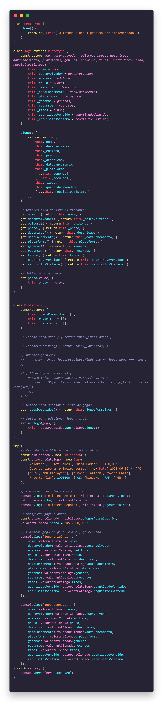

# 3.2. Módulo Padrões de Projeto GoFs Criacionais

## Introdução

Ao criar um diagrama de classes, uma questão importante que pode gerar gargalos de desempenho é identificar de quem é a responsabilidade pela instanciação de uma classe, ou mesmo transferir essa responsabilidade. Alguns padrões de design criacionais do GoF (Gang of Four) ajudam a lidar com essa questão, focando em como os objetos são criados e auxiliando na implementação de um sistema mais flexível e reutilizável, evitando dependências rígidas. São eles:

1. **Factory Method**: Delega a instanciação para as subclasses ajuda a evitar gargalos de desempenho, pois permite que subclasses definam qual classe instanciar;
2. **Abstract Factory**: Semelhante ao Factory Method, mas foca na criação de famílias de hierarquias de objetos, ajudando a evitar gargalos em hierarquias complexas e frequentemente acessadas;
3. **Builder**: Separa a construção de um objeto da sua representação, ajudando na implementação de objetos compostos que podem ser configurados de várias maneiras diferentes;
4. **Prototype**: Tem como objetivo criar novos objetos a partir de uma cópia de um objeto existente, o que ajuda no desempenho, especialmente em jogos. É útil quando a criação de um novo objeto é cara ou complexa e pode ser simplificada clonando uma instância existente;
5. **Singleton**: Garante que uma classe tenha apenas uma instância e fornece um ponto de acesso global a essa instância. É útil quando se precisa de exatamente uma instância de uma classe, como em arquivos de configuração ou conexão com o banco de dados;
6. **Multiton**: Permite a criação de instâncias e limita a quantidade delas por objeto. Mesma facilitação do singleton, mas em contextos que terão mais de uma instância necessária porém ainda sim com um limite;
7. **Object Pool**: Auxilia no reaproveitamento de objetos. Já deixa os objetos criados para facilitar quanto os usuários forem acessar, muito usado em jogos.

Sendo assim, esses padrões ajudam a lidar com a complexidade da criação de objetos, facilitando a manutenção e a evolução do software ao longo do tempo.

## Prototype

O Prototype é um padrão de projeto de software criacional, visando a criação de novos objetos a partir de um "clone" do modelo original, sem a necessidade de instanciar o modelo. Isso reduz as operações que, de outra forma, seriam caras ou complicadas. Esse protótipo permite acessar a interface, sem se preocupar com a complexidade de criar novas instâncias do cliente.

### Aplicações no projeto

Para a utilização desse padrão foi avaliado inicialmente a possibilidade da criação de um protótipo para a classe Carrinho, que também possui um array de Jogos. Porém, esta opção foi descartada, pois caso fosse implementado deste modo ocorreria uma sobrecarga no método. Posteriormente, foi definido a clonagem de Jogos somente quando forem adicionados a Biblioteca privada de um usuário. Assim teremos:
 
1. A garantia do acesso ao seu jogo comprado na plataforma, mesmo se ele for retirado do Catálogo ou sofra alguma alteração.
2. Os usuários podem modificar seus jogos sem afetar os jogos do Catálogo ou aqueles possuídos por outros usuários.
 
Dessa forma, foi elaborado a adaptação do [diagrama de classe](../Modelagem/2.1.1.UMLEstaticos.md) conforme a Figura 01. Assim, quando o usuário adquirir um jogo, um clone dessa classe jogo (em roxo) seria criado por meio da interface Prototype (em laranja), permitindo assim que o usuário tenha acesso a esse clone na sua biblioteca (em verde).

<strong>Figura 01 - Prototype</strong>

Autor: João Matheus, João Pedro, Luan Melo, Luciano Ricardo, Pedro Cabeceira, Pedro Henrique e Sabrina

    
Implementação em código - Prototype

    
Output do código - Prototype

## Singleton

O Singleton é um padrão de projeto que facilita a criação e o acesso a uma única instância global de uma classe. No contexto específico deste projeto, a Figura 02 ilustra a aplicação do Singleton na classe "Catalogo". Esta transformação garante que apenas uma instância da classe "Catalogo" exista, assegurando que todos os clientes acessem a mesma instância para consultas e operações.

### Aplicações no projeto

Essa abordagem é especialmente útil em cenários onde é crucial manter a eficiência no uso de recursos. Ao utilizar o padrão Singleton para o "Catalogo", conforme representado na Figura 02 do [Diagrama de Classe](../Modelagem/2.1.1.UMLEstaticos.md), reduzimos a complexidade de gerenciamento de múltiplas instâncias e garantimos um acesso controlado e compartilhado às funcionalidades do catálogo.

<strong>Figura 02 - Singleton</strong>

Autor: João Matheus, João Pedro, Luan Melo, Luciano Ricardo, Pedro Cabeceira, Pedro Henrique e Sabrina

    
Implementação em código - Singleton

    
Output do código - Singleton

## Histórico de Versão

| Data       | Versão | Atividade                                                     | Responsável                                                                                                                                                                                                                                                                                                                         |
| ---------- | ------ | ------------------------------------------------------------- | ----------------------------------------------------------------------------------------------------------------------------------------------------------------------------------------------------------------------------------------------------------------------------------------------------------------------------------- |
| 23/07/2023 | 1.0    | Implementação e criação dos GoFs Prototype e Singleton        | [João Matheus](https://github.com/JoaoSchmitz), [João Pedro](https://github.com/uMorbeck), [Luan Melo](https://github.com/luanmq), [Luciano Ricardo](https://github.com/l-ricardo), [Pedro Cabeceira](https://github.com/pkbceira03), [Pedro Henrique](https://github.com/phmelosilva) e [Sabrina](https://github.com/sabrinaberno) |
| 23/07/2023 | 1.1    | Aprimorando encapsulamento e visualização dos dados na código | [Marcus](https://github.com/marcusmartinss)                                                                                                                                                                                                                                                                                         |
| 24/07/2023 | 1.2    | Adicionando código e prints dos outputs                       | [Luciano Ricardo](https://github.com/l-ricardo) e [Marcus](https://github.com/marcusmartinss)                                                                                                                                                                                                                                       |
| 24/07/2023 | 1.3    | Adiciona texto introdutório                                   | [Alexia Cardoso](https://github.com/alexianaa)                                                                                                                                                                                                                                                                                      |
| 24/07/2023 | 1.4    | Adiciona texto do Prototype                                   | [Luan Mateus](https://github.com/luanduartee) e [Raquel Eucaria](https://github.com/raqueleucaria)                                                                                                                                                                                                                                  |
| 24/07/2023 | 1.5    | Adiciona texto do Singleton                                   | [Pedro Barbosa](https://github.com/pedrobarbosaocb)                                                                                                                                                                                                                                                                                 |
| 24/07/2023 | 1.6    | Revisão Geral                                                 | [Luan Mateus](https://github.com/luanduartee), [Pedro Barbosa](https://github.com/pedrobarbosaocb), [Raquel Eucaria](https://github.com/raqueleucaria)                                                                                                                                                                              |

## Referências

[1] REFACTORING GURU. Padrões de Projeto. Disponível em: https://refactoring.guru/pt-br/design-patterns. Acesso em: 23 de jul. de 2024.

[2] Richard Carr. blackwasp, 2012. Multiton Design Pattern. Disponível em: https://www.blackwasp.co.uk/multiton.aspx. Acesso em: 24 de jul. de 2024.

[3] Refactoring.guru. Padrões de projeto criacionais. Disponível em: https://refactoring.guru/pt-br/design-patterns/creational-patterns. Acesso em: 24 de jul. de 2024. 

[4] Serrano, Milene. Aprender3. Disponível em: https://aprender3.unb.br/pluginfile.php/2790264/mod_label/intro/Arquitetura%20e%20Desenho%20de%20Software%20-%20Aula%20GoFs%20Criacionais%20-%20Profa.%20Milene.pdf. Acesso em: 24 de jul. de 2024.  

[5] Geeksforgeeks. Prototype Design Pattern. Disponível em: https://www.geeksforgeeks.org/prototype-design-pattern/. Acesso em: 24 de jul. de 2024.  

