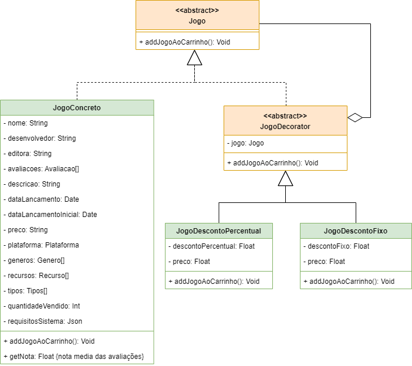

# 3.2. Módulo Padrões de Projeto GoFs

**Foco_02:** Padrões de Projeto GoFs.

Padrões de projetos GoFs são soluções típicas para problemas em códigos orientados a objetos. Esse documento aborda três tipos de padrão GoFs: Comportamental, Criacional e Estrutural.

## GoF Estrutural

O GoF estrutural tem como principal preocupação a forma com que as classes e os objetos são compostos, formando estruturas complexas e maiores. Os padrões estruturais explicam como fazer as estruturas com as classes e objetos para manter estruturas flexíveis e eficientes, assim garantindo que mesmo se os requisitos ou as funcionalidades mudem, ou se expandem, a estrutura do software ainda permanecerá flexível e eficiente.

### Composite

O Composite é um padrão de projeto estrutural que permite a criação de objetos em estruturas de árvore, possibilitando que cada um deles seja tratado como um objeto individual. O principal problema desse padrão é que ele só faz sentido quando o modelo central da aplicação pode ser representado como uma árvore. O maior benefício desse padrão é que não é preciso se preocupar com as classes dos objetos que estão na árvore, permitindo que todos os objetos sejam tratados com a mesma interface.

Para apresentar sua aplicabilidade no nosso projeto escolhemos dentro no [diagrama de classes](../Modelagem/2.1.1.UMLEstaticos.md) a hierarquia formada pela classe abstrata FormaPagamento e suas filhas: Boleto, Pix e Credito. O composite então seria uma forma do usuário poder usar mais de uma forma de pagamento para realizar um pedido gerando então a folha JuncaoFormaPagamento, que tanto herda da classe FormaPagamento quanto tem uma ligação de agregação. O composite criado tem um atributo que se chama "metodo" que é um array que acumula as outras possíveis formas de pagamento, para tal ela tem além das operações herdadas outras duas operações que a permite adicionar e remover as outras folhas da classe abstrata.

<strong>Figura 01 - Composite</strong>

Autor: Alexia

### Decorator

O Decorator é um padrão de projeto estrutural que permite acoplar novos comportamentos a objetos ao envolvê-los em objetos que contêm esses comportamentos adicionais. Ele oferece uma alternativa flexível à criação de subclasses, permitindo que novas funcionalidades sejam adicionadas dinamicamente a um objeto.

A classe Jogo representada no [diagrama de classes](../Modelagem/2.1.1.UMLEstaticos.md), possui os atributos preço e desconto, sem a especificação do tipo de desconto e entendendo-se que todo jogo possui um desconto, mesmo que seja nulo. Com isso, a Figura 02 propõe uma utilização de um Decorator para possibilitar a adesão dinâmica de dois tipos diferentes desconto ao Jogo disponibilizado.

<strong>Figura 02 - Decorator</strong>

Autor: Pedro Barbosa

### Facade

O **Facade** é um padrão de projeto que fornece ao usuário uma interface única e mais simplificada, que envolve funcionalidades de vários subsistemas, sem que seja necessário se preocupar com toda a complexidade deles, facilitando assim a utilização.

No nosso projeto, identificamos uma oportunidade de aplicar esse padrão no [diagrama de classes](../Modelagem/2.1.1.UMLEstaticos.md), mais especificamente na interface de usuário de compras, na qual o usuário interage com vários subsistemas ao longo do fluxo, como catálogo de jogos, carrinho de compras e formas de pagamento. Dessa forma, com o Facade, todo o fluxo seria simplificado, permitindo ao usuário acessar apenas a interface **LojaFacade**, sem precisar se preocupar com toda a lógica e complexidade das subclasses. O diagrama que representa a estrutura desse caso pode ser consultado na figura a seguir.

<strong>Figura 03 - Facade</strong>

Autor: Luan Mateus

## Histórico de versão

| Data       | Versão | Atividade                         | Responsável |
| ---------- | ------ | --------------------------------- | ----------- |
| 22/07/2024 | 1.0    | Coloca conceito de GoF Estrutural e Composite | [Pedro Cabeceira](https://github.com/pkbceira03)  |
| 22/07/2024 | 1.1    | Adiciona implementação Composite | [Alexia Cardoso](https://github.com/alexianaa)  |
| 22/07/2024 | 1.2    | Adiciona implementação Decorator | [Pedro Barbosa](https://github.com/pedrobarbosaocb)  |
| 23/07/2024 | 1.3    | Adiciona implementação Facade | [Luan Mateus](https://github.com/luanduartee)  |

## Referências
[1] DECORATOR. Decorator em Padrões de estruturais. Disponível em: <https://refactoring.guru/pt-br/design-patterns/decorator>. Acesso em: 22 de julho de 2024.
[2] DECORATOR Design Pattern in Java. Disponível em <https://sourcemaking.com/design_patterns/decorator/java/1>. Acesso em: 23 de julho de 2024.
[3] Padrão de Projeto Facade em Java. Disponível em <https://www.devmedia.com.br/padrao-de-projeto-facade-em-java/26476>. Acesso em: 23 de julho de 2024.
[4] ROBERTO, Jones. Design patterns – Parte 2. 2019. Disponível em: https://medium.com/@jonesroberto/desing-patterns-parte-2-2a61878846d. Acesso em: 22 jul. 2024.
[5] REFACTORING GURU. Padrões de Projeto. Disponível em: https://refactoring.guru/pt-br/design-patterns. Acesso em: 22 jul.2024.

