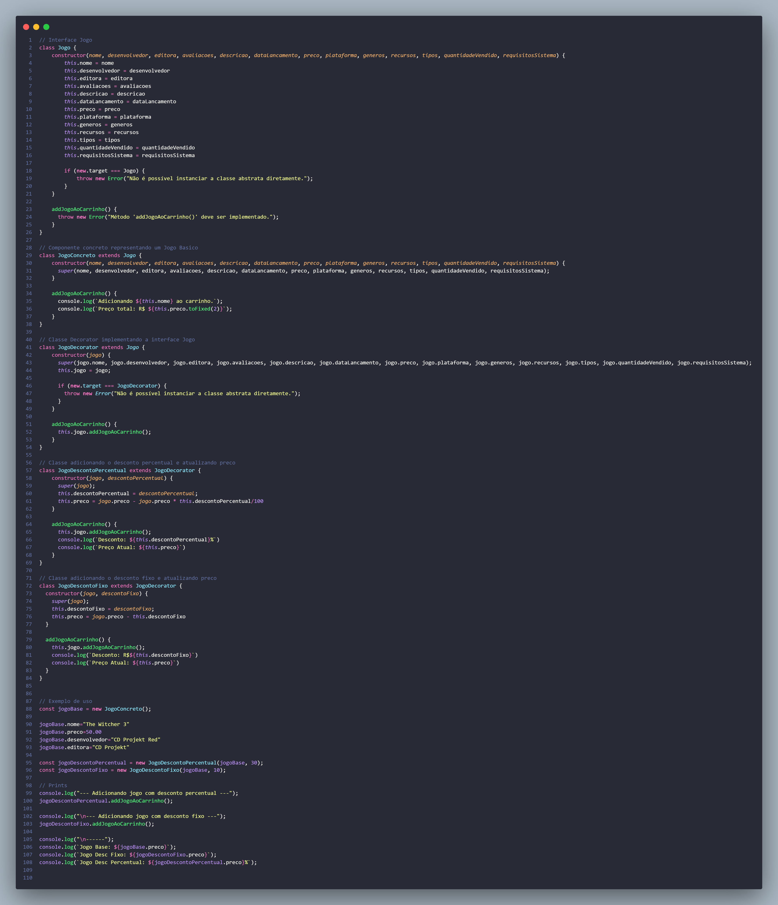

# 3.2. Módulo Padrões de Projeto GoFs - Estrutural

## Introdução

O principal foco dos padrões de projeto estruturais é a composição das classes e dos objetos, formanndo estruturas comp. Os padrões estruturais explicam como fazer as estruturas com as classes e objetos para manter a flexibilidade e a eficiência, assim garantindo que mesmo se os requisitos ou as funcionalidades mudem, ou se expandem, a estrutura do software ainda permanecerá flexível e eficiente. Para melhor visualização, todas as implementações estruturais podem ser encontradas neste [link](https://github.com/UnBArqDsw2024-1/2024.1_G1_My_Ecommerce/tree/main/codigo/estrutural/).

## Composite

O **Composite** é um padrão de projeto estrutural que permite a criação de objetos em estruturas de árvore, possibilitando que cada um deles seja tratado como um objeto individual. O principal problema desse padrão é que ele só fazer sentido quando o modelo central da aplicação pode ser representado como uma árvore. O maior benefício desse padrão é não precisar se preocupar com as classes dos objetos que estão na árvore, permitindo que todos os objetos sejam tratados com a mesma interface.

### Aplicações no projeto

Para apresentar sua aplicabilidade no nosso projeto escolhemos dentro do [diagrama de classes](../Modelagem/2.1.1.UMLEstaticos.md) a hierarquia formada pela classe abstrata FormaPagamento e suas filhas: Boleto, Pix e Credito. O **Composite** então seria uma forma do usuário poder usar mais de uma forma de pagamento para realizar um pedido, podendo pagar uma primeira parcela por Boleto, a próxima com Pix etc gerando então a folha JuncaoFormaPagamento, que tanto herda da classe FormaPagamento quanto tem uma ligação de agregação. A class JuncaoFormaPagamento, criada a partir do **Composite** tem um atributo que se chama "metodo" que consiste array que acumula as outras possíveis formas de pagamento, para tal ela tem além das operações herdadas outras duas operações que a permite adicionar e remover as outras folhas de pagamento da classe abstrata.

<strong>Figura 01 - Composite</strong>

Autor: Alexia

    
Implementação em código - Composite

        

    
Output do código - Composite

## Decorator

O Decorator é um padrão de projeto estrutural que permite acoplar novos comportamentos a objetos ao envolvê-los em objetos que contêm esses comportamentos adicionais. Ele oferece uma alternativa flexível à criação de subclasses, permitindo que novas funcionalidades sejam adicionadas dinamicamente a um objeto.

### Aplicações no projeto

A classe Jogo representada no [diagrama de classes](../Modelagem/2.1.1.UMLEstaticos.md), possui os atributos preço e desconto, sem a especificação do tipo de desconto e entendendo-se que todo jogo possui um desconto, mesmo que seja nulo. Com isso, a Figura 02 propõe uma utilização de um Decorator para possibilitar a adesão dinâmica de dois tipos diferentes desconto ao Jogo disponibilizado.

<strong>Figura 02 - Decorator</strong>

Autor: Pedro Barbosa

Para aplicarmos o **Decorator** em nível de código, utilizamos a classe Jogo e a partir dela extendemos para a classe JogoDescontoPercentual. A partir disso, mostramos como um jogo ba
te ficou com o desconto aplicado como desconto fixo e desconto percenual. Vejamos a seguir

    
Implementação em código - Decorator

    
Output do código - Decorator

## Facade

O padrão **Facade** tem como principal objetivo fornecer uma interface simplificada para um conjunto complexo de interfaces em um subsistema. Ele define uma interface de nível mais alto que torna o subsistema mais fácil de ser utilizado. SSeus benefícios incluem a simplicidade, ao reduzir a complexidade da interação com o subsistema; o isolamento, facilitando a modificação dos subsistemas internos sem grandes impactos; e o desacoplamento, facilitando a manutenção e evolução do código.

### Aplicações no projeto

No nosso projeto, identificamos uma oportunidade de aplicar esse padrão no [diagrama de classes](../Modelagem/2.1.1.UMLEstaticos.md), mais especificamente na interface de usuário de compras. Nesta interface, o usuário interage com vários subsistemas ao longo do fluxo, como catálogo de jogos, carrinho de compras e formas de pagamento. Com o padrão Facade, todo o fluxo seria simplificado, permitindo ao usuário acessar apenas a interface **LojaFacade**, sem precisar se preocupar com toda a lógica e complexidade das subclasses.

No diagrama de classes, a interface LojaFacade fornece uma interface simplificada para o cliente interagir com os subsistemas de catálogo, carrinho, pedido e forma de pagamento. A classe LojaFacade encapsula a complexidade dessas operações e fornece métodos convenientes para buscar jogos, filtrar jogos, adicionar jogos ao carrinho, confirmar e cancelar pedidos, e realizar pagamentos. Essa abordagem torna o sistema mais fácil de usar e mantém o código cliente desacoplado dos detalhes internos dos subsistemas.

<strong>Figura 03 - Facade</strong>

Autor: Luan Mateus

    
Implementação em código - Facade

    
Output do código - Facade

## Bridge

Bridge é um padrão de design estrutural que permite dividir uma classe grande ou um conjunto de classes intimamente relacionadas em _duas hierarquias separadas_: **abstração e implementação**, ambas podendo ser desenvolvidas independentemente. Ao separar as regras de negócio das camadas de abstração, se torna mais fácil aproveitar o código, gerando _maior encapsulamento e facilidade de manutenção_.

Esse padrão funciona como uma ponte e é amplamente utilizado em várias arquiteturas de alto nível com distribuição de recursos. Ele permite que o software forneça implementações alternativas, estendidas ou compostas de maneira diferente. Ao contrário do padrão Adapter, que ajusta a funcionalidade de componentes já projetados, o Bridge é aplicado desde o início do projeto para garantir a flexibilidade na evolução do sistema.

Conforme as [Telas de Compra](../Base/1.4.4.Prototipar.md), podemos perceber a possibilidade de apresentar o recibo de diferentes formas. Com base nisso, implementamos um exe que divide a lógica do recibo e suas implementações em diferentes formatos de arquivo. Para isso, foram realizadas adaptações do [Diagrama de Classes](../Modelagem/2.1.1.UMLEstaticos.md) (Figura 04), restringindo o contexto, simplificando alguns atributos e adicionando as classes que implementam a lógica do recibo (em azul) e as que implementam a lógica dos formatos (em verde).

<strong>Figura 04 - Bridge</strong>

Autor: Raquel Eucaria

    
Implementação em código - Bridge

    
Output do código - Bridge

## Histórico de versão

| Data       | Versão | Atividade                                                               | Responsável                                                                                                                                                                                                                                                                                    |
| ---------- | ------ | ----------------------------------------------------------------------- | ---------------------------------------------------------------------------------------------------------------------------------------------------------------------------------------------------------------------------------------------------------------------------------------------- |
| 22/07/2024 | 1.0    | Coloca conceito de GoF Estrutural e Composite                           | [Pedro Cabeceira](https://github.com/pkbceira03)                                                                                                                                                                                                                                               |
| 22/07/2024 | 1.1    | Adiciona implementação Composite                                        | [Alexia Cardoso](https://github.com/alexianaa)                                                                                                                                                                                                                                                 |
| 22/07/2024 | 1.2    | Adiciona implementação Decorator                                        | [Pedro Barbosa](https://github.com/pedrobarbosaocb)                                                                                                                                                                                                                                            |
| 23/07/2024 | 1.3    | Adiciona implementação Facade                                           | [Luan Mateus](https://github.com/luanduartee)                                                                                                                                                                                                                                                  |
| 23/07/2024 | 1.4    | Adiciona implementação Bridge                                           | [Raquel Eucaria](https://github.com/raqueleucaria)                                                                                                                                                                                                                                             |
| 23/07/2024 | 1.5    | Adiciona os códigos no documento                                        | [Raquel Eucaria](https://github.com/raqueleucaria)                                                                                                                                                                                                                                             |
| 23/07/2024 | 1.6    | Revisão geral, melhorando codigos e adicionando print do output         | [Luciano Ricardo](https://github.com/l-ricardo)                                                                                                                                                                                                                                                |
| 24/07/2024 | 1.7    | Revisão geral, melhorando as explicações do artefato e da implementação | [Sabrina B.](https://github.com/sabrinaberno), [Pedro Henrique](https://github.com/phmelosilva), [Luciano Ricardo](https://github.com/l-ricardo), [João Pedro Morbeck](https://github.com/uMorbeck), [Luan Q.](https://github.com/luanmq), [Marcus Martins](https://github.com/marcusmartinss) |

## Referências

[1] DECORATOR. Decorator em Padrões de estruturais. Disponível em: <https://refactoring.guru/pt-br/design-patterns/decorator>. Acesso em: 22 de julho de 2024.

[2] DECORATOR Design Pattern in Java. Disponível em <https://sourcemaking.com/design_patterns/decorator/java/1>. Acesso em: 23 de julho de 2024.

[3] Padrão de Projeto Facade em Java. Disponível em <https://www.devmedia.com.br/padrao-de-projeto-facade-em-java/26476>. Acesso em: 23 de julho de 2024.

[4] ROBERTO, Jones. Design patterns – Parte 2. 2019. Disponível em: https://medium.com/@jonesroberto/desing-patterns-parte-2-2a61878846d. Acesso em: 22 jul. 2024.

[5] REFACTORING GURU. Padrões de Projeto. Disponível em: https://refactoring.guru/pt-br/design-patterns. Acesso em: 22 jul.2024.

[6] BRIDGE Design Pattern in Java. Disponível em <https://sourcemaking.com/design_patterns/bridge>. Acesso: 22 de julho de 2024.

[7] NEW THINK TANK. Bridge Design Pattern Tutorial. Disponível em: https://www.newthinktank.com/2012/10/bridge-design-pattern-tutorial/. Acesso em: 22 de julho de 2024.

[8] Arquitetura e Desenho de Software - Video Aula 09d. SERRANO, Milene. Acesso em: 22 de julho de 2024.

[9] Arquitetura e Desenho de Software - Módulo Padrões de Projeto GoF(s) Estruturais - Implementações Complementares. SERRANO, Milene. Acesso em: 22 de julho de 2024.

[10] Arquitetura e Desenho de Software - AULA - GOFS ESTRUTURAIS - Profa. Milene Serrano - Material em Slides. SERRANO, Milene. Acesso em: 22 de julho de 2024.
