# 3.3. Módulo Padrões de Projeto GoFs - Comportamental

## Introdução

Os GoFs Comportamentais possuem foco nas interações e responsabilidades das classes e objetos, identificando padrões de comunicação entre objetos e fornecendo soluções eficientes para problemas recorrentes relacionado ao comportamento dos objetos.  Esses padrões ajudam a distribuir a responsabilidade dos objetos e garantem que a comunicação seja flexível, extensível e de fácil manutenção.

Esses padrões comportamentais são essenciais para a criação de software modular e robusto, proporcionando uma base sólida para a comunicação eficaz entre os objetos e facilitando a manutenção e extensão do código. Ao aplicar esses padrões, os desenvolvedores podem resolver problemas complexos de design de software de maneira elegante e eficiente, promovendo a reutilização de código e a clareza arquitetônica.

## Strategy

O Strategy é um padrão de projeto em que é definida uma família de algoritmos, todos eles em classes próprias e em seguida torna-os intercambiáveis, ou seja, faz com que todos eles possam ser escolhidos e utilizados de acordo com a necessidade da aplicação. O Strategy busca fornecer um algoritmo específico para uma estratégia necessária para a aplicação, assim evitando a criação de um único método que lida com todas as diferentes maneiras para se entregar um resultado.

### Aplicação no Projeto

No contexto do projeto foi utilizado o padrão para a parte de pagamento. Para evitar uma sobrecarga na classe de Pagamento, responsável pela confirmação e cancelamento de um pagamento, foi criada uma outra classe abstrata FormaPagamento para se relacionar com 3 diferentes formas de pagamento no sistema: Boleto, Pix e por Cartão de Crédito.

<strong>Figura 01 - Strategy</strong>

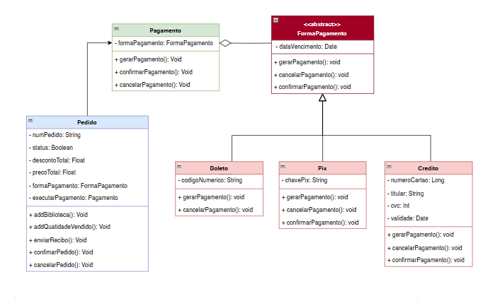

Autor: João Morbeck, Luciano de Freitas e Raquel

    
Implementação em código - Strategy

<b>
Código pedido.js
</b>

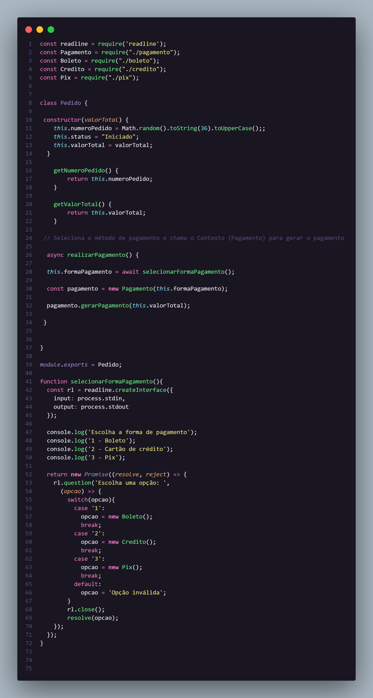

<b>
Código pagamento.js
</b>

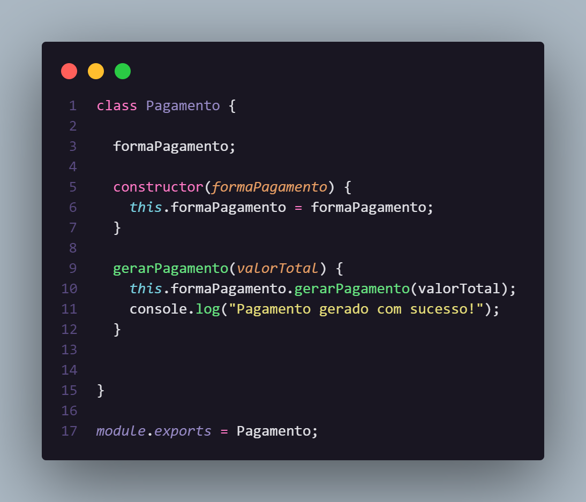

<b>
Código formaPagamento.js
</b>

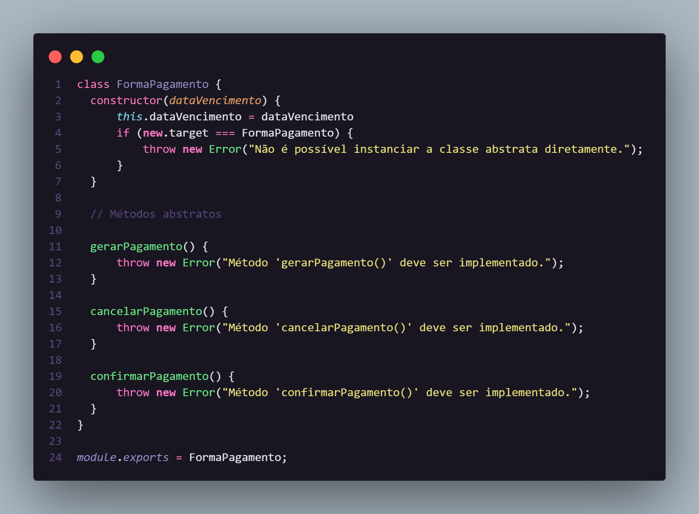

<b>
Código boleto.js
</b>

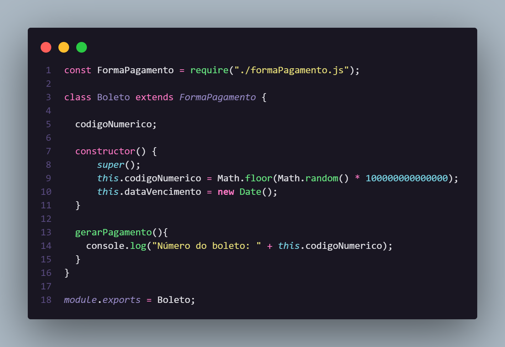

<b>
Código pix.js
</b>

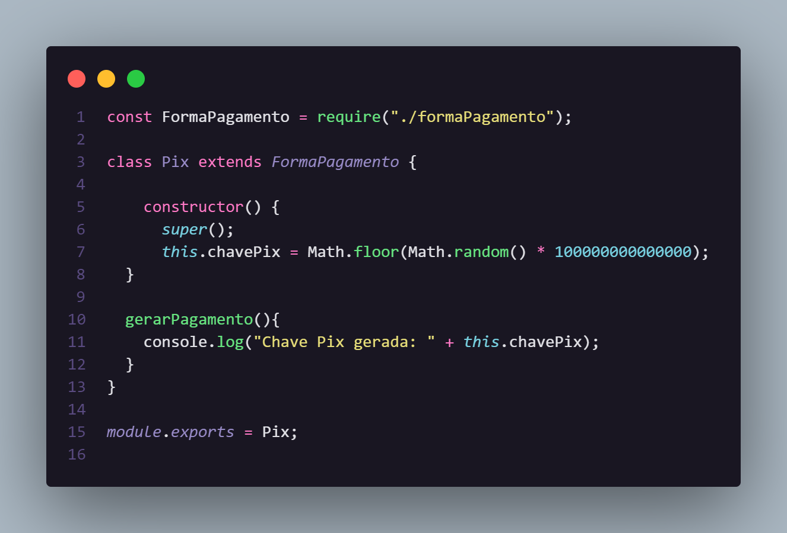

<b>
Código credito.js
</b>

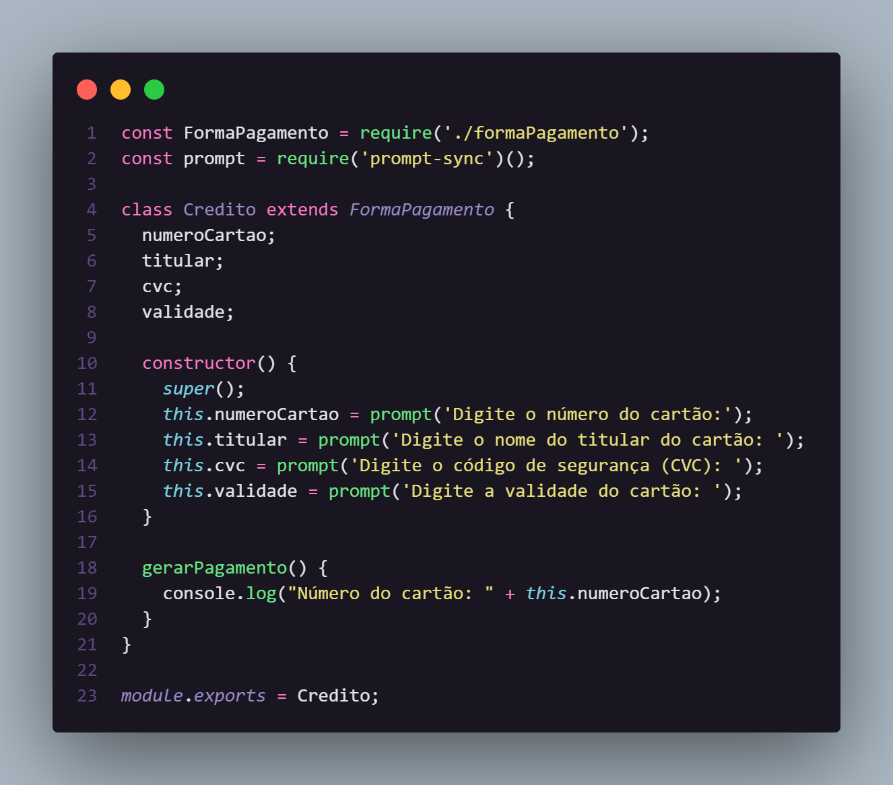

    
Output do código - Strategy

Para testarmos os códigos implementados, criamos um arquivo teste.js com as informações necessárias para o teste. Veja a seguir nas imagens as saídas:

<b>
Resultado pagamento por Boleto
</b>

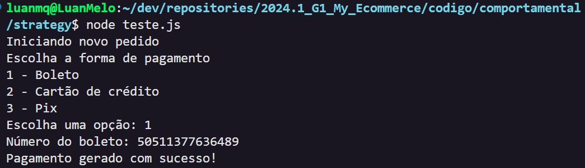

<b>
Resultado pagamento por Crédito
</b>

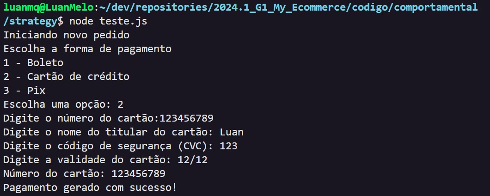

<b>
Resultado pagamento por Pix
</b>

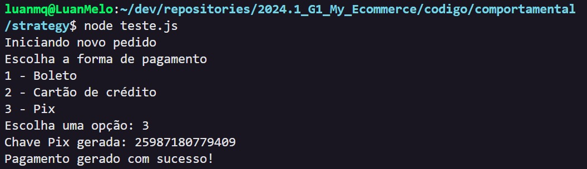

## Observer

Para explicar esse padrão, vamos trabalhar em cima de um contexto. Imagine que você esteja em uma orquestra, onde cada músico precisa seguir as notas das músicas no tempo certo para não atrapalhar os outros músicos e nem atrapalhar a harmonia da música. Agora pense em um software que precisa se comunicar com vários métodos e funcionalidades e é preciso manter uma fluides e eficiência. É nessa parte que entra o Observer. O **Observer** é um padrão de projeto que possui dentro do seu escopo o **Subject**, que é como um maestro de uma orquestra que orienta cada Observer. Os Observers são como os músicos atentos a cada atualização do Maestro para poder entrar e sair nos momentos certos da música. Assim, o Observer é um padrão de projeto que define um mecanismo de inscrição para realizar uma notificação para cada um dos clientes que estão inscritos após qualquer atualização do Subject.

### Aplicação no Projeto

No contexto da nossa aplicação foi definida a utilização do GoF Observer para observar quando um usuário logado quiser adicionar um jogo em sua lista de desejos. Para que assim, quando o jogo estiver com promoção ou descontos, o usuário possa ser notificado sobre isso. Para aplicar esse padrão foi levado em consideração que o cliente interage com a classe Catálogo que por sua vez interaje diretamente com um jogo da classe Jogo. Por isso incluímos apenas as relações entre Jogo, Biblioteca e a interface criada para implementar o Observer.

<strong>Figura 02 - Observer</strong>

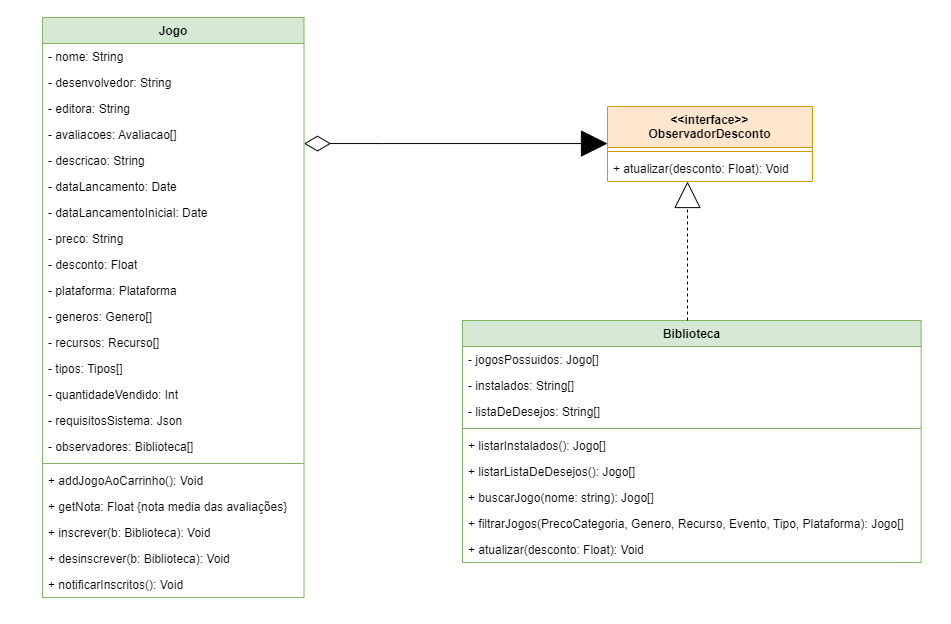

Autor: João Pedro, Marcus Vinicius e Pedro Henrique

 Implementação em código - Observer 

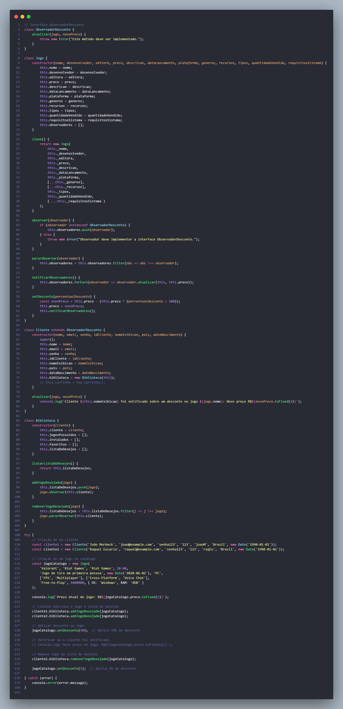

    
Output do código - Observer

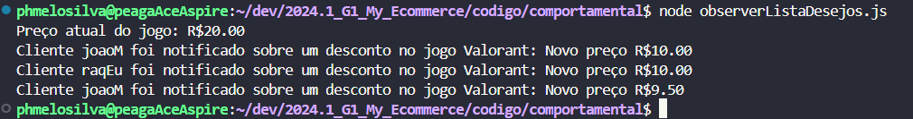

## Referências

- STRATEGY. Strategy em Padrões comportamentais. Disponível em: <https://refactoring.guru/pt-br/design-patterns/strategy>. Acesso em: 23 de julho de 2024.

## Histórico de versão

| Data       | Versão | Atividade                                          | Responsável                                                                                                                                                                                                     |
| ---------- | ------ | -------------------------------------------------- | --------------------------------------------------------------------------------------------------------------------------------------------------------------------------------------------------------------- |
| 23/07/2024 | 1.0    | Adiciona conceito de GoF Comportamental e Strategy | [João Pedro Morbeck](https://github.com/uMorbeck)                                                                                                                                                               |
| 24/07/2024 | 1.1    | Adiciona GoF Observer                              | [Luciano Ricardo](https://github.com/l-ricardo) e [Pedro Cabeceira](https://github.com/pkbceira03)                                                                                                              |
| 24/07/2024 | 1.2    | Implementação de código do Strategy                | [Alexia Naara](https://github.com/alexianaa), [Luciano Freitas](https://github.com/luciano-freitas-melo), [Raquel Eucaria](https://github.com/raqueleucaria), [Pedro Cabeceira](https://github.com/pkbceira03) e [Luan Mateus](https://github.com/luanduartee) |
| 24/07/2024 | 1.3    | Adiciona explicação e implementação do Strategy    | [Pedro Henrique](https://github.com/phmelosilva) e [Luan Melo](https://github.com/luanmq)                                                                                                                       |
| 24/07/2024 | 1.4    | Alterções dos textos de introdução ao artefato e implementação, Revisão Geral | [Pedro Henrique](https://github.com/phmelosilva) e [Sabrina B.](https://github.com/sabrinaberno) |
