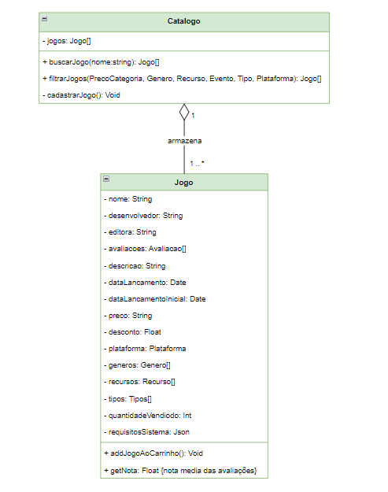
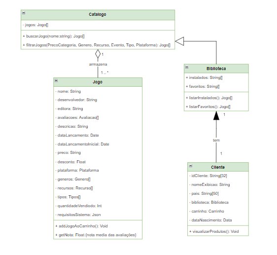
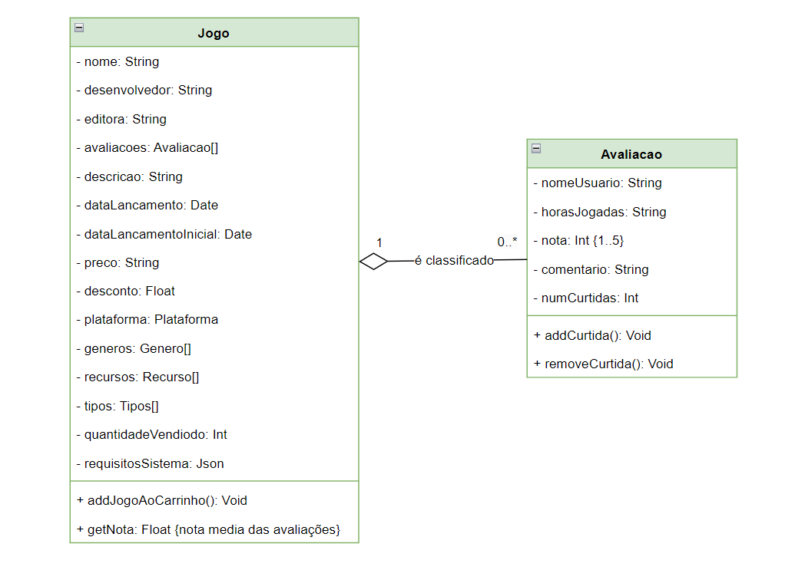
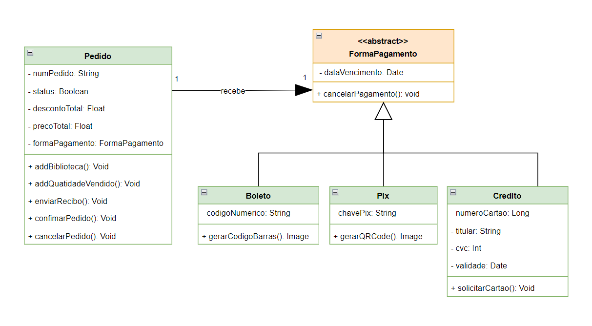

# 3.4. Módulo Padrões de Projeto GRASPs

## Introdução

Os padrões de projeto são soluções reutilizáveis para problemas de design comuns em software orientado a objetos (Gamma et al., 1994, p. 15). Eles fornecem um conjunto de diretrizes para a atribuição de responsabilidades a classes e objetos em sistemas orientados a objetos, promovendo a reutilização de código, a coesão alta e o baixo acoplamento.

Os padrões GRASP (General Responsibility Assignment Software Patterns) consistem em uma série de princípios (nove, no total) baseados em conceitos para atribuição de responsabilidades a classes e objetos na construção de softwares de qualidade utilizando programação orientada a objetos. Este conjunto de princípios tem sua origem no livro "Applying UML and Patterns — An Introduction to Object-Oriented Analysis and Design and the Unified Process", escrito por Craig Larman em 1997, e eles são compostos por:

- Criador ou Creator
- Especialista
- Alta Coesão
- Baixo Acoplamento
- Controladora ou Controller
- Polimorfismo
- Invenção Pura ou Fabricação Própria
- Indireção
- Variações Protegidas

Todos esses princípios tem o papel de ajudar na resolução de problemas comuns encontrados por desenvolvedores durante a criação de um software orientado a objetos. Isso é realizado por meio da padronização e documentação das boas práticas, relacionadas a atribuição de responsabilidades a classes e objetos, já testadas e consolidadas no mercado. A seguir iremos detalhar alguns GRASPs e suas respectivas aplicações em nosso projeto.

Autor: João Matheus

## Criador

O Creator é um dos padrões GRASP mais importantes. Este padrão define qual classe deve ser responsável pela criação de instâncias de outras classes. A escolha da classe responsável pela criação é crucial para a organização do sistema e para a manutenção do baixo acoplamento entre as classes. O padrão GRASP Creator sugere que uma classe deve ser responsável pela criação de instâncias de outra classe se uma ou mais das seguintes condições forem verdadeiras:

- **Contém/Composição:** B contém A ou é uma composição de A.
- **Registro:** B registra A.
- **Uso Próximo:** B usa A de maneira muito próxima.
- **Dados de Inicialização:** B tem dados iniciais de A, os quais serão passados para A quando este for criado. B é um “especialista” em relação à criação de A.

### Aplicação no Projeto

No diagrama fornecido, temos duas classes principais: Catalogo e Jogo. A classe Catalogo contém uma coleção de objetos da classe Jogo e fornece métodos para buscar, filtrar e cadastrar jogos. Já a classe Jogo, por sua vez, representa um jogo individual e contém informações detalhadas como nome, desenvolvedor, editora, plataforma, entre outras.

- **Contém/Composição:** A classe Catalogo contém uma coleção de objetos Jogo. Isso sugere que Catalogo é responsável por gerenciar os objetos Jogo, incluindo sua criação.
- **Registro:** Catalogo registra instâncias de Jogo em sua coleção interna, sendo o ponto central de gerenciamento desses objetos.
- **Uso Próximo:** Catalogo usa objetos Jogo de forma intensiva em seus métodos buscarJogo, filtrarJogos e cadastrarJogo. Como Catalogo precisa criar, armazenar e manipular objetos Jogo frequentemente, faz sentido que ela seja responsável por sua criação.
- **Dados de Inicialização:** Catalogo pode possuir ou ter acesso aos dados necessários para inicializar um objeto Jogo. Por exemplo, ao cadastrar um novo jogo, Catalogo pode coletar todas as informações necessárias e criar a instância do Jogo.

<strong>Figura - GRASP Criador na classe Catalogo</strong>

Autores: Pedro Henrique, Luciano Ricardo, Luan Melo e Sabrina Caldas

## Especialista

O padrão de projeto Especialista foca em atribuir as responsabilidades do sistema para as classes mais especializadas dentro de seus contextos. É possível existir classes especializadas na criação de outras classes, no cálculo de valores específicos, no armazenamento de informações e outras possíveis ações realizadas dentro de um sistema. Por se tratar de um padrão amplo é possível aplicá-lo de diversas formas, porém a principal maneira de enxergar a sua necessidade é quando se entende que uma das responsabilidades do sistema atribuída a uma classe pode ser executada com mais eficiência caso venha a ser construído uma outra própria para essa ação, trazendo diretamente dados e outras informações que facilitam a execução da responsabilidade.

### Aplicação no Projeto

No contexto do projeto, é possível identificar 2 exemplos de aplicações do padrão especialista. O primeiro faz referência a relação entre Biblioteca e Cliente, sendo Biblioteca uma classe especialista no armazenamento dos jogos possuídos pelo cliente. Veja que seria possível atribuir o conjunto de jogos diretamente na classe de Cliente, porém criando a classe especialista se torna possível a listagem de jogos, recursos de filtragem e busca e adições de outras ações, como a opção de favoritar jogos. Caso não existisse a classe especialista de Biblioteca todo escopo da mesma seria implementado em Cliente trazendo informações desnecessárias para os contextos mais frequentes de uso da classe.

A segunda aplicação do padrão especialista é na relação entre Jogo e Avaliação, novamente o escopo da avaliação de um jogo se mostrou grande o suficiente para que a equipe entendesse a necessidade de trazer uma classe especialista para essa responsabilidade.

<strong>Figura - GRASP Especialista na classe Biblioteca</strong>

<strong>Figura - GRASP Especialista na classe Avaliação</strong>

Autores: Pedro Henrique, Luciano Ricardo, Luan Melo e Sabrina Caldas

## Polimorfismo

O GRASP Polimorfismo, como seu nome já diz, é um padrão de projeto muito remetente ao conceito de polimorfismo que aprendemos na disciplina de Orientação a Objetos. [1] A sua principal diretriz diz que: a menos que haja um comportamento default na superclasse, declare uma operação polimórfica na superclasse como sendo abstrata.

Ou seja, utilizamos esse padrão em casos onde há variações de objetos que são semelhantes de alguma forma. Isso implica no uso e criação de classes abstratas ou interfaces, o que, por sua vez, pode facilitar a identificação de possíveis aplicações deste GRASP por parte de um desenvolvedor.

### Aplicação no Projeto

Em nosso projeto de E-Commerce, esse princípio foi aplicado na classe responsável por lidar com formas de pagamento por um jogo que o cliente compra dentro do site. Inicialmente, o nosso [Diagrama de Classes](../Modelagem/2.1.1.UMLEstaticos.md) contou com uma versão onde se encontrava apenas uma classe FormaPagamento, sem a presença de relacionamentos como herança, por exemplo.

Com o decorrer do desenvolvimento do diagrama, nossa equipe modificou essa classe para que se tornasse uma classe abstrata. O propósito foi de aprimorar o Diagrama de Classes e aplicar as boas práticas do GRASP Polimorfismo em nosso projeto. A partir disso, foi criada a classe abstrata denominada FormaPagamento que possui três classes que herdam dela: as classes Boleto, Pix e Credito, as quais representam formas especializadas de realizar um determinado tipo de pagamento para a compra de um jogo na plataforma.

A seguir pode-se observar as classes criadas a nível UML, além de uma lista que destaca os principais elementos que tornam a aplicação do GRASP Polimorfismo possível.

<strong>Figura - GRASP Polimorfismo na classe abstrata FormaPagamento</strong>

Autores: Pedro Henrique, Luciano Ricardo, Luan Melo e Sabrina Caldas

## Alta Coesão e Baixo Acoplamento

Assim como o Poliformismo, o GRASP de Alta Coesão e o GRASP de Baixo Acoplamento são padrões de projeto muito remetentes ao conceitos da Orientação a Objetos.

O Baixo Acoplamento sugere que as classes devem ter o mínimo de dependências possíveis entre si. O objetivo é reduzir as dependencias diretas utilizando interfaces e abstrações para minimizar essas dependências, facilitando assim a manutenção do software e a reutilização de codigo.

Já Alta coesão sugere que as responsabilidades de uma classe devem ser fortemente relacionadas e focadas em uma única tarefa. O objetivo é que cada unidade de código tenha um propósito bem definido e específico.

### Aplicação no Projeto

No contexto do projeto, visamos equilibrar a Alta Coesão e o Baixo Acoplamento o que pode ser notado em nosso [Diagrama de Classes](../Modelagem/2.1.1.UMLEstaticos.md). Podemos destacar a relação de Pedido com FormaPagamento, onde para aumentar a coesão removemos a responsabilidade de cuidar do pagamento para a classe FormaPagamento que posteriormente evoluiu para uma classe abstrata afim de reduzir o acoplamento.

<strong>Figura - GRASP Baixo Acoplamento e  Alta Coesão</strong>

Autores: Pedro Henrique, Luciano Ricardo, Luan Melo e Sabrina Caldas

## Histórico de versão

| Data       | Versão | Atividade                                                      | Responsável                                     |
| ---------- | ------ | -------------------------------------------------------------- | ----------------------------------------------- |
| 18/07/2024 | 1.0    | Adiciona GRASP Polimorfismo                                    | [Pedro H.](https://github.com/phmelosilva)      |
| 19/07/2024 | 1.1    | Adiciona GRASP Creator                                         | [Sabrina B.](https://github.com/sabrinaberno)   |
| 19/07/2024 | 1.2    | Adiciona GRASP Especialista                                    | [Luan Q.](https://github.com/luanmq)            |
| 19/07/2024 | 1.3    | Adiciona introdução aos GRASPs e revisão do GRASP Polimorfismo | [João M.](https://github.com/JoaoSchmitz)       |
| 20/07/2024 | 1.4    | Adiciona GRASPs Alta Coesão e Baixo Acoplamento                | [Luciano Ricardo](https://github.com/l-ricardo) |

## Referências

[1] Professora Millene Serrano - Material Complementar (Parte II) - Módulo Padrões de Projeto GRASP(s). Disponível em: <https://aprender3.unb.br/pluginfile.php/2790263/mod_label/intro/Arquitetura%20e%20Desenho%20de%20Software%20-%20Aula%20GRASP_B%20-%20Profa.%20Milene%20-%20Complementar.pdf>. Acesso em: 18 jul. 2024.
[2] Erich Gamma et al. Design Patterns: Elements of Reusable Object-oriented Software. Addison-Wesley, 1994. Acesso em: 19 jul. 2024.
[3] Grzybek, Kamil. GRASP - GENERAL RESPONSIBILITY ASSIGNMENT SOFTWARE PATTERNS EXPLAINED. Disponível em: <https://www.kamilgrzybek.com/blog/posts/grasp-explained>. Acesso em: 19 jul. 2024.
