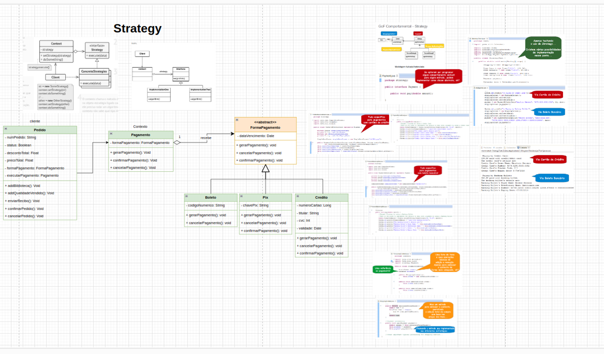
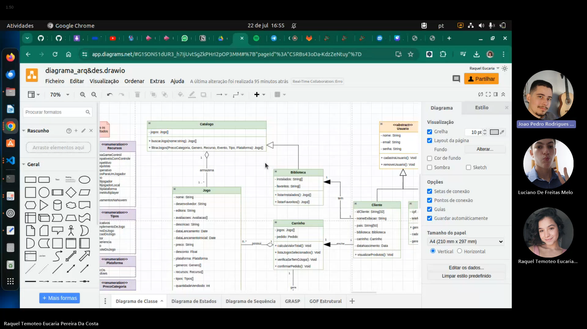

# Ata de reunião - 22/07/2024 - Comportamentais

**Horário:** 16h50

**Local:** Teams

**Participantes presentes:**

1. João Pedro Rodrigues Morbeck
2. Luciano de Freitas Melo
3. Raquel Temóteo Eucaria Pereira da Costa
    
    ---
    

### **Resumo**

Durante a reunião, os membros discutiram a aplicação de padrões de projeto comportamentais. Morbeck propôs usar o padrão Observer para acompanhar a avaliação de jogos favoritos e observar uma lista de desejos. Raquel complementou a ideia da lista de desejos de Morbeck e sugeriu o uso do padrão Strategy para métodos de pagamento, associando-o ao diagrama de estados desenvolvido na entrega anterior. Luciano trouxe à discussão dos padrões Command e Mediator para auxiliar na implementação do front-end, principalmente o último para a reutilização de componentes.

### **Escolha**

- **Strategy** - Método de pagamento: Desenvolver estratégias de pagamento.
- **Observer** - Lista de jogos favoritos: Implementar notificações para mudanças de status dos jogos favoritos (como descontos).
- **Mediator**: Para reutulização de componentes no front-end.

### **Prioridade**

1. **Strategy**: Foi escolhido como prioridade por ser considerado de aplicação mais fácil.
2. **Observer**: Será implementado após o Strategy.
3. **Mediator**: Será discutido e implementado depois dos dois primeiros.

Durante a reunião, a elaboração do Strategy foi iniciada. Os membros discutiram e trouxeram referências de materiais da disciplina e de sites recomendados pela professora.

### **Atividades e responsáveis**

1. **Morbeck**: Iniciar a parte conceitual no Pages.
2. **Raquel**: Revisar o conteúdo para continuação e aprimoramento da modelagem.
3. **Luciano**: Iniciar a implementação.
4. **Morbeck**: Conversar com Marcus (que não pôde comparecer) para dar início ao Observer.
5. **Todos**: Após concluírem suas atribuições, irão auxiliar na finalização do artefato como um todo e passar para o próximo padrão.

### **Comprovação (com data e horário)**

[GoF Comportamental-20240722_165333-Gravação de Reunião.mp4](https://unbbr.sharepoint.com/:v:/s/Arquitetura42/Ef_m-0Rdsw5Cn9KYs0mG5jwBZzq7iSMZofzDh9sAUmbOZA?e=gBrBgw&nav=eyJyZWZlcnJhbEluZm8iOnsicmVmZXJyYWxBcHAiOiJTdHJlYW1XZWJBcHAiLCJyZWZlcnJhbFZpZXciOiJTaGFyZURpYWxvZy1MaW5rIiwicmVmZXJyYWxBcHBQbGF0Zm9ybSI6IldlYiIsInJlZmVycmFsTW9kZSI6InZpZXcifX0%3D)