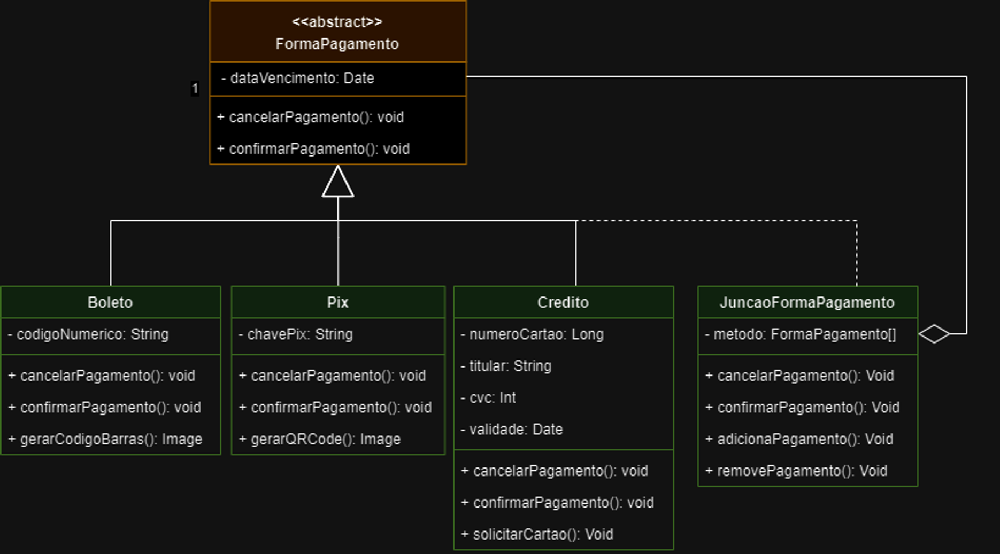

# Ata de reunião - 22/07/2024 - Estrutural

**Horário:** 08:45 - 09:50

**Local:** Sala S4

**Participantes presentes:** 

- Alexia Naara da Silva Cardoso
- Luan Mateus Cesar Duarte
- Pedro de Oliveira Campos Barbosa
- Raquel Temóteo Eucaria Pereira da Costa
---

## Resumo
Em aula redefinimos as entregas que o grupo tinha planejado com focos em grasp, gof e emergente para gof **comportamental, criacional e estrutural**. Nos reunimos para conversar sobre os gofs estruturais, definir os padrões a serem utilizados e dividir as tarefas.

## Discussão sobre Padrões GoF Estruturais

**Composite**

- Alexia: Propôs a utilização do padrão Composite para juntar diferentes formas de pagamento, apesar de não estar na epic. A ideia seria adicionada ao protótipo e diagrama.

  
**Decorator**

- Raquel: Sugeriu o uso do padrão Decorator no front-end para explicar os componentes e aplicar estilos diferentes na página.

**Object Pool**

- Pedro: Levantou a ideia de usar Object Pool para preparar os jogos no carrinho, porém, este é um padrão criacional.

**Facade**

- Luan: Propôs o uso do padrão Facade como uma central operacional para simplificar a interação com o sistema.
  
**Bridge**

- Alexia: Sugeriu a aplicação do padrão Bridge, com Barbosa concordando.
- Raquel: Considerou a possibilidade de usar Bridge para a emissão de recibos.

## Validação com a professora
Millene deu a ideia de vale presente, respondeu a dúvida sobre o composite. Deu dicas sobre o diagrama de classe que já temos um strategy. Falou sobre o composite ter uma agregação ao invés de composição para dar mais flexibilidade.

## Alinhamento de Entrega
- Adaptar o diagrama para confecção dos padrões
- Fazer os diagramas e repassar para revisar.
- Requisito para o padrão: Conceitual, modelagem e implementação.

## Escolhas e responsáveis
1. Composite - Alexia
   
    

    
código composite

            class FormaPagamento {
            constructor(dataVencimento) {
                this.dataVencimento = dataVencimento
                if (new.target === FormaPagamento) {
                    throw new Error("Não é possível instanciar a classe abstrata diretamente.");
                }
            }

            // Método abstrato
            cancelarPagamento() {
                throw new Error("Método 'cancelarPagamento()' deve ser implementado.");
            }

            confirmarPagamento() {
                throw new Error("Método 'confirmarPagamento()' deve ser implementado.");
            }
        }

        class Boleto extends FormaPagamento {
            constructor(codigoNumero) {
                super();
                this.codigoNumero = codigoNumero;
            }

            cancelarPagamento() {
                return "Pagamento em Boleto Cancelado";
            }

            confirmarPagamento() {
                return "Pagamento em Boleto Confirmado";
            }

            gerarCodigoBarras() {
                return this.codigoNumero;
            }
        }

        class Pix extends FormaPagamento {
            constructor(chavePix) {
                super();
                this.chavePix = chavePix;
            }

            cancelarPagamento() {
                return "Pagamento de Pix Cancelado";
            }

            confirmarPagamento() {
                return "Pagamento de Pix Confirmado";
            }

            gerarQRCode() {
                return "QR Code";
            }
        }

        class Credito extends FormaPagamento {
            constructor(numeroCartao, titular, cvc, validade) {
                super();
                this.numeroCartao = numeroCartao;
                this.titular = titular;
                this.cvc = cvc;
                this.validade = validade;
            }

            cancelarPagamento() {
                return "Pagamento de Cartão Cancelado";
            }

            confirmarPagamento() {
                return "Pagamento de Cartão Confirmado";
            }

            solicitarCartao() {
                return this.numeroCartao;
            }
        }

        class JuncaoFormaPagamento extends FormaPagamento {
            constructor() {
                super();
                this.metodo = [];
            }

            adicionaPagamento(formaPagamento) {
                this.metodo.push(formaPagamento);
            }

            removePagamento(formaPagamento) {
                const index = this.metodo.indexOf(formaPagamento);
                if (index > -1) {
                    this.metodo.splice(index, 1);
                }
            }

            cancelarPagamento() {
                this.metodo.forEach(metodo => metodo.cancelarPagamento());
                return "Todos os pagamentos foram cancelados.";
            }

            confirmarPagamento() {
                this.metodo.forEach(metodo => metodo.confirmarPagamento());
                return "Todos os pagamentos foram confirmados.";
            }
        }

        // Criando formas de pagamento
        const cartaoCredito = new Credito('1234 5678 9101 1121', 'João Silva', '123', '12/25');
        const boletoBancario = new Boleto('34191.75503 00000.104628 01605.093000 7 81180000025400');

        console.log(cartaoCredito.solicitarCartao());

        // Criando o composite
        const juncaoPagamento = new JuncaoFormaPagamento();
        juncaoPagamento.adicionaPagamento(cartaoCredito);
        juncaoPagamento.adicionaPagamento(boletoBancario);

        // Confirmando pagamentos
        console.log(juncaoPagamento.confirmarPagamento()); // Saída: Todos os pagamentos foram confirmados.

        // Cancelando pagamentos
        console.log(juncaoPagamento.cancelarPagamento()); // Saída: Todos os pagamentos foram cancelados.
    

2. Decorator - Pedro
3. Facade - Luan
4. Bridge - Raquel

**Comprovação (com data e horário):**

