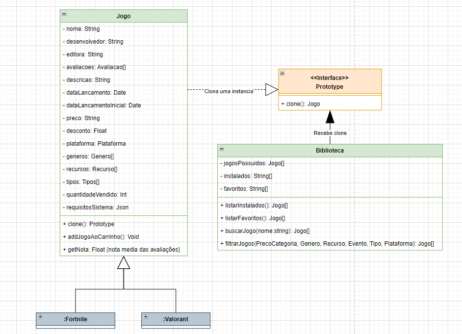
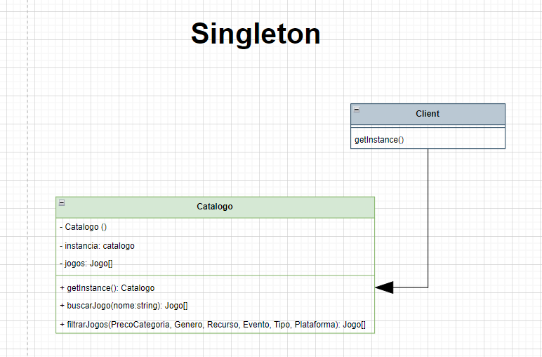
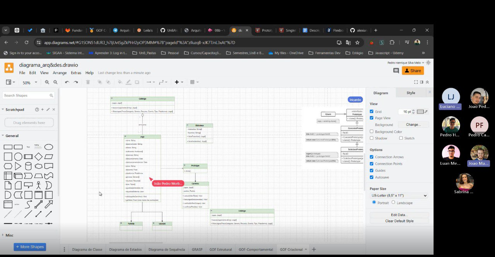

**Horário:** 16:00 - 20:30

**Local:** Teams

**Participantes presentes:** 

- João Pedro Rodrigues Morbeck
- João Matheus Schmitz
- Luciano Ricardo da Silva Junior
- Luan Melo Queiroz
- Pedro Cabeceira de Freitas
- Pedro Henrique da Silva Melo
- Sabrina Caldas Berno

---

## Descrição

No início, Luciano Ricardo, Pedro Henrique e João Morbck se reuniram para discutir como aplicar um GoF Criacional no projeto, levando em consideração as dificuldades encontradas em reuniões passadas.

Com isso, o grupo passou 1 hora com dificuldades e discussões para saber qual GoF implementar. Após isso, houve a chegada dos membros João Matheus, Luan Melo, Pedro Cabeceira e Sabrina Berno que ajudaram com a definição dos GoFs a serem utilizados. 

Durante esse momento, o grupo passou boa parte do tempo discutindo sobre as implicações que o GoF Prototype teria para a adição de um jogo clonado. Após isso, o grupo definiu que os GoFs a serem implementados são o **Prototype**, para a criação de jogos, e o  **Singleton**, para a criação de uma instância única de Catálogo.

Com isso, após a criação dos diagramas que definem os GoFs criacionais Prototype e Singleton, os membros implementaram esses GoFs em código JavaScript e definiram descrições para cada um dos GoFs para serem encaixados no Pages posteriormente.

Ficou pendente a questão de implementar uma classe Prototype e de passar as descrições do artefato para o Pages.

### **Atividades definidas e Participantes**

1. **Criação dos Diagramas dos GoFs Prototype e Singleton**
    1. João Morbeck, João Schmitz, Luan Melo, Luciano Ricardo, Pedro Henrique, Pedro Cabeceira e Sabrina Caldas Berno:
2.  **Implementação do Prototype**
    1. João Schmitz, Luan Melo, Luciano Ricardo, Pedro Henrique, Pedro Cabeceira e Sabrina Caldas Berno. 
3. **Implementação do Singleton**
    1. Luan Melo, Luciano Ricardo e Pedro Henrique

### **Comprovação (com data e horário):**

Horário: das 16h - 20h30

[***Link da Reunião no Teams***](https://unbbr.sharepoint.com/sites/Arquitetura42/_layouts/15/stream.aspx?id=%2Fsites%2FArquitetura42%2FDocumentos%20Compartilhados%2FGeneral%2FRecordings%2FGeneral%2D20240723%5F161324%2DGrava%C3%A7%C3%A3o%20de%20Reuni%C3%A3o%2Emp4&referrer=StreamWebApp%2EWeb&referrerScenario=AddressBarCopied%2Eview%2E34d273ea%2Dcbd0%2D4c54%2D8126%2D0ca69cb7705c)