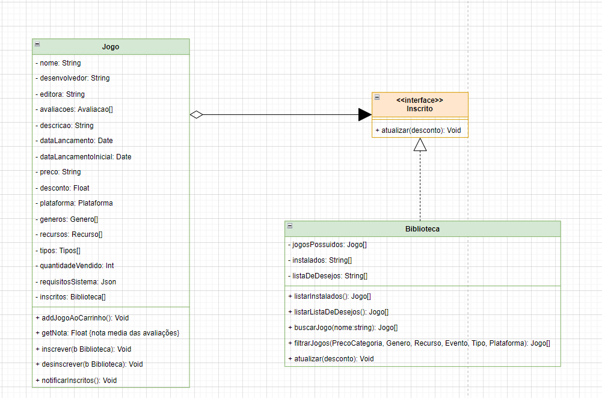
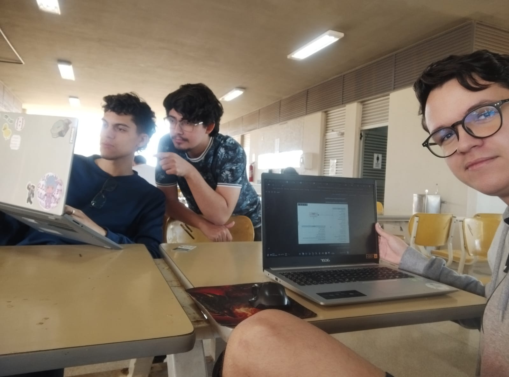

**Horário:** 13:00 - 14:00

**Local:** RU

**Participantes presentes:** 

- João Pedro Rodrigues Morbeck
- Marcus Vinicius Paiva Martins
- Pedro Henrique da Silva Melo
---

## Descrição

Os membros definiram a utilização do GoF Observer para observar quando um usuário logado quiser adicionar um jogo em sua lista de desejos. Para que assim, quando o jogo estiver com promoção ou descontos, o usuário possa ser notificado sobre isso. 

Como forma de aplicar isso no contexto do nosso Diagrama de Classes, o grupo levou em consideração que o cliente interage com a classe Catálogo que por sua vez interaje diretamente com um jogo da classe Jogo.  

Por isso incluímos apenas as relações entre Jogo, Biblioteca e a interface criada para implementar o Observer.

### OBSERVAÇÃO

 O grupo optou por usar o Observer para trabalhar a lista de favoritos. Porém, os participantes desta reunião decidiram trocar o nome para lista de desejos porque é um conceito que faz mais sentido para que o usuário seja notificado de possíveis descontos/promoções a serem feitas em seus jogos desejados.

### **Atividades definidas e Participantes**

1. **Criação do GoF Observer para Lista de Favoritos**
    1. João Morbeck, Marcus Vinicius, Pedro Henrique
2. **Implementação do GoF Observer**
    1. Marcus Vinicius

### **Comprovação (com data e horário):**

REUNIÃO PRESENCIAL OCORRIDA NO RU:

