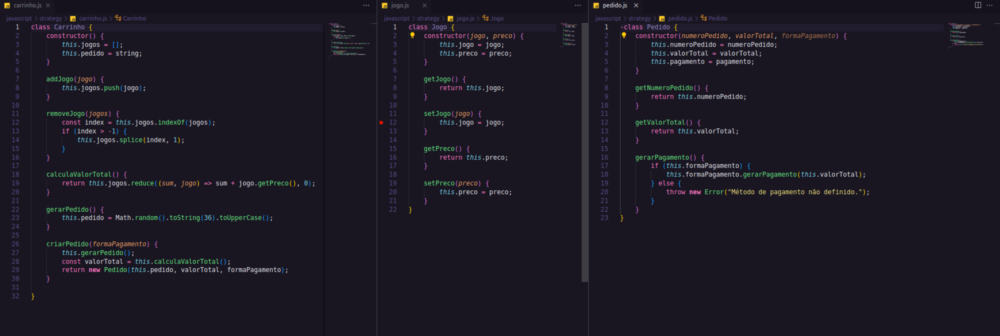
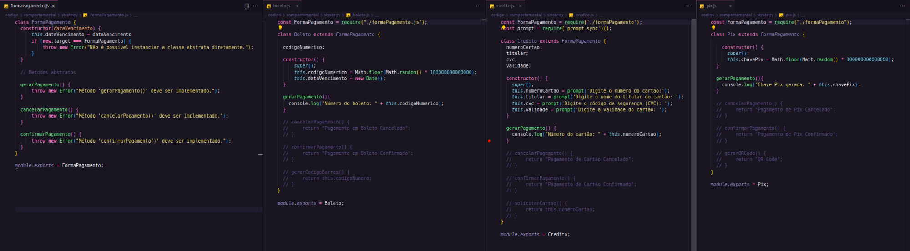
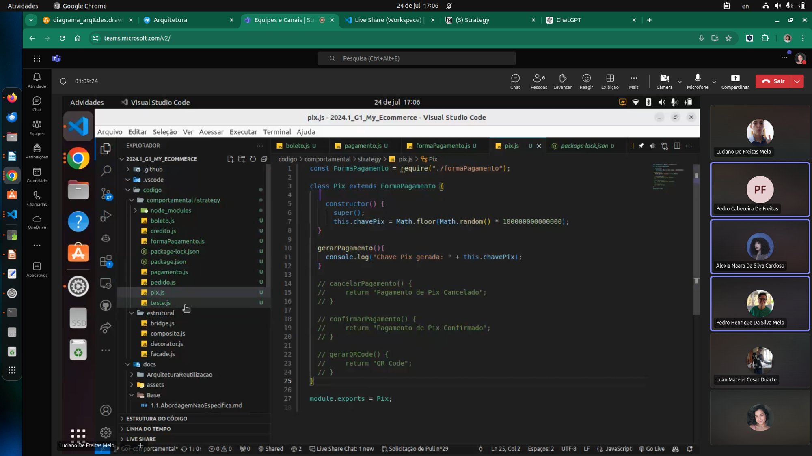

# Ata de Reunião 24/07 - Strategy

**Horário:** 16h00

**Local:** teams

**Participantes presentes:** 

1. Alexia Naara da Silva Cardoso
2. Luan Mateus Cesar Duarte
3. Luciano Freitas
4. Pedro Cabeceira de Freitas
5. Pedro Henrique da Silva Melo
6. Raquel Temóteo Eucaria Pereira da Costa

---

## **Resumo**

### Discussão inicial:

Raquel iniciou a discussão, apresentando sua implementação do diagrama e do código que estava mais voltado para o contexto do Strategy.

Posteriormente, Luciano apresentou suas implementações voltadas para as formas de pagamento e foi decidido seguir a lógica do Luciano.

### Ajuste do código

Os demais participantes foram entrando na chamada e auxiliando nos ajustes do código. Com isso, houve uma alteração na lógica dos métodos de pagamento. Então, o que antes eram só textos retornados no console, agora aceita informações a respeito da decisão dos diferentes métodos de pagamento, sendo eles: pix, boleto ou cartão de crédito. Assim, Pedido ficou definido como contexto do Strategy.

Ademais, após algumas discussões, os participantes decidiram não implementar o código de acordo com o Composite e sim fazer em paralelo com ele.

### Atividades e responsáveis

1. Criar um readme para o código - Raquel
2. Adicionar imagens do código no pages [em aberto]

## Comprovação

